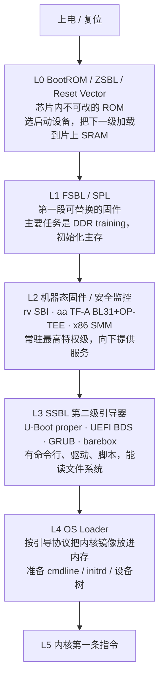

从按下电源到内核打印第一行日志，中间没有操作系统、没有 `printf`、没有文件系统，最开始连内存都不能用。CPU 从芯片里固定的地址取第一条指令，然后逐步建立运行环境：初始化时钟、训练内存、打开串口、找到下一段代码、校验、跳过去，这样交接五六次，最后把控制权交给内核的第一条指令。

这一段由固件（firmware）和引导程序（bootloader）完成。常见的理解停在「BIOS，然后 GRUB，然后开机」，实际是五六级逐级交接，每一级都有硬件上的原因：复位时 DRAM 还不能用；需要一个比内核更高的特权级管理硬件；需要在不可信的环境外再加一层可信环境。下面逐级说明每一级为什么出现、解决什么问题、后来被什么取代。

<!-- more -->

---

## 从上电到内核的六级

RISC-V（rv）、x86/x64（x86）、aarch64/arm（aa）、LoongArch（la）从上电到内核都是同一个结构：每一级加载下一级、交出控制权，后一级比前一级能力更强、运行环境更完整。这里把它分成六级，记作 L0 到 L5。



| 级别 | 角色 | 为什么需要这一级 | 做完后的状态 |
|:--:|:--:|:--:|:--:|
| **L0** | BootROM / ZSBL / Reset Vector | 复位时 CPU 没有 RAM、没有初始化好的外设，也不知道从哪里取指，需要一段出厂固化、不会损坏的代码 | 选定启动设备，把 L1 放进片上 SRAM 并跳过去 |
| **L1** | FSBL / SPL | DRAM 上电后不能直接用，要先做 **DDR training**，所以这段代码只能放在几十 KB 的片上 SRAM 里 | 主存可用，把更大的 L2/L3 加载到 DRAM |
| **L2** | 机器态固件 / 安全监控 | 需要一个比内核更高的特权级常驻，统一管理底层硬件、提供运行时服务、隔离可信与不可信环境 | 设置特权委托与内存保护，降级跳入 L3 |
| **L3** | SSBL | 需要一个功能齐全的引导环境：读文件系统、命令行、网络、脚本、选择启动项 | 找到并加载内核镜像和相关数据 |
| **L4** | OS Loader | 内核镜像有固定的交接格式（引导协议），要放到正确地址、按 ABI 填好寄存器、备好参数 | 内核镜像就位，寄存器按约定填好 |
| **L5** | 内核入口 | | 内核开始执行 |

- **结构相同，实现不同**：六级结构各架构通用，但每一级的实现差别很大。以 L2 为例，rv 用 SBI，aa 用 TF-A 加 OP-TEE，x86 用固件里的 SMM，解决的是同一类问题（最高特权级的常驻服务与隔离），做法完全不同。
- **级数可增可减**：六级是最完整的情况。开发板和虚拟机上常合并或省略几级，例如 QEMU 用 `-bios` 直接加载 SBI，没有 L0/L1；OpenSBI 把内核当作 payload 内嵌，省掉 L3/L4。量产硬件通常六级都有。
- **每一级只需弄清两件事**：上一级交给我什么（入口地址、参数寄存器、机器状态），我做完交给下一级什么。把每一级的这两个接口弄清楚，整条启动链就清楚了。

---

## 四种架构的启动链

### 对照表

| 级别 | rv | x86 | aa | la |
|:--:|:--:|:--:|:--:|:--:|
| **L0** BootROM | 复位向量加 ZSBL（片内 mask ROM）；QEMU virt 是 `0x1000` 处十来条指令 | 复位向量 `0xFFFFFFF0`（16 位实模式），芯片组与 ME/PSP 做早期初始化 | 片内 mask ROM，选启动设备，支持救砖下载模式 | 片内 BootROM，与 aa 相同 |
| **L1** FSBL/SPL | U-Boot SPL / HSS（PolarFire），DDR training | 没有独立的 FSBL，由 BIOS/coreboot 的 romstage 用 cache-as-RAM 完成 DDR 初始化 | TF-A BL1 + BL2 / Xilinx FSBL，DDR training | UEFI 固件早期初始化，含 DDR |
| **L2** 机器态/安全 | **SBI**（M-mode）：OpenSBI / RustSBI / BBL / 自研 | SMM（系统管理模式）/ SGX / TDX / SEV | TF-A **BL31**（EL3 安全监控）+ OP-TEE **BL32**（安全 EL1）；PSCI | UEFI 运行时，没有独立的机器态规范 |
| **L3** SSBL | U-Boot proper / UEFI（EDK2 或 U-Boot 内置） | 传统 BIOS（INT 调用 + MBR）/ UEFI BDS / GRUB | U-Boot proper / UEFI / barebox | UEFI + GRUB，早期是 PMON |
| **L4** OS Loader | U-Boot `booti` / GRUB / EFI stub | GRUB / Windows Boot Manager / systemd-boot | U-Boot `booti` / GRUB / EFI stub | GRUB / EFI stub |
| **L5** 交接 ABI | `mret` 进 S-mode，`a0`=hartid，`a1`=dtb 物理地址 | bzImage 按实模式、保护模式、长模式分段交接，`boot_params` | 降到 EL1/EL2，`x0`=dtb 物理地址 | UEFI 交接进内核 |
| 硬件描述 | 设备树（FDT/dtb） | 以 ACPI 为主，很少用设备树 | 以设备树为主，服务器用 ACPI | 服务器用 ACPI，其余用设备树 |
| 中断控制器 | CLINT/ACLINT + PLIC/APLIC+IMSIC | LAPIC + IOAPIC / MSI | GIC（v2/v3/v4） | 自有（extioi 等） |

### 三种架构的固件演变

三条线回答的是同一个问题：复位之后怎样一步步把机器初始化起来，又怎样对内核屏蔽硬件细节。它们起步的年代不同、兼容负担不同，所以做法不同。

**x86：从 BIOS 到 UEFI，以兼容为先。** 1981 年 IBM PC 的 BIOS（Basic Input/Output System）定下了「开机自检，再从磁盘第一个扇区加载引导代码」：16 位实模式、`INT 13h` 读盘、512 字节 MBR，这套接口用了二十多年。它的问题是太旧：实模式只有 1 MB 地址空间，MBR 只能管理 2 TB 的磁盘，也没有可扩展的驱动模型。1998 年 Intel 为安腾另做了 EFI，2005 年交给 UEFI Forum 发展成 UEFI，2007 年 Tianocore/EDK2 开源。UEFI 用 32/64 位模式、GPT 分区、FAT32 格式的 EFI 系统分区（ESP）、基于 Protocol 和 GUID 的驱动模型、Boot Manager 管理启动项，全面取代了 BIOS。现在 PC 和服务器的固件几乎都是 UEFI，但仍保留 CSM（兼容支持模块）模拟传统 BIOS。

**aa：从各厂商自定到 TF-A 统一。** 早期 aa 没有统一的固件标准，每家 SoC 的 BootROM 和第一级加载器各不相同。ARMv8 引入 EL0 到 EL3 四个异常级后，需要一个运行在 EL3、负责切换安全世界与非安全世界的安全监控程序，于是有了 Trusted Firmware-A（TF-A）。它把启动分成 BL1（BootROM 之后的第一段）、BL2（加载器）、BL31（EL3 常驻安全监控，实现 PSCI 电源接口）、BL32（安全世界 OS，常用 OP-TEE）、BL33（非安全世界的引导器，常用 U-Boot 或 UEFI）。TrustZone 把系统分成安全与非安全两部分，TF-A 和 OP-TEE 负责这两部分之间的切换与隔离。

**rv：起步晚，没有历史负担。** rv 2010 年在伯克利起步，一开始就把机器态固件接口标准化。最早是 BBL（Berkeley Boot Loader，来自 riscv-pk），在 M-mode 给内核提供一层很薄的运行环境；后来这层被定义成 **SBI（Supervisor Binary Interface）** 规范：S-mode 内核用 `ecall` 调用 M-mode 固件的标准服务（定时器、核间中断、远程 fence、CPU 热插拔、关机等）。OpenSBI（C 语言，Western Digital 主导）是参考实现，RustSBI（Rust）是另一个主流实现。SBI 在 rv 上的地位，相当于 aa 的 PSCI 加一部分固件运行时服务，也相当于 x86 上规范化、开源化、简化后的 BIOS/UEFI 运行时服务。

三条线有一个共同的走向：**早期由实现充当标准（BIOS、各厂商的 aa 固件），后来都变成规范与实现分离**，例如 UEFI 规范与 EDK2、SBI 规范与 OpenSBI/RustSBI、PSCI 规范与 TF-A。规范化之后，内核不必关心固件来自哪家厂商，固件层的作用就是向上屏蔽硬件与厂商的差异。

### 四个步骤

三条线做的是同一件事，可以分成四步：

1. **从固定地址开始**（L0）。复位后从固定地址取第一条指令，这段代码出厂固化、不能修改。rv 是复位向量加 ZSBL，x86 是 `0xFFFFFFF0` 处的复位向量，aa 是片内 mask ROM。它们只做最少的事：选好从哪个设备继续，把下一级放到能运行的地方。
2. **初始化主存**（L1）。复位时 DRAM 不能用，需要一段放在片上 SRAM 里的小程序完成 DDR training。rv 和 aa 是 SPL/FSBL，x86 把这一步放在 BIOS/coreboot 的 romstage 里，用 cache-as-RAM 临时充当内存。这一步完成后，机器才有了大容量内存。
3. **建立常驻服务与可信边界**（L2）。需要一个最高特权级的常驻固件：对内核屏蔽底层差异、提供运行时服务、隔离可信环境。rv 是 SBI（M-mode），aa 是 TF-A BL31 加 OP-TEE（EL3 与安全 EL1），x86 是 SMM 加 SGX/TDX/SEV 等机密计算扩展。
4. **选择并加载内核**（L3 到 L5）。功能齐全的引导器（U-Boot/UEFI/GRUB/barebox）读文件系统、访问网络、解析配置、选出内核，按引导协议放进内存、填好寄存器，最后跳到内核第一条指令。

四步里，第 3 步（L2）是三条线差别最大的一级，rv 的 SBI 是其中结构最清楚的。

### la

la 是龙芯自研的指令集，启动方式与 aa、x86 相近：桌面和服务器平台用 **UEFI**（龙芯移植的 EDK2）加 GRUB；早期和嵌入式平台用过 **PMON**（一个类似 BIOS 的老引导器，严格说属于 MIPS 时期的龙芯，LoongArch 已改用 UEFI，见「la 的启动」）。它有自己的特权级（PLV0 到 PLV3）和异常入口，套用六级结构同样成立：BootROM、固件、引导器、内核。

---

## L0：复位向量、BootROM 与 ZSBL

复位信号撤销后，CPU 内部寄存器回到确定的初值，程序计数器 PC 被设成一个**架构规定或芯片固定**的地址，然后取第一条指令。这个地址叫**复位向量（reset vector）**，它指向的出厂固化代码就是 L0。

L0 的条件最差：没有 DRAM（只有寄存器和少量片上 SRAM 或 cache），外设没有初始化，不知道从哪个设备继续，时钟可能还是最低的初始频率。它的目标很明确：**做最少的初始化，选好启动设备，把 L1 放到能执行的地方，然后跳过去。**

### rv：复位向量与 ZSBL

rv 特权规范没有规定复位向量的具体数值，交给平台决定。真实 SoC 上，复位向量指向片内的一块 **mask ROM**，也叫 BootROM、BROM，在 SBI 的语境里叫 **ZSBL**（Zeroth Stage Boot Loader，第零级引导器，表示它在 SBI 之前）。这块 ROM 有几 KB 到几十 KB，出厂时做进芯片，不能修改。

真机 ZSBL 通常做这些事：

- 初始化最基础的时钟（PLL），让 CPU 跑到可用频率；
- 根据 GPIO、eFuse 或拨码开关选择启动设备（SD 卡、SPI Flash、eMMC、USB 下载模式）；
- 把第一段可替换的固件（SPL）从启动设备读进片上 SRAM，此时 DRAM 还不能用；
- 可选地校验 SPL 的签名，这是 Verified Boot 信任链的起点，见「安全启动」；
- 提供救砖入口：正常启动失败或被强制时，进入串口或 USB 下载模式（全志的 FEL、瑞芯微的 MaskROM 模式等），让主机写入固件。

几个平台的 L0：

| 平台 | L0 | 大小 | 行为 |
|:--:|:--:|:--:|:--:|
| SiFive FU540/FU740（HiFive Unmatched） | 片内 mask ROM | 约 32 KB | 读 GPIO 选启动设备，把 SPL 加载进 L2 cache-as-RAM |
| StarFive JH7110（VisionFive 2） | 片内 BootROM（BROM） | 几十 KB | 选 SD 或 Flash，加载含 OpenSBI 的 SPL |
| Allwinner D1 | brom | 约 32 KB | 加载 SPL，失败则进入 FEL 下载模式 |
| SpacemiT K1 | 片内 BootROM | 几十 KB | 加载 SPL 到片上 SRAM |
| Microchip PolarFire SoC | HSS（Hart Software Services） | MB 级 | 比一般 ZSBL 复杂得多，是用户可编译的固件，不是 mask ROM |
| QEMU virt | `0x1000` 处的一段代码 | 约 10 条指令 | 设 `a0`=hartid、`a1`=dtb，跳到 `0x80000000` |

QEMU 把 L0 简化到了最少。QEMU virt 复位后 PC = `0x1000`，那里是 QEMU 预置的一小段复位代码，作用相当于真机的 ZSBL：

```asm
# QEMU virt 复位向量 @ 0x1000
0x1000:  auipc t0, 0x0          # t0 = 0x1000（当前 PC）
0x1004:  addi  a2, t0, 40       # a2 = 0x1028
0x1008:  csrr  a0, mhartid      # a0 = 当前 hart 的硬件 ID
0x100c:  ld    a1, 32(t0)       # a1 = dtb 物理地址，由 QEMU 放好
0x1010:  ld    t0, 24(t0)       # t0 = 0x80000000，下一级入口
0x1014:  jr    t0               # 跳到 0x80000000
```

这几条指令就是 QEMU 版 L0 的全部：**把 hartid 放进 `a0`，把设备树地址放进 `a1`，跳到 `0x80000000`。**`a0`=hartid、`a1`=dtb 这条约定从 L0 一直传到内核，见「L5：交给内核」。

`0x80000000` 不是规范规定的，而是事实标准：SiFive 早期 SoC 把 DRAM 映射到 `0x80000000`，QEMU virt 照搬了 SiFive 的布局，之后的 rv 板（VisionFive、SpacemiT K1、Allwinner D1 等）几乎都沿用。aa 板的 DRAM 起始地址各不相同（`0x0`、`0x40000000`、`0x80000000` 都有），全靠设备树描述，rv 在这一点上统一得多。

### x86：复位向量 0xFFFFFFF0 与实模式

x86 的 L0 历史负担最重。CPU 复位后进入 **16 位实模式**，CS:IP 被硬件设为 `0xFFFFFFF0`，这是接近 4 GB 顶端的地址，不是低地址。芯片组把这个地址映射到主板 SPI Flash 的顶部，那里放着固件的复位入口。`0xFFFFFFF0` 离 4 GB 只有 16 字节，只够放一条跳转指令，跳到固件真正的初始化代码。

为什么是实模式、为什么在 4 GB 顶端：这是从 8086 延续下来的兼容约定。早期 BIOS 映射在地址空间高端，复位向量也就在那里；为了让几十年的固件和引导代码继续运行，现代 x86 CPU 复位时仍表现为一颗 16 位实模式的 8086，再由固件逐步切到 32 位保护模式和 64 位长模式。

现代 x86 的 L0 远不止一条跳转。主核取第一条指令之前，往往已经有一颗独立的管理核运行过：Intel 的 ME（Management Engine）或 AMD 的 PSP（Platform Security Processor）。它们负责最早期的硬件检查和固件验证，是 x86 信任链真正的起点。主核复位后，固件（传统 BIOS 或 UEFI 的 SEC 阶段）接手，初始化芯片组和内存控制器，把 CPU 切到保护模式。x86 没有独立的 SPL，DDR 初始化放在固件早期阶段完成，见「x86：coreboot 的 bootblock 与 romstage」。

### aa：片内 mask ROM 与救砖模式

aa 的 L0 和 rv 最接近：片内一块出厂固化的 **Boot ROM（mask ROM）**。复位后 CPU 从复位向量进入 Boot ROM，由它根据启动引脚或 eFuse 选择启动设备，把第一级加载器（TF-A 的 BL1 或厂商的 FSBL）读进片上 SRAM 并跳过去。

aa 的救砖模式做得很完善，因为嵌入式设备的固件一旦损坏，需要从外部重新写入：

- NXP i.MX 的串口/USB 下载模式（Serial Download Protocol）；
- 全志的 FEL 模式（USB）；
- 高通的 EDL（Emergency Download，9008 模式）；
- 苹果设备的 DFU（Device Firmware Update）。

这些模式的原理相同：Boot ROM 发现正常启动设备无效，或者检测到强制信号时，改为通过 USB 或串口等待主机发来一段固件，放进 SRAM 执行，从而绕过损坏的存储。只要芯片本身没坏，就总有办法重新写入固件（仍受签名校验约束）。

### L0 做的事

三种架构的 L0 做的事基本一致，下面八项不是每个平台都做全，但都在这个范围内：

1. 把 CPU 从复位状态带到能执行代码的最小状态；
2. 初始化最基础的时钟，让 CPU 跑到可用频率；
3. 选择启动设备（GPIO、eFuse、拨码、优先级表）；
4. 把 L1 从启动设备读进**片上 SRAM**，因为 DRAM 还不能用；
5. 校验下一级的签名，作为 Verified/Secure Boot 的起点；
6. 提供救砖或恢复入口（串口、USB 下载模式）；
7. 传递最基本的交接信息，如 rv 的 hartid 和 dtb 地址；
8. 跳到 L1。

L0 **不能修改**（mask ROM 或芯片组固定），所以它可靠，但有 bug 也改不了，只能靠后续固件绕开。L0 可用的资源极少，这也决定了 L1 首先要做的事：初始化主存。

---

## L1：FSBL 与 SPL

L0 交出控制权时，机器仍然只有寄存器和片上 SRAM 可用，DRAM 还不能读写。L1 的任务是**初始化 DRAM**，再把更大的后续固件加载到主存。不同体系叫法不同：rv 和 U-Boot 叫 **SPL（Secondary Program Loader）**，aa 的 TF-A 叫 **BL1/BL2**，Xilinx 叫 **FSBL（First Stage Boot Loader）**，x86 没有独立的 L1，这一步在固件早期阶段完成。它们做的是同一件事。

### 为什么需要 L1

DRAM 不像 SRAM 那样上电就能用。它用电容存储电荷表示比特，需要**内存控制器**按精确的时序刷新、寻址、读写；高速 DDR 接口（DDR3/4/5，每秒数十亿次传输）的物理信号还要先校准才能可靠工作。这些初始化和校准统称 DDR 初始化与 **DDR training**。

这里有一个循环依赖：

- 要用 DRAM，得先运行初始化它的代码；
- 这段代码不能放在 DRAM 里，因为 DRAM 还没初始化；
- 只能放在容量很小的片上 SRAM（几十 KB 到几百 KB）里运行。

由此 L1 有两个硬性要求：**第一，必须很小**，要放得进 SRAM；**第二，必须可替换**，DDR 参数随板卡、内存颗粒、走线而变，不能固化在 mask ROM 里，要做成可重新编译和烧录的固件。这就是 L0（不可改）和 L1（可改，专门初始化主存）分成两级的原因。

### DDR training 为什么要在运行时做

DDR training 是 L1 里最复杂的部分。它不能在编译时算好，原因在物理层：DDR 总线上，选通信号（DQS）和数据信号（DQ）从控制器到内存颗粒，经过的走线长度和负载不同，还随温度和电压变化，到达时间各不相同。在每秒数十亿次传输的速率下，这点时间差就会让采样读到错误的电平。training 就是逐根信号找出正确的采样延迟和参考电压，让采样点落在数据眼图的中心。

DDR4 典型的 training 步骤：

| 阶段 | 校准对象 | 解决的问题 |
|:--:|:--:|:--:|
| Write Leveling | DQS 与时钟 CK 对齐 | 补偿 fly-by 走线造成各颗粒收到时钟的时间不同 |
| Read Gate Training | 读选通的门控窗口 | 找到读数据到达的时刻，在正确的时间打开接收 |
| Read/Write Leveling | 每根 DQ 相对 DQS 的延迟 | 让每个比特的采样点对准数据眼中心 |
| VREF Training | 参考电压 | 把判断 0 和 1 的电压阈值调到最佳 |

这些参数**只能在目标硬件上电后测出来**：工艺偏差、板级走线、内存颗粒批次、当前温度，编译时都不知道。所以 DDR training 必须在运行时由贴近硬件的固件来做。为了缩短之后的启动时间，训练结果常缓存到 eMMC 或 Flash，下次启动直接读取，跳过部分训练。

L1 运行时 DRAM 还不能用，所以它必须在片上 SRAM 里运行、必须很小。x86 没有大块片上 SRAM，用的是 **Cache-as-RAM（CAR）**：把 CPU 的 L2/L3 cache 临时锁定成可读写的 RAM，给早期代码（包括 DRAM 初始化）提供栈和变量空间，等 DRAM 训练好再切换过去。

### rv：U-Boot SPL

rv 平台上的 L1 通常是 U-Boot 的 SPL。它的主流程分两段，分别对应 DRAM 可用之前和之后：

```c
// 简化的 SPL 主流程（U-Boot, arch/riscv + common/spl）
start.S            // SPL 入口汇编：设栈（在 SRAM 内）、清 BSS、跳到 C
  └─ board_init_f  // "f" = before relocation，DRAM 尚不可用
        ├─ 时钟/IO 最小初始化
        └─ DRAM 控制器初始化 + DDR training   // 主存在这里初始化
  └─ board_init_r  // "r" = after relocation，DRAM 可用，可以加载大镜像
        └─ spl_load_image / spl_load_simple_fit  // 从启动设备读下一级
              └─ jump_to_image_no_args           // 跳到下一级
```

U-Boot 源码里的关键位置：

- `common/spl/spl.c`：SPL 主流程 `board_init_r()`，决定从哪个后端（MMC/SPI/NOR/NET/RAM 等）加载下一级；
- `common/spl/spl_fit.c`：解析 FIT/ITB 镜像（多组件打包格式，见「L3：第二级引导器」和「L4：OS Loader 与引导协议」）；
- `arch/riscv/lib/spl.c`：rv 专用的跳转逻辑；
- `drivers/ram/`：各家 SoC 的 DRAM 控制器与 training 驱动。

rv 上的 SPL 运行在 **M-mode**，但不提供运行时的 SBI 服务，所以要把 SBI 固件（L2）一起加载进来。在 QEMU 教程的启动链里，U-Boot 构建时用 `OPENSBI=` 环境变量把 RustSBI 或 OpenSBI 打包进来，SPL 解析 FIT 后把 SBI 复制到 `0x80000000`、U-Boot proper 复制到 `0x80200000`，再跳进 SBI，详见「U-Boot 的 proper 与 SPL」。Microchip PolarFire 的 **HSS（Hart Software Services）** 更复杂，是 MB 级、多个 hart 协同的可编译 FSBL，做的事比一般的 SPL 多得多。

### x86：coreboot 的 bootblock 与 romstage

x86 没有独立的 SPL，DRAM 初始化放在固件的早期阶段。以开源固件 coreboot 为例，启动分四段：

| 阶段 | 运行环境 | 主要工作 |
|:--:|:--:|:--:|
| bootblock | CAR（cache 当 RAM） | 最早期的 CPU 与芯片组设置，进入 romstage |
| romstage | CAR | **DRAM 初始化**（原生 raminit 或调用 Intel FSP 的 MemoryInit），完成后切到 DRAM |
| ramstage | DRAM | 枚举并初始化设备、建立 ACPI 表、加载 payload |
| payload | DRAM | SeaBIOS / GRUB / UEFI（TianoCore）/ 直接启动 Linux 等 |

**romstage 在 CAR 里做 DRAM 初始化**，作用相当于 rv/aa 的 SPL/BL2。Intel 把内存初始化、芯片初始化这类与具体芯片强相关的代码做成闭源的二进制 **FSP（Firmware Support Package）**，coreboot 调用它完成 raminit，这是 x86 固件至今难以完全开源的原因之一。传统 BIOS 同样用 CAR 度过 DRAM 就绪之前的阶段，只是这些过程封装在厂商固件内部，不对外公开。

### aa：TF-A BL1/BL2 与 Xilinx FSBL

aa 把 L1 分得更细。在 TF-A 的分级模型里：

- **BL1**：BootROM 之后的第一段可信固件，运行在片上 SRAM（可信区），做最小初始化，加载并校验 BL2；
- **BL2**：可信引导固件，**在这里完成 DDR 初始化**，再把后续各级（BL31 安全监控、BL32 安全 OS、BL33 非安全引导器）加载到对应位置；
- 然后进入 L2 的 BL31，见「L2：机器态固件与 SBI」。

厂商也有自己的 FSBL，例如 Xilinx Zynq 的 **FSBL**：除了 DDR 初始化，还负责加载 FPGA 比特流（PL 部分），再加载 BL31/U-Boot，这是 SoC FPGA 平台特有的。

三家的 L1 是同一个结构：**一段很小、可替换的固件，在片上 SRAM（或 CAR）里初始化主存，再把更大的后续固件放进主存。**

| | rv（U-Boot SPL） | x86（coreboot romstage） | aa（TF-A BL2 / FSBL） |
|:--:|:--:|:--:|:--:|
| 运行环境 | 片上 SRAM | Cache-as-RAM | 片上 SRAM（可信区） |
| 主要工作 | DDR training，加载下一级 | DRAM 初始化（FSP 或原生），加载 payload | DDR 初始化，加载 BL31/32/33 |
| 主存初始化代码 | `drivers/ram/` | FSP 或原生 raminit | 平台 DDR 驱动 |
| 下一级 | SBI（M-mode） | ramstage，再到 payload | BL31（EL3） |

---

## L2：机器态固件与 SBI

主存可用、后续固件就位后，是整条链上差别最大的一级：一个常驻最高特权级的固件，向下屏蔽硬件、提供运行时服务、隔离可信环境。rv 是 **SBI**，aa 是 TF-A 的 BL31 加 OP-TEE，x86 是固件里的 SMM 和机密计算扩展。其中 rv 的 SBI 结构最清楚、最开放，下面按版本演变、v0.1 的最小实现、v3.0 的全部扩展（EID、FID、是否必需、Linux 启动需要哪些、对应什么硬件）展开。

### rv 为什么需要 SBI

rv 特权架构定义三个模式：U-mode（用户程序）、S-mode（操作系统内核）、M-mode（机器模式，最高特权）。复位后 CPU 处于 M-mode。

每块板子的 CLINT（定时器与核间中断）、UART、复位寄存器地址都不同。如果 S-mode 内核直接读写这些寄存器，就要为每块板子各写一份内核。**做法是在 M-mode 放一层薄固件，向 S-mode 提供统一的 `ecall` 接口，内核只发 `ecall`，由固件操作真实硬件。** 这套接口的规范就是 **SBI（Supervisor Binary Interface）**，由 riscv-non-isa/riscv-sbi-doc 维护。

```
U-mode 程序  ──syscall(ecall)──→  S-mode 内核  ──SBI(ecall)──→  M-mode 固件  ──→  CLINT/UART/...
                                              ←──── mret ─────
```

U 到 S 是系统调用，S 到 M 是 SBI 调用，都用 `ecall` 陷入更高特权级，区别只在由谁处理、处理完用什么指令返回（S-mode 用 `sret`，M-mode 用 `mret`）。

**调用约定**（S-mode 到 M-mode）：

```
a7 = EID   扩展 ID（Extension ID，哪一类服务）
a6 = FID   函数 ID（Function ID，扩展里的第几个函数）
a0–a5      参数（最多 6 个）
执行 ecall
```

**返回约定**（M-mode 经 `mret` 回到 S-mode）：

```
a0 = error  错误码（SbiError）
a1 = value  返回值（仅 error == 0 时有意义）
```

错误码是统一的枚举，随版本增加：

| 值 | 名称 | 含义 |
|:--:|:--:|:--:|
| 0 | SUCCESS | 成功 |
| -1 | ERR_FAILED | 一般性失败 |
| -2 | ERR_NOT_SUPPORTED | 扩展或函数不存在 |
| -3 | ERR_INVALID_PARAM | 参数非法 |
| -4 | ERR_DENIED | 权限不足 |
| -5 | ERR_INVALID_ADDRESS | 地址无效或不可访问 |
| -6 ~ -8 | ALREADY_* | 资源已存在、已启动、已停止 |
| -9 | ERR_NO_SHMEM | 共享内存未设置（v2.0 起） |
| -10 ~ -13 | INVALID_STATE / BAD_RANGE / TIMEOUT / IO | v3.0 新增 |

面向多核的调用（IPI、RFNC、HSM）用 **HartMask** 指定一组 hart：`a0` 是位图，`a1` 是位图的起始 hart 编号（`-1` 表示所有 hart）。

### 版本演变与 v0.1

SBI 规范**只增加、不修改**：新版本不删除也不改动旧扩展，所以内核和固件可以各自升级。

```
v0.1              Legacy：9 个函数，没有 EID，a7 直接是函数号（接口来自 BBL，早于 2019）
v0.2 (2019)       建立 EID/FID 扩展框架，引入 Base 与 Timer/IPI/RFENCE/HSM 替代扩展
v0.3              增加 SRST（系统复位）、PMU（性能监控）
v1.0 (2022)       第一个正式批准的版本，整合 v0.2 与 v0.3
v2.0 (2024)       增加 DBCN、SUSP、CPPC、NACL、STA（调试控制台、挂起、调频、嵌套虚拟化加速、被占用时间）
v3.0 (2025)       增加 SSE、MPXY、DBTR、FWFT（软件事件、消息代理、调试触发器、固件特性开关），部分实现仍是实验性的
```

**v0.1 Legacy 是最小可用的 SBI。** 在 EID 之前，SBI 只有 9 个函数，`a7` 直接是函数号 0 到 8，返回值只用 `a0`，没有 `a1`，没有统一错误码，也不能探测某个函数是否存在：

| a7 | 函数 | 功能 | 对应硬件 |
|:--:|:--:|:--:|:--:|
| 0 | set_timer | 设定时器（写 mtimecmp），不清 STIP，由调用方处理 | CLINT mtimecmp |
| 1 | console_putchar | 向调试串口输出一个字节（阻塞） | UART THR |
| 2 | console_getchar | 从调试串口读一个字节，无数据返回 -1 | UART RBR |
| 3 | clear_ipi | 清本 hart 的软件中断（清 SSIP） | CLINT |
| 4 | send_ipi | 向位图指定的 hart 发 IPI（写 MSIP） | CLINT MSIP |
| 5 | remote_fence_i | 通知目标 hart 执行 fence.i | 经 IPI |
| 6 | remote_sfence_vma | 通知目标 hart 刷 TLB | 经 IPI |
| 7 | remote_sfence_vma_asid | 带 ASID 的远程 TLB 刷新 | 经 IPI |
| 8 | shutdown | 关机 | 复位设备 |

这 9 个函数就是引导早期内核所需的最小 M-mode 固件：定时器让调度能分时，串口能输出，核间中断和远程 fence 支持多核，再加关机。「动手写最小的 SBI、SPL、UEFI 应用与引导器」里的最小 SBI 就从这张表开始。

**v0.2 引入 EID 框架。** v0.2 把「函数号放 `a7`」改成「EID（扩展号）放 `a7`、FID（函数号）放 `a6`」（v1.0 在 2022 年把 v0.2 和 v0.3 整合成第一个正式批准的版本），带来四点改进：

1. 有了 EID 命名空间，扩展之间不再冲突；
2. 返回值分成 error 和 value 两个字段；
3. 有了 `probe_extension`，内核可以先探测再调用；
4. EID 取 ASCII 编码，便于识别：`0x54494D45` 是 "TIME"，`0x53525354` 是 "SRST"，`0x735049` 是 "sPI"（IPI）。

**版本号的编码**是 `(major << 24) | minor`：v1.0 = `0x01000000`，v2.0 = `0x02000000`，v3.0 = `0x03000000`，v0.1 = `0x00000001`。Linux 启动时先调 `sbi_get_spec_version`，结果小于 `0x01000000` 就按 Legacy 固件走兼容路径，否则按 EID 框架调用。

### v3.0 的全部扩展

规范定义的标准扩展有 16 个，另有 Legacy，以及留给厂商和固件自定义的 EID 区间。下表的 FID 数按 riscv-sbi-doc 当前源码统计。

| EID | 名称 | 简称 | FID 数 | 引入版本 | 是否必需 | 功能 |
|:--:|:--:|:--:|:--:|:--:|:--:|:--:|
| | Legacy | | 9 | v0.1 | v0.x 中是 | 最早的 9 个函数 |
| 0x10 | Base | BASE | 7 | v0.2 | **必需** | 版本信息、扩展探测、CPU 识别 |
| 0x54494D45 | Timer | TIME | 1 | v0.2 | 否† | 设定时器（自动清 STIP） |
| 0x735049 | IPI | IPI | 1 | v0.2 | 否 | 核间中断 |
| 0x52464E43 | Remote Fence | RFNC | 7 | v0.2 | 否 | 远程 TLB 与指令缓存刷新 |
| 0x48534D | Hart State Mgmt | HSM | 4 | v0.2 | 否 | hart 启动、停止、挂起、查询状态 |
| 0x53525354 | System Reset | SRST | 1 | v0.3 | 否 | 关机、重启 |
| 0x504D55 | Perf Monitor | PMU | 9 | v0.3 | 否 | 硬件性能计数器 |
| 0x4442434E | Debug Console | DBCN | 3 | v2.0 | 否 | 调试串口（批量读写） |
| 0x53555350 | Suspend | SUSP | 1 | v2.0 | 否 | 系统挂起到内存 |
| 0x43505043 | CPPC | CPPC | 4 | v2.0 | 否 | 协作式调频调压 |
| 0x4E41434C | Nested Accel | NACL | 5 | v2.0 | 否 | 嵌套虚拟化加速 |
| 0x535441 | Steal-time Acct | STA | 1 | v2.0 | 否 | 虚拟化下被宿主占用的时间 |
| 0x535345 | Supervisor SW Events | SSE | 10 | v3.0 | 否 | 固件向 S-mode 注入事件 |
| 0x4D505859 | Message Proxy | MPXY | 8 | v3.0 | 否 | 与固件侧服务收发消息 |
| 0x44425452 | Debug Triggers | DBTR | 8 | v3.0 | 否 | 硬件调试触发器 |
| 0x46574654 | FW Features | FWFT | 2 | v3.0 | 否 | 运行时开关固件特性 |

> † TIME 规范上不是必需的，但它是 Linux 分时调度的定时器来源，实际上几乎必须实现；CPU 支持 Sstc 时，内核可以绕过它直接写 `stimecmp`。

各扩展做什么、关键的 FID、对应哪个硬件：

- **BASE（0x10，唯一必需）**。7 个函数（FID 0 到 6）：`get_spec_version`（版本号）、`get_impl_id`（实现者：0 是 BBL、1 是 OpenSBI、4 是 RustSBI 等）、`get_impl_version`、`probe_extension(eid)`（探测扩展是否存在）、`get_mvendorid/marchid/mimpid`（CPU 的三个识别 CSR）。Linux 的第一个 SBI 调用就是 `get_spec_version`，之后用 `probe_extension` 逐个探测 TIME、IPI、HSM，决定走哪条路径。BASE 不会返回 NOT_SUPPORTED。
- **TIME（0x54494D45，1 个 FID）**。`set_timer(stime_value)` 设定本 hart 下一次定时器中断的时刻。计数器 `mtime` 大于等于 `mtimecmp` 时硬件置 MTIP，固件转成 STIP 交给 S-mode。**对应硬件是 CLINT 的 mtimecmp**；CPU 有 Sstc 扩展时，S-mode 可以直接写 `stimecmp`，不用 `ecall`（固件初始化时把 `menvcfg.STCE` 置 1）。与 Legacy 的 `set_timer` 相比，TIME 版会自动清 STIP。
- **IPI（0x735049，1 个 FID）**。`send_ipi(mask, base)` 向一组 hart 发软件中断。**对应硬件是 CLINT 的 MSIP 寄存器**：固件写目标 hart 的 MSIP，目标 hart 进入 M-mode，固件清 MSIP 并置 SSIP，S-mode 看到 SSIP 后处理。用于任务迁移、TLB shootdown、唤醒等待启动的 hart。
- **RFNC（0x52464E43，7 个 FID）**。通知其他 hart 执行 `fence.i` 或 `sfence.vma`，保持多核的指令缓存与 TLB 一致。FID 0 到 2 供普通内核使用（`remote_fence_i`、`remote_sfence_vma`、`remote_sfence_vma_asid`），FID 3 到 6 是 H 扩展（虚拟化）用的 G-stage 与 VS-stage fence。**底层靠 IPI**：本地先 fence，再发 IPI 让远端 fence。
- **HSM（0x48534D，4 个 FID）**。管理 hart 的生命周期：`hart_start(id, addr, opaque)` 让某个 hart 从 addr 开始执行 S-mode 代码，`hart_stop` 停止自己，`hart_get_status` 查询状态，`hart_suspend` 挂起。Linux 的 SMP 启动靠它：启动核运行后，逐个 `hart_start` 把其他核带进内核。hart 有一套状态机（Stopped、Start_pending、Started、Suspended 等）。**底层用 IPI 唤醒在 `wfi` 里等待的从核**。
- **SRST（0x53525354，1 个 FID）**。`system_reset(type, reason)`，type 为关机、冷重启或温重启。**对应硬件是平台的复位设备**（QEMU virt 上是 SiFive test device，写入特定值即退出或重启）。它取代 Legacy 的 shutdown，增加了重启和原因码。
- **PMU（0x504D55，9 个 FID）**。性能监控接口：枚举、配置、启停硬件性能计数器（hpmcounter），读取固件计数器，是 `perf` 的基础。**对应硬件是 CPU 的性能计数 CSR**。
- **DBCN（0x4442434E，3 个 FID）**。调试控制台：`console_write` 与 `console_read` 按物理地址加长度批量读写，支持 4 GB 以上地址；`console_write_byte` 写单个字节。取代 Legacy 的 putchar 和 getchar。**对应硬件是调试串口**（QEMU virt 上是兼容 NS16550A 的 UART）。
- **SUSP（0x53555350，1 个 FID）**。`system_suspend(type, resume_addr, opaque)` 把整个系统挂起到内存（S2RAM），唤醒后启动核从 resume_addr 继续执行。
- **CPPC（0x43505043，4 个 FID）**。协作式处理器性能控制，是 ACPI CPPC 寄存器的 SBI 封装，服务器调频用，嵌入式一般不需要。
- **NACL（0x4E41434C，5 个 FID）**。嵌套虚拟化加速：通过共享内存批量同步 CSR、hfence 和 sret，减少 Guest 与 Hypervisor 之间的陷入次数。
- **STA（0x535441，1 个 FID）**。`steal_time_set_shmem`：虚拟化环境下，固件定期把「本 vCPU 被宿主占用了多少 CPU 时间」写进共享内存，Guest 据此修正调度和负载统计。
- **SSE（0x535345，10 个 FID）**。Supervisor Software Events：M-mode（或硬件）向 S-mode 注入事件，直接跳到 S-mode 注册的处理函数，不经过中断控制器，类似从固件发出的信号。用于 RAS 错误上报、PMU 溢出、双重陷阱等，是 v3.0 中最复杂的扩展。
- **MPXY（0x4D505859，8 个 FID）**。Message Proxy：固件提供通道，S-mode 通过共享内存与 M-mode 侧的服务（TEE、SCMI、PLDM 等）收发消息，用一套统一接口代替零散的 `ecall`。
- **DBTR（0x44425452，8 个 FID）**。Debug Triggers：S-mode 通过 SBI 管理 rv 调试规范里的硬件触发器（执行断点、数据监视点、触发链），不用直接访问 M-mode 的调试寄存器。
- **FWFT（0x46574654，2 个 FID）**。Firmware Features：运行时开关固件行为，例如非对齐访问异常是否委托给 S-mode、控制流完整性（landing pad、shadow stack）、PTE 的 A/D 位是否由硬件更新、指针屏蔽等；设置后可以加锁，之后不能再改。

**是否必需，以及 Linux 启动需要哪些：**

| 层级 | 扩展 | 缺少时 |
|:--:|:--:|:--:|
| 必需 | BASE | Linux 的第一个 SBI 调用就是 `get_spec_version`，没有 BASE 无法启动 |
| 实际必需 | TIME | 没有定时器中断，无法分时调度 |
| 实际必需 | IPI | 没有核间通信，多核无法工作 |
| 实际必需 | RFNC | 进程切换和缺页时无法刷新远端 TLB，内存管理出错 |
| 实际必需 | HSM | 无法启动其他 hart，只能单核运行 |
| 推荐 | SRST | 无法正常关机和重启，panic 后停在原地 |
| 推荐 | DBCN | 早期的 earlycon 不可用（可以用 Legacy putchar 代替） |
| 可选 | PMU/SUSP/CPPC/NACL/STA | 分别失去 perf、休眠、调频、虚拟化优化 |
| 较新 | SSE/MPXY/DBTR/FWFT | v3.0 的高级特性，缺少时对应功能不可用 |

所以，**要把多核 Linux 启动到登录提示符，SBI 固件实现 BASE、TIME、IPI、RFNC、HSM、SRST、DBCN 七个扩展就够了**；单核、不需要 earlycon 时还可以更少。

**扩展与硬件的对应：**

| 扩展 | 对应硬件 |
|:--:|:--:|
| TIME | CLINT `mtimecmp`（或 Sstc 的 `stimecmp`） |
| IPI | CLINT `MSIP` |
| RFNC | 经 IPI 触发，目标 hart 执行 `fence.i`/`sfence.vma` |
| HSM | 经 IPI 唤醒在 `wfi` 中等待的从核 |
| SRST | 平台复位设备（QEMU：SiFive test device） |
| DBCN | 调试串口（QEMU：NS16550A UART） |
| PMU | 性能计数 CSR（hpmcounter） |

**从实现者的角度看：每多实现一组扩展，固件多支持一类功能。**

| 依次增加的扩展 | 新增的能力 | 适用场景 |
|:--:|:--:|:--:|
| Legacy putchar（或 BASE + DBCN） | 能向串口输出 | 最早的硬件调试，还没有调度 |
| TIME | 定时器中断，可以分时调度 | 单核内核 |
| IPI、RFNC、HSM | 启动其他核、核间中断、远程 TLB 一致 | 多核 SMP |
| SRST | 正常关机和重启 | 完整的开关机流程 |
| **以上 7 个（BASE/TIME/IPI/RFNC/HSM/SRST/DBCN）** | **把多核 Linux 启动到登录提示符** | **通用操作系统的启动要求** |
| PMU | perf 性能分析 | 调优 |
| SUSP | 挂起到内存（S2RAM） | 低功耗 |
| CPPC | 动态调频 | 服务器、移动设备 |
| NACL、STA | 嵌套虚拟化加速、被占用时间统计 | 虚拟化宿主 |
| SSE/MPXY/DBTR/FWFT | 软件事件、消息代理、硬件调试、特性开关 | v3.0 全部特性 |

启动内核只需要中间那一行的 7 个扩展，前面几行是硬件调试阶段的中间状态，后面几行是额外功能。各家最小 SBI 实现也都先把这 7 个做齐。

### M-mode 固件启动的八步

SBI 固件从复位到把控制权交给内核，主要有八步。下面的写法与语言无关，OpenSBI 的 `fw_base.S`、RustSBI 的 `_start` 和其他实现都是这个结构，「动手写最小的 SBI、SPL、UEFI 应用与引导器」也按这个结构来写。

**入口 `_start`**（裸函数，没有函数序言和尾声，此时还没有栈）：

```asm
_start:
    csrr  t0, mhartid          # 1. 读当前 hart ID
    la    sp, __stack_top      # 2. 每个 hart 一段独立的栈：sp = top - hartid*STACK_SIZE
    li    t1, STACK_SIZE
    mul   t1, t0, t1
    sub   sp, sp, t1
    csrw  mscratch, sp         # 3. 把 M-mode 的 sp 存进 mscratch，
                               #    trap 入口用 csrrw 原子地换栈
    bnez  t0, secondary        # 4. 启动核（0）清 BSS，其他核等 IPI
    call  fw_init              #    启动核：清零 BSS，进入 C 初始化，a1 = dtb 物理地址
secondary:
    call  fw_secondary         # 其他核：设好栈与 trap 后 wfi，等 HSM hart_start
```

**C 初始化 `fw_init`**（配置完 M-mode 后用 `mret` 降到 S-mode）：

| 步骤 | 操作 | 作用 |
|:--:|:--:|:--:|
| 1 | `mtvec = trap_entry` | 设置 M-mode 异常与中断入口（Direct 模式） |
| 2 | `mstatus`：MPP=01, MPIE=1, FS=01 | `mret` 后进入 S-mode、打开中断、允许使用 FPU |
| 3 | `menvcfg`：STCE=1（有 Sstc 时）等 | 允许 S-mode 直接写 `stimecmp`、使用 cbo 指令 |
| 4 | `pmpaddr0 = 全地址`，`pmpcfg0 = TOR\|R\|W\|X` | 让 S-mode 能访问全部物理内存（PMP 默认全部拒绝） |
| 5 | `medeleg` 把异常委托给 S-mode，**但不委托 S-mode 的 ecall** | 缺页、断点、U-mode ecall 交给 S-mode；S-mode ecall 留在 M-mode，这就是 SBI 的入口 |
| 6 | `mideleg` 把 SSIP/STIP/SEIP 委托给 S-mode | S-mode 自己处理软件、定时器、外部中断 |
| 7 | `mepc = os_entry`（如 0x80200000），`a0=hartid`，`a1=dtb` | 设好返回地址和交接寄存器 |
| 8 | `mret` | PC=mepc、特权级变为 MPP 即 S-mode、MIE=MPIE，控制权交给内核 |

第 5 步是 SBI 能工作的前提：**所有异常里只有 S-mode 的 `ecall` 不委托**，内核每次 `ecall` 都会陷入 M-mode 固件。第 4 步也不能省，PMP 默认拒绝所有访问，不放开的话 S-mode 连内存都读不了。

**运行时的 trap 处理**（S-mode 每次 `ecall` 都经过这里）：

```
S-mode 执行 ecall
  → 硬件：mepc=ecall 地址, mcause=9(S-ecall), 跳到 mtvec(trap_entry)
trap_entry（裸函数）:
  csrrw sp, mscratch, sp      # 原子换栈：取得 M-mode 栈，同时把 S-mode 的 sp 存进 mscratch
  保存 31 个通用寄存器到 TrapFrame
  call trap_handler(frame, mepc, mcause)
      中断: MTIP → 置 STIP 转交; MSIP → 清 MSIP 置 SSIP 转交
      S-ecall:
          eid=a7, fid=a6, args=a0..a5
          ret = dispatch(eid, fid, args)   # 按扩展表分发
          frame.a0 = ret.error; frame.a1 = ret.value
          frame.mepc += 4                  # 跳过 ecall 指令，否则会反复陷入
  恢复寄存器
  csrrw sp, mscratch, sp      # 换回 S-mode 栈
  mret                        # 回到 S-mode
```

`dispatch` 就是「v3.0 的全部扩展」那张表的代码形式：外层 `switch(eid)`，内层 `switch(fid)`。有的实现在编译期按选定的 SBI 版本决定启用哪些分支，没选的一律返回 NOT_SUPPORTED，固件只包含用到的扩展，运行时也没有额外判断。

### OpenSBI 源码

OpenSBI 是 SBI 的参考实现，用 C 编写，结构清楚。目录结构：

```
opensbi/
├── firmware/                ← 固件入口汇编与三种固件形式
│   ├── fw_base.S            M-mode 第一条指令
│   ├── fw_jump.S            跳转固件（编译时固定下一阶段地址）
│   ├── fw_dynamic.S         动态固件（运行时从上一级取入口，QEMU 默认）
│   └── fw_payload.S         内嵌载荷固件（把 OS 打包进来）
├── lib/sbi/                 ← 与硬件无关的 SBI 核心
│   ├── sbi_init.c           C 入口 sbi_init()
│   ├── sbi_ecall.c          ecall 分发
│   ├── sbi_trap.c           trap 总入口
│   └── sbi_ecall_*.c        各扩展的实现（timer/ipi/hsm/...）
├── lib/utils/               ← 通用驱动库（clint/aclint/uart8250/...）
├── include/sbi/sbi_ecall_interface.h   所有 EID/FID 常量
└── platform/generic/        通用平台：启动时扫描 FDT 自动匹配驱动
```

`fw_base.S` 的 `_start` 按上面八步的前半部分执行：关中断（`csrw mie, zero`）、为每个 hart 设独立的栈、清 BSS、把 `mtvec` 指向 `_trap_handler`，然后 `call sbi_init`。

`sbi_init()`（`lib/sbi/sbi_init.c`）分两部分：每个 hart 都执行的初始化（堆、domain 内存保护域、hart 的 PMP、串口、平台、定时器、IPI），然后只有启动核执行 `sbi_ecall_init()` 注册全部扩展的处理函数；最后 `sbi_hart_switch_mode()` 执行 `mret` 降到 S-mode，正常情况下不返回。

`sbi_ecall_handler()`（`lib/sbi/sbi_ecall.c`）是运行时的核心：从陷阱帧取 `a7`（EID）和 `a6`（FID），用 `sbi_ecall_find_extension(eid)` 找到扩展，调用它的 `handle()`，把结果写回 `a0`（error）和 `a1`（value），再 `mepc += 4` 跳过 `ecall`。

**三种固件形式**对应不同的部署方式：

| 形式 | 下一阶段入口从哪来 | 场景 |
|:--:|:--:|:--:|
| `fw_jump` | 编译时固定地址（`FW_JUMP_ADDR`） | QEMU 测试、内存布局固定的板子 |
| `fw_dynamic` | 运行时由上一级（如 SPL）通过 `a2` 传入 `next_addr` | 量产环境（QEMU `-bios default` 用的就是它） |
| `fw_payload` | 把 OS 镜像打包进固件 | 单文件部署，不需要引导器 |

**generic 平台**让 OpenSBI 能通用：启动时遍历 FDT，按 `compatible` 字符串自动绑定驱动，如 `riscv,clint0` 对应 CLINT 驱动、`ns16550a` 对应 uart8250、`sifive,test` 对应复位驱动，地址从 FDT 的 `reg` 属性读取，不需要编译时固定。代价是所有驱动都编进固件，二进制偏大。适配新板子通常只需提供正确的 FDT。

### RustSBI 与 BBL

**RustSBI** 用 Rust 编写，用 trait 表示扩展，用类型系统保证安全。适配一块板子就是实现对应的 trait：

```rust
// 为某块板子实现 Timer trait
impl rustsbi::Timer for MyBoardClint {
    fn set_timer(&self, stime_value: u64) { /* 写这块板子 CLINT 的 mtimecmp */ }
}
let sbi = RustSBI::builder().timer(MyBoardClint).console(MyBoardUart).build();
```

它的 **Prototyper** 是与 OpenSBI `fw_dynamic` 对应的通用固件，同样从 FDT 动态发现设备。入口 `_start` 是裸函数，`rust_main(hartid, opaque)` 里的 `opaque` 就是 dtb 地址，之后设置委托和 PMP，`mret` 降到 S-mode。与 OpenSBI 的主要区别：

| | OpenSBI | RustSBI |
|:--:|:--:|:--:|
| 语言 | C | Rust |
| 扩展实现 | 静态编译进固件 | 注入 trait 对象 |
| 平台适配 | `platform/` 加编译时选择 | trait 分发或独立的 BSP crate |
| 安全保证 | 依靠 C 编程规范 | 所有权与借用检查 |
| 入口 | `fw_base.S` 汇编 | `#[naked] _start` |

**BBL 与 riscv-pk 是 SBI 的前身。** SBI 规范出现之前，伯克利的 `riscv-pk` 提供 M-mode 环境：`bbl`（Berkeley Boot Loader）在 M-mode 给上层内核提供一层薄环境；`pk`（proxy kernel）运行在 S-mode（M-mode 环境由 bbl 提供），代理运行用户程序，通过 HTIF 把系统调用转发给宿主，常用于在 Spike 模拟器上运行单个程序和教学。「S-mode 用 `ecall` 请求 M-mode 服务」这一做法就是从 BBL 总结并标准化而来的。现在 OpenSBI 和 RustSBI 已经取代了 BBL。

### 各 SBI 实现对比

SBI 规范对上层（U-Boot、Linux）是透明的，换实现只需改 `-bios` 参数或 SPL 的打包配置：

| 实现 | 语言 | 扩展实现方式 | 平台适配 | 定位 |
|:--:|:--:|:--:|:--:|:--:|
| BBL / riscv-pk | C | 固定的少量函数 | 编译时 | 前身，用于 Spike 和教学 |
| OpenSBI | C | 静态编译 | FDT generic 加 platform/ | 事实上的参考实现，使用最广 |
| RustSBI | Rust | trait 注入 | trait 或 BSP crate | Rust 社区的主流实现 |
| tg-rcore SBI | Rust | 内置的精简实现 | 随教学内核提供 | 与教学内核一体 |
| KuSBI | Zig | comptime 裁剪 | BSP、Kconfig、FDT 三种方式 | 按规范版本分别编译的实验实现 |

### x86 的对应：SMM、SGX、TDX、SEV

x86 没有 SBI 这样「开放规范加开源实现」的机器态服务层，但有功能上的对应物，大多在闭源固件里。

- **SMM（System Management Mode）**：比 ring 0 更高、对操作系统不可见的执行模式，由 SMI（系统管理中断）触发，进入固件预置的 SMM 处理程序，处理电源管理、风扇和固件功能。它在「最高特权、常驻、对 OS 屏蔽底层」上与 M-mode 固件相同，区别是由 BIOS/UEFI 厂商提供、闭源、不能替换。
- **SGX、TDX（Intel）与 SEV（AMD）**：机密计算扩展，分别提供 enclave、机密虚拟机、内存加密，隔离出可信执行环境，对应 SBI 与安全监控中「可信边界」的部分。

rv 的机器态服务是**开放、开源、可替换**的 SBI；x86 的这一层是**厂商私有、随固件出货**的。

### aa 的对应：TF-A BL31、PSCI、OP-TEE

aa 把这一级分成安全监控、电源接口、安全世界 OS 三个组件，和 SBI 能一一对应。

- **TF-A BL31**：常驻 EL3（最高异常级）的安全监控，负责非安全世界与安全世界的切换，相当于 aa 的 M-mode 固件。
- **PSCI（Power State Coordination Interface）**：EL1 的内核用 `SMC` 指令（作用相当于 rv 的 `ecall`）陷入 BL31，请求 CPU 上电、下电、挂起，以及系统关机和重启。它对应 SBI 的 **HSM、SRST、SUSP** 三个扩展，多核启动、关机、休眠都通过它。
- **OP-TEE（BL32）**：运行在安全 EL1 的 TEE 操作系统，运行可信应用（TA），提供 GlobalPlatform API，是 TrustZone 中的安全世界。

三条线的 L2 对比：

| | rv | aa | x86 |
|:--:|:--:|:--:|:--:|
| 最高特权的常驻固件 | SBI（M-mode） | TF-A BL31（EL3） | SMM |
| 调用方式 | `ecall` | `SMC` | SMI 触发 |
| 电源与多核接口 | HSM + SRST + SUSP | PSCI | ACPI 加固件 |
| 安全世界 | Keystone / CoVE（较新） | TrustZone + OP-TEE | SGX / TDX / SEV |
| 开放程度 | 开放规范，开源实现 | 开放规范（PSCI），多为开源 | 以厂商私有为主 |

---

## L3：第二级引导器

L1、L2 完成硬件初始化后，需要一个功能齐全的引导环境：读文件系统、命令行、网络、解析配置、选择启动项，最后找到并加载内核。这一级叫 SSBL（Second-Stage Boot Loader），代表有 U-Boot、UEFI（实现如 EDK2）、GRUB、barebox，它们的定位不同，各自是哪种意义上的标准也不同。

### 三种不同的标准

U-Boot、UEFI、GRUB 常被混为一谈，其实处在不同层面：

- **U-Boot 是一个实现，没有独立的规范文档。** 嵌入式领域普遍使用它，它的命令、环境变量、FIT 镜像格式因此成了事实约定，标准由源码定义。
- **UEFI 是一份开放规范。** UEFI Forum 发布规范文档，定义 Boot Services、Runtime Services、Protocol/GUID、启动项管理等接口；EDK2（TianoCore）是参考实现，但任何人都可以实现这套规范。U-Boot 自己就内置了一个 UEFI 实现（`lib/efi_loader/`），能加载 grub.efi、Linux EFI stub、systemd-boot。规范与实现分离，是 UEFI 和 U-Boot 最大的不同。
- **GRUB 是一个实现，同时推动了 Multiboot 协议。** GRUB 定义的 **Multiboot/Multiboot2** 协议把引导器和被引导的内核分开：遵守 Multiboot 的内核都能被遵守 Multiboot 的引导器加载。

### U-Boot 的 proper 与 SPL

U-Boot 全称 Universal Boot Loader，在嵌入式设备上同时承担 BIOS 和引导器的角色。它被分成 **SPL** 和 **U-Boot proper** 两个独立编译的二进制。

**日常使用**：在串口提示符下，`printenv`/`setenv`/`saveenv` 读写和保存环境变量，`tftpboot`/`dhcp`/`ext4load`/`fatload` 把内核或镜像加载到内存，`booti`/`bootm`/`bootefi` 按格式启动内核，`bootflow scan` 加 `boot` 走自动启动流程，`mmc`/`usb`/`nvme` 操作存储设备。开机倒计时内不打断，就执行环境变量 `bootcmd`，典型内容是「从某个分区把内核加载到内存，设好 `bootargs`，再 `booti` 启动」。

**分成两个二进制有三个原因：**

1. **容量**：完整的 U-Boot proper 有几 MB（驱动模型、命令行、网络、文件系统、UEFI 实现），而上电时只有片内 SRAM 可用（几十 KB 到几 MB），放不下。官方文档写的是 "xPL images normally have a different text base"，链接基址不同，只能是两个二进制。
2. **顺序**：DRAM 要先训练才能用，训练代码只能放在 SRAM 里，所以需要一个很小的程序先初始化 DRAM，再加载完整的固件。
3. **特权级**（rv 特有）：SPL 运行在 M-mode，proper 要等 SBI（OpenSBI、RustSBI 等）用 `mret` 切到 S-mode 后才运行。proper 不再做硬件初始化，只负责找 OS、构造启动参数、跳转。

**SPL 很小，运行在 SRAM 里，训练 DRAM 并把 proper 放进 DRAM；proper 功能完整，运行在 DRAM 里，交互式地找到并加载内核。** 两者来自同一份源码，一次 `make` 同时编出（构建跑两遍，定义了 `CONFIG_XPL_BUILD` 的那一遍编 SPL），入口汇编 `arch/riscv/cpu/start.S` 也共用，用 `#ifdef CONFIG_XPL_BUILD` 区分两条路径。

| | SPL | U-Boot proper |
|:--:|:--:|:--:|
| 大小 | 通常不超过 64 KB | 几 MB |
| 运行位置 | 片上 SRAM | DRAM |
| 时机 | DRAM 还不能用 | DRAM 可用 |
| 特权级（rv） | M-mode | S-mode（由 SBI 切换） |
| 工作 | 训练 DRAM、加载 proper、跳转 | 命令行、环境变量、文件系统、网络、UEFI、加载 OS |
| 能否省略 | 可以（SRAM 够大，或 Falcon 模式直接启动 OS） | 不能（除非 SPL 直接加载 OS） |

同样的思路还有更多级：**TPL**（Tertiary PL，比 SPL 更早、更小，专门加载 SPL）、**VPL**（Verification PL，A/B 验证启动时决定加载哪个 SPL）。

**U-Boot 从 1999 年起持续演进**，不是某一次重写出来的。以 `Makefile` 中 `VERSION=2026 PATCHLEVEL=04` 的源码为例，文件数从最早的 1401 个增长到 37780 个，支持的板子从 71 块增加到 722 块：

| 时间 | 变化 | 解决的问题 |
|:--:|:--:|:--:|
| 1999 到 2002 | PPCBoot 与 ARMboot 合并为 U-Boot | 跨架构的通用引导器（源码里两份版权声明可以作证） |
| v2008.10 | `nand_spl/` 演变为主线的 SPL | SoC 变大而 SRAM 没变大，只能两阶段启动 |
| v2008.10 | 版本号改为 YYYY.MM | 按固定周期发布 |
| 约 v2014.04 | 驱动模型（`drivers/core/`） | 统一的驱动模型，按设备树自动 probe |
| v2014.04 | `arch/` 重构，`dts/` 与 Linux 共享 | 目录整理、复用设备树 |
| 约 v2014.07 | Kconfig 取代大量 `#define` | 上千块板子的配置得以管理 |
| v2017.09 起 | EFI loader（`lib/efi_loader/`） | U-Boot 实现 UEFI 接口，可以加载 UEFI 程序 |
| 约 v2018.05 | 完整的 rv 移植 | 大量 rv 单板机开始使用 |
| v2020.10 起 | bootstd/Bootflow，2024 年弃用 `distro_bootcmd` | 用可测试的 C 状态机取代 shell 脚本 |

**SPL 的主要工作是让 DRAM 可用，再把 proper 放进 DRAM。** SPL 的 C 主流程从 `board_init_f`（`arch/riscv/lib/spl.c`，DRAM 可用之前）到 `board_init_r`（`common/spl/spl.c`，选择后端加载镜像、按镜像类型选择跳转方式）。DRAM 训练放在驱动模型里：`spl_dram_init()` 实际上就是 `uclass_get_device(UCLASS_RAM, 0, &dev)`，触发对应 SoC 的 DDR 驱动 probe。具体有三种做法：厂商闭源程序先运行（K230、D1、RK35xx），U-Boot 自带的 `UCLASS_RAM` 驱动（FU540、FU740、JH7110），或者 BootROM 已经完成训练、SPL 只读容量寄存器（SpacemiT K1）。

**proper 的主要工作是重定位自己，然后完成引导。** proper 启动后先执行 `relocate_code`（`start.S`）把自己移到高端内存：它用 `-pie -fpie` 编译，移动后手动修补 `.rela.dyn` 里的 `R_RISCV_RELATIVE` 重定位项，所以同一个二进制可以放在任意内存地址，一个二进制能用在多款 SoC 上。之后是一直没变的两段：`board_init_f`（重定位前，`initcall_run_f()` 执行五十多步）和 `board_init_r`（重定位后，`initcall_run_r()` 执行八十多步），最后进入 `for(;;) main_loop()`。f 表示 before relocation，r 表示 after relocation，rv、aa、x86 都是这样划分的。

**驱动模型由 uclass、driver、udevice 三部分组成**（`drivers/core/`）：

- **udevice**：设备实例，组织成树（root、总线、设备、子设备）；
- **driver**：驱动定义，关键字段有 `id`（属于哪个 uclass）、`of_match`（compatible 字符串数组）、`probe`/`bind` 回调、`ops`（接口函数指针表）；
- **uclass**：接口类别，所有 UART 属于一个 uclass，所有 MMC 属于另一个，给上层提供统一接口。

驱动注册靠**链接段**而不是运行时：`U_BOOT_DRIVER(name)` 宏在编译时把驱动放进链接段 `__u_boot_list_2_driver_*`（`KEEP` 和 `SORT` 防止被回收并按名排序），运行时当数组读取。Linux 用 `module_init` 和动态加载，U-Boot 则在编译时确定全部驱动，适合裸机，代码也更小。设备树驱动的 probe 流程：`lists_bind_fdt` 用驱动的 `of_match` 匹配设备树节点的 `compatible`，匹配成功就 bind（登记），需要时再 probe（初始化、写寄存器）。重定位前后各扫描一次，重定位前只 bind 标了 `u-boot,dm-pre-reloc` 或 `u-boot,dm-spl` 的少数节点，因为此时 malloc 池只有 64 KB。

**启动流程是 `main_loop`、自动启动、`bootcmd`、`booti`/`bootm`。** proper 进入 `main_loop()` 后，倒计时内没有按键就执行 `bootcmd`。旧的方式是层层展开的 `distro_bootcmd`：`run distro_bootcmd`，再到各设备的 `bootcmd_<dev>`，扫描 `extlinux.conf`、`boot.scr` 或 EFI 程序，最后 `booti $kernel - $fdt`。最终落到两个命令：

- **`booti`**（rv/aa 的 Image 格式，`cmd/booti.c`）：检测压缩、解析 Image 头、重定位、找到 ramdisk 和 fdt，执行 bootm 状态机直到 `OS_GO`；
- **`bootm`**（`boot/bootm.c` 的状态机：START、FINDOS、LOADOS、RAMDISK、FDT……OS_GO）：rv 最终执行 `arch/riscv/lib/bootm.c` 的 `boot_jump_linux`，即 `kernel(gd->arch.boot_hart, images->ft_addr)`，所以 **rv Linux 的入口参数是（hartid, dtb）**。rv 的 `do_bootm_linux` 不到 100 行，因为特权级切换已经由 SBI 完成，不像 aa 还要切换 EL、刷 cache。

**SPL 与 SBI 的交接。** SPL 和 proper 之间还有 SBI。SPL 在 `common/spl/spl_opensbi.c` 里填写 `fw_dynamic_info` 结构（magic 为 "OSBI"，`next_addr` 为 proper 入口，`next_mode` 为 1 即 S-mode，以及 `boot_hart`），然后带着 `a0`=hartid、`a1`=dtb、`a2`=&fw_dynamic_info 跳进 OpenSBI；OpenSBI 检查 `a2` 指向的 magic，走 fw_dynamic 路径，初始化完成后 `mret` 进入 S-mode 的 proper。

**环境变量**只在 proper 里有（SPL 太小，一般不带）。它按优先级尝试多个存储后端（MMC、SPI flash、ext4、FAT、NAND 等），`env_load` 依次加载，支持多份冗余和 A/B 切换。`env_get`、`env_set`、`env_save` 三个接口从 2002 年起基本没变。

**bootstd/Bootflow 与 Falcon 模式。** 旧的 `distro_bootcmd` 是 shell 脚本，难读、难扩展、没有测试，2020 年起被 C 实现的 **bootstd/Bootflow** 取代（`boot/` 目录：bootdev 设备层、bootmeth 扫描方法、bootflow 表示一次启动尝试），2024 年正式弃用脚本。另一种优化是 **Falcon 模式**：SPL 跳过 proper 直接启动 Linux。SPL 事先用 `spl export` 把内核启动参数存起来，启动时直接加载内核并复制参数，少一级以加快启动；代价是需要额外的机制决定加载 proper 还是内核，Falcon 失败时可以退回标准流程。

### UEFI 与 EDK2

U-Boot 是实现即标准，UEFI 则是先有规范、后有实现。UEFI（Unified Extensible Firmware Interface）的规范由 UEFI Forum 维护，**当前版本是 2.11 与 PI 1.9（2024-12-17 发布）**；EDK2（TianoCore）是开源的参考实现。

**UEFI 的由来。** 1981 年的 BIOS 是 16 位实模式、汇编编写、只能寻址 1 MB、没有标准镜像格式、不分模块，到 64 位服务器时代已经不够用。1998 年 Intel 为 Itanium 启动 EFI 项目，2005 年成立 UEFI Forum，EFI 改名为 UEFI，规范从 Intel 移交给论坛；2007 年 UEFI 2.0 发布，同年 Tianocore EDK 开源。之后陆续补齐功能：2011 年 UEFI 2.3.1 引入 **Secure Boot**（随 Windows 8 普及），2015 年 UEFI 2.5 加入 HTTP Boot，2016 年完善对 aa 的支持（aa 服务器使用 UEFI），**2017 年 UEFI 2.7 定义了 rv 的处理器绑定**，2022 年 UEFI 2.10 加入对 la 的支持，2024 年 PI 1.9 补上 la。UEFI 把 BIOS 发展成了开机前运行的一个小型操作系统：64 位、用 C 开发、分阶段、标准 ABI、PE/COFF 镜像、基于 GUID 和 Protocol 的模块化、NVRAM 变量。

几个名字常被混用：**UEFI Specification** 是规范文档；**Tianocore** 是开源社区；**EDK / EDK II** 是社区的产品（EDK II 从 2010 年起用 C 重写）；**UDK** 是 EDK II 的定期稳定版本。产业链是：UEFI Forum 写规范，EDK II 是参考实现，AMI（Aptio，约占 PC 的一半）、Insyde（H2O，笔记本）、Phoenix、百敖（国产）在 EDK II 上二次开发，再卖给整机厂商。

**启动阶段：常说五个，PI 规范定义了七个。** 平台初始化（PI）规范把 UEFI 启动分成七个阶段，平时多说前五个：

| 阶段 | 全称 | 做什么 |
|:--:|:--:|:--:|
| SEC | Security | 复位后的第一段代码，系统信任的起点；x86 复位向量是 `0xFFFFFFF0`，没有 DRAM 时用 Cache-As-RAM |
| PEI | Pre-EFI Init | **主要是 DRAM 训练**（最难，几千行），生成 HOB 链交给 DXE |
| DXE | Driver Execution Env | 加载所有驱动，建立 Handle/Protocol/GUID 数据库与调度器 |
| BDS | Boot Device Selection | 读 NVRAM 的 `Boot####`/`BootOrder` 选择启动项，开机按 F12 出现的菜单就在这里 |
| TSL | Transient System Load | 操作系统厂商的引导程序运行的阶段（rboot、grub.efi、EFI stub 都在这里） |
| RT | Runtime | 操作系统接管后仍可调用的少量 Runtime Services |
| AL | After Life | 操作系统交还固件的过渡阶段（关机、重启） |

**四个核心机制。** 第一，**System Table 是唯一入口**：UEFI 程序的入口签名是 `EfiMain(ImageHandle, SystemTable)`，从 SystemTable 可以拿到 BootServices、RuntimeServices、控制台和 ConfigurationTable（ACPI、设备树、SMBIOS 的指针）。第二，**Boot Services（BS，只在启动前可用）与 Runtime Services（RS，启动前后都可用）**：BS 提供内存分配、事件、Protocol、镜像加载等三十多个接口，其中调用 `ExitBootServices` 后 BS 全部失效，硬件交给操作系统；RS 提供变量读写、时间、`ResetSystem` 等 14 个接口，Linux 的 `efivarfs` 就是通过 RS 访问变量的。第三，**模块化靠 Protocol、Handle 和 GUID**：UEFI 不是函数库，而是类似 COM 的「对象加服务发现」运行时，Handle 是匿名对象，可以挂多个 Protocol；Protocol 是一组函数指针，用 128 位 GUID 标识；全局数据库充当服务目录。第四，**镜像格式统一为 PE/COFF**（后缀 `.efi`，与 Windows 的 .exe 同一格式），BIOS 时代没有标准镜像格式。

**ESP，即 EFI 系统分区。** BIOS 的引导代码只有 MBR 里的 446 字节；UEFI 固件内置了 FAT 驱动，引导程序变成独立分区里的 PE/COFF 文件。这个分区就是 ESP，规范要求用 **FAT32**（GPT 类型 GUID `C12A7328-...`，MBR 类型 `0xEF`），因为 FAT32 没有专利费、各操作系统通用、简单到可以放进固件。目录固定为 `EFI/`：

```
ESP (FAT32，Linux 常挂载在 /boot/efi)
└── EFI/
    ├── BOOT/BOOTX64.EFI / BOOTAA64.EFI / BOOTRISCV64.EFI   ← 默认的后备引导器
    ├── ubuntu/{shimx64.efi, grubx64.efi, grub.cfg}
    └── Microsoft/Boot/bootmgfw.efi
```

固件选择 `.efi` 有两种方式：**正常情况**读 NVRAM 的 `BootOrder` 和 `Boot####` 变量（每个是一个 `EFI_LOAD_OPTION`，包含描述和设备路径），Linux 安装时用 `efibootmgr` 写入一项，指向 `\EFI\ubuntu\shimx64.efi`；**后备方式**是找不到启动项或选择「从 U 盘启动」时，自动查找 `\EFI\BOOT\BOOT<arch>.EFI`。

**rv 上的 EDK2 是不带 PEI 的 S-mode payload。** EDK2 的 `OvmfPkg/RiscVVirt/README` 说明，rv 上的 EDK2 是「运行在前一级 M-mode 固件（如 OpenSBI）之后的 S-mode payload，不带 PEI 阶段」。也就是说，**M-mode 的 SBI 已经完成内存初始化，EDK2 跳过 SEC、PEI 和 CAR，直接从 DXE 开始**，整条链是 `SBI(M-mode) → EDK2(S-mode，无 PEI) → OS`。x86 上的 EDK2 则要从复位向量开始，经过 SEC、PEI 自己训练内存。两者不同，是因为 rv 把机器态固件独立成了开放的 SBI。EDK2 本身规模很大（约 200 万行 C、27 个顶层 Pkg，核心是定义接口的 MdePkg、通用驱动 MdeModulePkg 和平台包 OvmfPkg），是工业固件的事实基础。

### rboot：527 行的 UEFI 引导器

rboot 与 EDK2 正好相反：527 行 Rust、4 个文件的 UEFI 引导器（rcore-os 王润基编写，x86_64）。它**不实现 UEFI，而是 UEFI 的使用者**：编译成 PE/COFF 格式的 `.efi` 程序，运行在 TSL 阶段，把文件系统解析、物理内存管理、串口、显存、ACPI 查找、PE/COFF 加载这些约一万七千行的底层工作交给固件（EDK2/OVMF），自己只负责加载内核并跳进去。有了规范与实现的分离，写引导器不用从头写固件。

rboot 的 `efi_main` 主流程（按源码，共八步）：

1. 初始化 uefi-rs 运行时（分配器、日志、panic 处理，都依赖固件的 BS）；
2. 从 ESP 读配置文件 `\EFI\Boot\rboot.conf`；
3. 通过 GOP（Graphics Output Protocol）初始化显存，取得 framebuffer 信息；
4. 从 ConfigurationTable 取 ACPI RSDP 和 SMBIOS 的地址，之后传给内核；
5. 读 ELF 格式的内核文件，记下入口地址；
6. 读 initramfs（可选）；
7. **建页表，必须在 `ExitBootServices` 之前**：页表的帧分配器底层调用 `allocate_pages`，这是 Boot Service，`ExitBootServices` 后就不能用了。rboot 不新建 PML4、不切换 CR3，而是用固件正在使用的页表（`Cr3::read()` 读出），临时去掉写保护，在上面**追加**高半区映射（内核段、栈，以及把物理内存按固定偏移线性映射），完成后恢复写保护；
8. 预先分配 BootInfo（`ExitBootServices` 之后不能再分配内存），调用 `ExitBootServices`，把最终的内存图填进 BootInfo，然后跳进内核。跳转用 `call` 而不是 `jmp`，通过 `rdi` 传 `&BootInfo`（System V AMD64 的第一个参数寄存器），**不重新加载 CR3**，内核运行在固件页表加 rboot 追加的映射之上。

`ExitBootServices` 是 UEFI 中交出硬件控制权的时刻，与 rv 上 SBI 用 `mret` 从 M-mode 降到 S-mode 性质相同。

**EFI stub**：Linux 内核可以同时是一个 PE/COFF 格式的 `.efi`（x86 在 `arch/x86/boot/header.S` 加 PE 头，`libstub` 提供 EFI 入口）。从 Linux 3.3（2012）起，UEFI 可以把内核当作普通程序直接启动，不需要单独的引导器。rboot 和 EFI stub 是 TSL 阶段的两种做法：前者由外部引导器加载 ELF 内核，后者是内核自带 PE 头，自己充当引导器。

### GRUB2 与 Multiboot 协议

GRUB2（约 30 万行 C，GPL-3.0+）和 U-Boot、barebox 的定位不同：它是**操作系统选择器**，运行在 BIOS 或 UEFI 固件之上，**不做硬件初始化**（DDR、时钟都依赖固件），负责找内核、显示菜单、按协议加载、跳转。同类的有 systemd-boot、rEFInd。Multiboot 协议也是 GRUB 制定的。

**使用**：GRUB 的配置文件是 `grub.cfg`，通常不手写，而是用 `grub-mkconfig` 根据 `/etc/default/grub`（约 30 个变量）和 `/etc/grub.d/*`（一组脚本：`10_linux` 探测内核、`30_os-prober` 探测其他系统、`40_custom` 自定义项）生成，安装到磁盘用 `grub-install`。一个启动项是一段 `menuentry`，里面是 `linux`、`initrd`、`multiboot` 等命令。启动失败进入 `grub rescue>` 后，可以手动 `set root=`、`linux`、`boot`。

**实现**：GRUB 的可移植性来自几层抽象：

- **加载器**：所有协议（multiboot、linux、chainloader、xnu 等）都实现 `cmd_xxx`、`xxx_boot`、`xxx_unload` 三个函数，注册到唯一的全局加载器槽（`grub_loader_set`）；`boot` 命令或超时触发 `grub_loader_boot()`，调用当前的启动函数。
- **文件系统**：42 个文件系统驱动（ext2、btrfs、fat、xfs、zfs、erofs 等），统一的 `struct grub_fs` 函数表。**没有固定的魔数表**，`grub_fs_probe` 依次对每个文件系统尝试 `fs_dir(device,"/")`，第一个不报 BAD_FS 的就是。
- **分区表**：11 种分区表（gpt、msdos、apple、bsd 等），各自实现 `iterate`。解析 GPT 就是读保护性 MBR、检查 `0xAA55`，读 LBA1、检查 "EFI PART"，再遍历分区项。
- **脚本**：`grub.cfg` 是简化的 shell，由 Flex 词法和 Bison 语法（约 350 行文法）解析成语法树，再由树解释器执行；`menuentry` 本身是内置命令，其内容在选中时才执行。
- **Secure Boot 通过校验器框架实现**：每次 `grub_file_open` 都会经过已注册的 `grub_file_verifier`。`shim_lock` 校验器有两种路径：新版 shim 提供 image-loader 协议，旧版 shim 用 `EFI_SHIM_LOCK_PROTOCOL` 的 `verify(buf,size)`；UEFI 变量 `MokSBState==1` 时可以关闭校验。另一个 **PGP 校验器**把 GPG 公钥编进 `core.img`，对内核、模块、ACPI 表、设备树做分离签名校验，是独立于 shim 的第二种信任来源。

**Multiboot 协议把内核和引导器分开**，是 GRUB 影响最大的贡献（由 Bryan Ford 和 GRUB 原作者 Erich Stefan Boleyn 主笔）：遵守 Multiboot 的内核都能被遵守 Multiboot 的引导器加载。内核在文件开头放一个带魔数的头，引导器扫描到后按约定加载，跳转时把信息表地址放进寄存器：

| 常量 | Multiboot 1 | Multiboot 2 |
|:--:|:--:|:--:|
| 内核头魔数 | `0x1BADB002` | `0xE85250D6` |
| 引导器跳转时的寄存器魔数 | `0x2BADB002`（EAX） | `0x36D76289`（EAX） |
| 头必须位于文件前多少字节 | 8192 | 32768 |
| 头对齐 | 4 | 8 |

BIOS 下的跳转约定：`EAX` 为引导器魔数，`EBX` 为信息表（mbi）物理地址，32 位保护模式，关中断。Multiboot 2 用 tag 链表传递命令行、内存图、framebuffer 等，比 Multiboot 1 灵活。按这几个常量和约定，就能写出兼容的内核或引导器。

### barebox

barebox（约 10 万行 C，是 U-Boot 的七分之一，GPL-2.0）和 U-Boot 定位相同，是**独立的引导器**，自己完成 DDR 后期初始化、时钟和驱动，提供 shell、文件系统和网络，加载内核。它的做法是按 Linux 内核的风格重写 U-Boot：POSIX 文件接口、devfs、Linux 式的驱动模型、与 Linux 相同的 Kconfig，主要用于工业、汽车和医疗设备。

**使用**：交互界面是 `hush`（Bourne 语法的 shell），支持 if、for、while 和函数。启动策略可以用一行 `boot bootchooser` 实现 A/B 回退；启动项可以用 `blspec`（BootLoaderSpec，与 systemd-boot 同一规范，读 `loader/entries/*.conf`）。配置放在 `defaultenv` 和全局变量里。调试方便：`sandbox` 架构可以把 barebox 当作普通程序在 PC 上运行，配合 pytest 做自动化测试。

**实现**：barebox 也分两段，命名和组织更像内核：

- **PBL（Pre-Bootloader）和 proper**：PBL 相当于 SPL，它是位置无关代码，会重定位自己，**解压之前就打开 MMU 以启用 D-cache 加速**，然后解压（lz4、lzo、gz、xz）。解压出来的是 ELF 而不是裸二进制，按段权限 `PF_R/W/X` 设置页表权限（PBL 阶段就做到 W^X），再通过带类型标签的交接数据把 FDT 传给 proper，不再靠 r0、r1、r2 寄存器。
- **proper 依次执行 initcall**：`start_barebox` 按顺序执行 17 级 initcall（pure、core、postcore、console、mem、mmu……late），然后进入自动启动倒计时和 `run_shell(hush)`，与 Linux 的 initcall 机制几乎相同。
- **驱动模型照搬 Linux**：`drivers/` 下 52 个子目录与 Linux 的 `drivers/` 基本一一对应（clk、i2c、spi、mtd、net、mci、pci、usb 等）。
- **POSIX VFS 和 devfs**：`fs/fs.c`（3654 行）提供 `open/read/write/lseek/mount`，支持 18 种文件系统；devfs 把分区表示成 cdev（子 cdev 自动带偏移），可以任意嵌套。熟悉 Linux VFS 就能看懂 barebox 的 VFS，`i_fop` 同名同义。
- **bootchooser 的 A/B 回退**：每个启动目标有优先级和剩余尝试次数；选中目标时**先把尝试次数减一并立即写回非易失存储，然后再跳转**，避免 panic 循环把次数用完却没有记录；系统进入用户态后调用 `last_boot_successful` 才重置计数。可以直接配合 RAUC 做 OTA。

**关于 multi_v8 的常见误解。** 常说「一个 barebox 二进制能在几十块板子上运行」，准确地说：`multi_v8_defconfig` 一次构建出几十个镜像，**共用同一个 barebox proper，但每块板子有自己的 PBL**（包含该板的设备树，放在公共 proper 前面）。真正一个二进制通用的只有 `barebox-dt-2nd.img`：它作为第二级由上层（U-Boot 或 UEFI）加载，靠运行时传入的 FDT 判断板型，所以任意 aa 板都能运行同一份。

L3 的四个代表：U-Boot 和 barebox 是嵌入式的独立引导器，自己初始化硬件；GRUB 是桌面和服务器的操作系统选择器，依赖固件；UEFI 是规范化的固件引导环境。它们都负责把内核加载进内存并按 ABI 跳转，区别在于是否初始化硬件、是实现还是规范、面向嵌入式还是桌面。

---

## L4：OS Loader 与引导协议

引导器找到内核后要做两件事：把内核镜像放到正确的内存位置；按内核要求的引导协议（boot protocol）准备好寄存器、机器状态和相关数据。每种架构的协议细节不同，填错一个寄存器就无法启动。

### 内核镜像格式

- **vmlinux**：带符号的 ELF 格式完整内核，用于调试，**不直接启动**；
- **Image**（rv/aa）：用 `objcopy` 从 vmlinux 提取的裸二进制，前 64 字节是约定的头（见下），可以加载到任意 2 MB 对齐的地址并自己重定位，常压缩成 `Image.gz`；
- **bzImage**（x86，big zImage）：带实模式 setup 头、能自解压的内核，是 x86 的标准启动格式；
- **uImage**（U-Boot 传统格式）：在内核前加 64 字节的 mkimage 头（魔数 `0x27051956`，记录加载地址、入口地址、类型、CRC）；
- **FIT（.itb）**：沿用 DTB 的二进制格式，把内核、设备树、initramfs 多个部分打包成一个文件，支持逐个哈希和签名，以及多套配置（见本节末尾）。

### 三种架构的引导协议

| | rv | aa | x86（bzImage） |
|:--:|:--:|:--:|:--:|
| 传参方式 | 寄存器 | 寄存器 | 结构体（setup header） |
| 硬件描述 | `a1` = dtb 物理地址 | `x0` = dtb 物理地址 | 无，x86 用 ACPI |
| 其他入口寄存器 | `a0` = hartid | `x1` 到 `x3` = 0（保留） | |
| 镜像头魔数 | `"RSC\x05"` @0x38 | `"ARM\x64"` @0x38 | `HdrS`(0x53726448) @0x202 |
| 进入时的 MMU | 关闭（satp=0），内核自己建页表 | **必须关闭** | 从实模式开始，内核自己切换 |
| 进入时的 cache | | data cache **必须关闭** | |
| 进入的特权级 | S-mode | EL2（首选）或 EL1 | 实模式，再到保护模式、长模式 |

- **rv**：入口时 `a0` 为当前 hart 的 ID，`a1` 为 dtb 物理地址，就是从 L0 一直传下来的两个寄存器。64 字节的 Image 头里有可执行的跳转码 `code0`/`code1`（EFI 启动时 `code0` 换成 "MZ"）、`text_offset`、`image_size`、`flags`，`magic2` = `"RSC\x05"` 位于偏移 0x38，这个偏移特意与 aa 一致。进入内核时 MMU 关闭，由内核自己建页表。
- **aa**：只传 `x0` = dtb 物理地址，**不传 hartid**，`x1` 到 `x3` 保留为 0。对机器状态要求严格：MMU 关闭，内核镜像区域的 data cache 关闭，异步中断屏蔽，进入 EL2（首选）或 EL1；dtb 要 8 字节对齐，不超过 2 MB。镜像头魔数 `"ARM\x64"` 位于 0x38。
- **x86**：不靠寄存器，靠实模式的 setup header（`HdrS` 魔数位于偏移 0x202，没有则按旧协议处理）。引导器填写 `boot_params`/`setup_header` 中的 `cmd_line_ptr`（命令行线性地址）、`ramdisk_image` 和 `ramdisk_size`（initrd）、`code32_start` 等，保护模式内核放在 `0x100000`。

### Multiboot

Multiboot 由 GRUB 推动，**与具体操作系统无关**，遵守它的内核都能被遵守它的引导器加载，教学操作系统（如 xv6）常用。它不依赖 UEFI，硬件信息通过引导器构造的信息表传递，不用 DTB 或 ACPI。两代协议的常量见「GRUB2 与 Multiboot 协议」：Multiboot 1 内核头魔数 `0x1BADB002`，跳转时 `EAX` = `0x2BADB002`、`EBX` = 信息表指针；Multiboot 2 头魔数 `0xE85250D6`，`EAX` = `0x36D76289`，信息用 tag 链表。

### EFI stub

UEFI 平台上，三种架构有一种共同的做法：**内核镜像本身就是合法的 PE/COFF（`.efi`）文件**，`code0` 处是 "MZ"，偏移 0x3C 指向 PE 头。UEFI 固件可以像运行普通 `.efi` 一样用 `LoadImage`/`StartImage` 加载内核，内核里的 stub 先作为 EFI 程序运行（此时 Boot Services 还可用），自己收集信息、调用 `ExitBootServices`，再跳进真正的内核入口。所以 rv、aa、x86 的内核既是裸 Image，也是 `.efi`。

stub 用一棵设备树把信息交给内核主体（即使在 ACPI 系统上也造一棵很小的设备树），里面放 EFI system table 地址和 EFI 内存图；其余信息（RSDP、cmdline、initrd、KASLR 种子）通过 Linux 私有的 EFI configuration table 传递，或写进设备树的 `/chosen`。设备发现方式在这里分开：启用 ACPI 时，RSDP 通过 EFI Configuration Table 的 `ACPI_20_TABLE_GUID` 交给内核（UEFI 规范要求）；不启用 ACPI 时，内核使用通过 `DEVICE_TREE_GUID` 传来的设备树。

### cmdline 与 initrd 的传递

| 数据 | 设备树方式 | x86 方式 | EFI stub 方式 |
|:--:|:--:|:--:|:--:|
| cmdline | `/chosen/bootargs`（引导器写入） | `setup_header.cmd_line_ptr` | 从 `.efi` 的 LoadOptions 转写进 `/chosen` 或 boot_params |
| initrd | `/chosen/linux,initrd-start` 与 `-end` | `ramdisk_image` 与 `ramdisk_size` | 通过 `LINUX_EFI_INITRD_MEDIA_GUID` 设备路径加载 |

FIT 镜像把内核、设备树、ramdisk 打包在一起，U-Boot 解析后写好 `/chosen`，再 `booti` 或 `bootm`。生成用 `mkimage -f kernel.its kernel.itb`，启动时 `bootm 0x...#conf-name` 用 `#` 选择配置；把公钥放进 `u-boot.dtb` 就能做验证启动。

---

## L5：交给内核

前面所有步骤最后归结为一个动作：把控制权交给内核的第一条指令。入口地址、参数寄存器、机器状态，任何一个不对都会导致 panic。

### 交接 ABI 对比

| | rv | aa | x86 |
|:--:|:--:|:--:|:--:|
| 交接指令 | `mret`（M 到 S）或 `sret` | `ERET`（降到 EL1/EL2） | 跳转到保护模式或长模式入口 |
| 入口寄存器 | `a0`=hartid，`a1`=dtb | `x0`=dtb | `RSI` 为 `boot_params` 指针 |
| 硬件描述 | dtb（`a1`） | dtb（`x0`）或 ACPI（EFI 表） | ACPI（RSDP） |
| 进入的特权级 | S-mode | EL1/EL2 | 长模式 ring 0 |

### 各架构的最后一步

- **rv**：SBI 设置 `mepc` 为内核入口、`mstatus.MPP` 为 S-mode、`a0` 为 hartid、`a1` 为 dtb，执行 `mret`，CPU 切到 S-mode，PC 指向内核第一条指令，即「M-mode 固件启动的八步」的最后一步。
- **aa**：BL31 或 U-Boot 用 `ERET` 降到 EL1/EL2，`x0` 为 dtb，并确保 MMU 和 data cache 已关闭，避免内核开头的代码读到过期的缓存。
- **x86**：引导器填好 `boot_params`，按协议跳到保护模式或长模式的内核入口；走 UEFI 时，由内核的 EFI stub 或外部引导器在 `ExitBootServices` 之后跳转。
- **UEFI 方式**（以 rboot 为例）：`ExitBootServices` 是交出控制权的时刻，之后引导器用 `call` 跳进内核，通过 `RDI` 传 `&BootInfo`，内核运行在固件页表加引导器追加的映射之上，见「rboot：527 行的 UEFI 引导器」。

每一级都依赖「上一级交给我什么、我交给下一级什么」的寄存器约定。rv 的 `a1`、aa 的 `x0` 如果不是 dtb 物理地址，内核会找不到内存或解析出错误数据，在开头几条指令附近就崩溃；x86 的 `boot_params` 字段填错也一样。这套从 L0 复位向量一直传到 L5 的寄存器约定，是整个启动过程的主线。跳到内核之后，固件与引导的阶段结束，操作系统开始运行。

---

## 设备发现与安全启动

除了 L0 到 L5 的纵向顺序，还有两件事贯穿每一级：怎样告诉内核硬件是什么样的（设备发现），以及怎样保证每一级都没有被篡改（安全启动）。它们不属于某一级，从 BootROM 一直延续到内核。

### 设备树与 ACPI

操作系统不能把「机器上有哪些硬件、地址在哪」固定在代码里，否则换一块板子就要改内核。业界有两套方案：**设备树（DT/FDT）**，嵌入式、rv、aa SoC 的主流；**ACPI**，x86 PC 和服务器、aa 服务器以及 rv 服务器使用。

**两套方案的由来。** 设备树来自 1990 年代 Sun 的 OpenFirmware（OpenBoot）。2005 年 Ben Herrenschmidt 把内存中的设备树**扁平化序列化**成 Flattened Device Tree（FDT），随 Linux 的 PowerPC 移植引入，这是今天 DTB 二进制格式的起点。2011 到 2013 年，Linus 批评 ARM 子树里大量板级代码，设备树随之在 ARM 上全面推广；2016 年 devicetree.org 开始独立维护规范，当前稳定版是 v0.4。ACPI 诞生于 1996 年（Intel、Microsoft、Toshiba），为 PC、Windows、即插即用和电源管理设计，取代了更早的 APM、PnP BIOS 和 MPS。它用 **AML 字节码**描述硬件和控制方法，操作系统不必为每台机器单独写代码。2011 年 ACPI 5.0 引入 Hardware-Reduced 模式，为非 x86 平台做准备；2014 年 ACPI 5.1 加入 aa 支持，开始用于 aa 服务器。参考实现是 Intel 维护的 ACPICA，2023 年起 rv 的 ACPI 支持也进入了 Linux 主线。

**设备树没有取代 ACPI，ACPI 也没有取代设备树，两者按领域分开使用**：嵌入式和移动设备用设备树，PC 和服务器用 ACPI。被取代的是 BIOS 里的 APM、PnP 和 ARM 早期的 `mach-*` C 代码。

**DTB 的二进制结构。** DTB 是一段连续字节（装入内存后叫 FDT，内容相同），**大端序**，由四部分组成：Header（魔数 `0xD00DFEED`、各部分偏移、版本）、内存保留块、Structure Block（token 流：`BEGIN_NODE`/`END_NODE`/`PROP`/`NOP`/`END`）、Strings Block（属性名去重后的字符串池）。属性名不存在树里，而是放在 Strings Block，`PROP` token 用偏移引用，所以 `reg`、`compatible` 出现多少次都只存一份。关键概念：`compatible`（字符串列表，从最具体到最通用排列，驱动据此匹配）、`reg`（地址和大小，cell 宽度由父节点的 `#address-cells`/`#size-cells` 决定）、`phandle`（节点引用 ID）、`/chosen`（bootargs、initrd 地址等启动信息，引导器常写这里）、`/memory`（描述 RAM）、`interrupt-parent` 和 `interrupts`（树状的中断模型）。

**DTB 在启动链中的传递。** dtb 物理地址从 L0 起就放在 `a1`（rv）或 `x0`（aa），一直传到内核，途中**只有四处会修改它**：U-Boot SPL 打板级补丁（内存大小、MAC 地址），U-Boot proper 在执行 bootcmd 时写 `/chosen`，SBI 在 `mret` 前加 memreserve 保护自己的 M-mode 内存，Linux 运行时加载 overlay；其他各级只读不改。SBI 加 memreserve 这一步不能省：Linux 展开设备树后建立页分配器，没有声明保留的物理内存都会分配出去，SBI 自己的 `.text` 和栈如果不在 memreserve 里就会被占用，下次 `ecall` 跳进被覆盖的代码而 panic。这是固件告诉操作系统自己占用了哪些内存的唯一途径。

**ACPI 的结构。** ACPI 是一组表，入口是 **RSDP**（签名 `"RSD PTR "`），指向 RSDT/XSDT（表目录），再指向各功能表：FADT（电源管理寄存器，并指向 DSDT）、**DSDT**（主要的 AML 字节码）、**MADT**（中断控制器描述，相当于设备树里的中断控制器节点）、rv 专用的 RINTC、IMSIC、APLIC、PLIC、RHCT 等。与设备树最大的不同是 **ACPI 需要解释器**：`_CRS`（获取资源）、`_STA`（状态）是可执行的 AML 控制方法，操作系统用 ACPICA 解释器执行它们；设备树是纯静态数据，直接读取。RSDP 的查找方式：x86 传统方式扫描 EBDA 和 `0xE0000` 段（16 字节步长加校验和）；现代平台以及 aa、rv 一律通过 UEFI，从 EFI Configuration Table 按 `ACPI_20_TABLE_GUID` 取得（规范要求）。

| | 设备树 | ACPI |
|:--:|:--:|:--:|
| 使用领域 | 嵌入式、rv、aa SoC | x86 PC/服务器、aa 服务器、rv 服务器 |
| 源格式与二进制 | DTS 编译成 DTB | ASL 编译成 **AML 字节码** |
| 解释器 | **不需要**，直接读取 | **需要**，控制方法可执行 |
| 大小 | 几 KB 到几十 KB | 几十 KB 到几 MB |
| 字节序 | 大端 | 小端 |
| 入口 | `a1`/`x0` 指针 | RSDP（扫描或从 EFI 表取得） |
| 获取资源 | `reg`、`interrupts` 静态字段 | `_CRS` 控制方法，动态执行 |
| 维护方 | devicetree.org | UEFI Forum / Intel ACPICA |

设备树简单、静态、不需要解释器，适合固定的硬件和很小的固件（SBI 扫描一遍就能解析）；ACPI 复杂、动态、自带字节码解释器，适合多变的配置和复杂的电源管理（厂商把逻辑写进 AML，操作系统不必了解板子细节），代价是体积大、需要解释器、攻击面大。rv 嵌入式默认用设备树，因为设备树本来就出自嵌入式、结构简单；rv 服务器用 ACPI，是为了与 aa 服务器一致（统一的发行版镜像和厂商工具）。

**最小的设备发现。** 写一个很小的固件不需要完整的 libfdt，一个扫描一遍的 FDT 解析器约两百行：检查魔数 `0xD00DFEED`，读 `off_dt_struct`/`off_dt_strings`，主循环逐个读 token（`BEGIN_NODE` 深度加一并读节点名，`PROP` 读长度和名称偏移，`END_NODE` 深度减一，`END` 结束），把需要的字段（`/cpus` 的 `timebase-frequency`、CPU 的 `riscv,isa`、`/soc` 下设备的第一个 `compatible` 和第一个 `reg` 地址）复制到自己的 `.bss` 缓冲区（不要保留指向 FDT 内部的指针，那块内存可能被操作系统覆盖），扫完就不再使用 FDT。ACPI 也一样：只做 CPU 和中断发现时**不需要实现 AML**，找到 RSDP，遍历 XSDT，按签名找到 MADT，逐个解析子表（rv 的 RINTC 取 HartId 和 ImsicAddr，PLIC 取 BaseAddr）即可；只有电源管理（`_CRS`、`_PSx`）才需要 AML 解释器。

### 安全启动

启动链的每一级都可能被篡改，因此有三种保护机制。它们名字相近、原理不同，常被混用：

| 机制 | 做法 | 是否阻止执行 | 信任根 | 代表 |
|:--:|:--:|:--:|:--:|:--:|
| **Secure Boot** | 执行前检查，拒绝运行未签名或不可信的代码 | 是，在执行时阻止 | UEFI PK/KEK/db/dbx | UEFI Secure Boot |
| **Verified Boot** | 每一级由上一级用 OEM 密钥验签后才加载 | 是，在加载时阻止 | SoC eFuse 中固化的 OEM 公钥哈希，加不可修改的 ROM | Android AVB / ChromeOS |
| **Measured Boot** | 计算每一级的哈希并扩展进 TPM PCR，不阻止 | 否，只记录 | TPM EK（出厂写入） | TPM 加远程证明 |

主要区别：**Secure Boot 和 Verified Boot 是强制的**，签名不对就不运行；**Measured Boot 只记录**，照常运行，但把运行了什么记进 TPM，由远程证明（用 AIK 签名 PCR 交给远端判断）事后确认。三者常一起用：先用 Verified/Secure Boot 保证只运行可信代码，再用 Measured Boot 留下可证明的记录。TPM 的累积方式是 `PCR_new = H(PCR_old ‖ measurement)`，哈希链中任何一段不同，最终的 PCR 值就不同。信任根有两类：度量的信任根是 TPM 的 EK（出厂可信）；验证的信任根是 SoC eFuse 中固化的 OEM 公钥哈希，加上电后第一条指令所在的不可修改的 mask ROM。私钥从不存放在设备上。

对应到 L0 到 L5，就是一条**逐级验签的信任链**：

```
硬件信任根（SoC ROM 内固化的 OEM 公钥哈希）
  → 验 SPL 签名 → SPL
  → 验 FIT 签名 → FIT（SBI + U-Boot proper + dtb）
  → 验内核签名 → Linux
  → 验 rootfs 哈希树（dm-verity）→ rootfs
  → 验应用签名 → 应用
```

每一级用上一级提供的公钥验证下一级，哪一级验证失败就停在哪一级。各家的实现：ChromeOS 是只读固件、可写固件、内核、dm-verity rootfs 整条链；Android AVB 2.0 用 vbmeta 分区集中存放哈希和签名，逐个验证各分区，并把启动状态分为绿、黄、橙、红四级；iOS 是 BootROM、LLB、iBoot、内核的苹果私钥链；Windows/UEFI 是微软签名的 shim、发行版签名的 grub、签名的内核；Intel TXT 是 Measured Boot 的典型，把固件、引导器、内核的度量值记入 TPM PCR0 到 PCR7。

**各架构的安全世界。** 除了安全启动，运行时的可信隔离各架构差别很大：x86 有 SMM（ring -2）、ME（ring -3）、SGX、TDX、SEV，比较分散；aa 的 **TrustZone** 最成熟，EL3 的安全监控就是 TF-A BL31，安全 EL1 运行 OP-TEE 等 TEE 操作系统，安全与非安全的划分由硬件强制，入口指令是 `smc`；rv 的基础 ISA 没有 TEE，依靠 PMP/ePMP，社区有 Keystone、Penglai 等方案（多处于研究阶段），入口是 `ecall` 进入 M-mode 的安全监控；la 没有独立的安全世界，依靠 UEFI Secure Boot、外接 TPM 2.0、国密 SM2/3/4 和厂商签名链。这与 L2 一节对应：机器态固件本身就负责安全边界。

---

## 用一套 HAL 支持四种架构

四种架构差别这么大，内核能否用一套代码同时支持？办法是硬件抽象层（HAL）。下面以 polyhal 为例（Byte-OS 出品，MIT 许可，支持 rv、x86、aa、la，与 arceos 的 axhal 同属 Rust 跨架构内核基础库），看抽象能做到什么程度、做不到什么。

### 一个接口，四份实现

polyhal 的核心是过程宏 `define_arch_mods!`：每个子系统目录只写一行，它就按目标架构引入 `riscv64.rs`、`x86_64.rs`、`aarch64.rs`、`loongarch64.rs` 中对应的一份。上层只看到统一的接口，底下是四份独立实现。差别最大的是启动入口：四份 `_start` 都是裸函数，做的事一样（建栈、建立地址翻译、开 MMU 或分页、跳进 Rust），指令完全不同：

| 架构 | `_start` 收到什么 | 怎样建立地址翻译 | 跳到 |
|:--:|:--:|:--:|:--:|
| rv | `a0`=hartid，`a1`=dtb | Sv39 临时页表（1 GB 大页恒等映射加高半区），写 `satp` | `rust_main` |
| aa | `x0`=dtb，从 mpidr 取 cpuid | 配置 MAIR、TCR、TTBR0 与 TTBR1 临时页表，SCTLR 打开 M 位 | `rust_tmp_main` |
| x86 | Multiboot：`eax`=magic，`ebx`=info | 汇编设置 CR0(PG)、CR4(PAE)、EFER(LME) 切到长模式 | `rust_tmp_main` |
| la | `csrrd` 读 cpuid | 写 DMW 直接映射窗口（不需要页表就能线性访问物理内存），CRMD 打开分页 | `rust_tmp_main` |

rv 和 aa 用临时页表加 satp/TTBR，la 用 DMW 直接映射窗口（不必先建页表），x86 用 Multiboot 头加长模式切换，polyhal 用四段独立的汇编分别处理。

四个入口之后进入同一套 **ctor 多阶段框架**：按固定优先级 `Primary → Cpu → Platform → HALDriver → KernelService → Normal` 执行构造函数，驱动和中断控制器用 `ph_ctor!` 宏把自己的 `init` 函数登记到一个链接段，由框架统一扫描调用，不再需要手写一长串 `init()`。这与「U-Boot 的 proper 与 SPL」中 U-Boot 用链接段注册驱动是同一个做法。

### boot_core 背后的四种固件协议

「上电后由谁启动第二个核」最能看出 HAL 之下的硬件差别。polyhal 的 `boot_core(hartid, entry, sp)` 是统一接口，四份实现调用了四种完全不同的固件协议：

| 架构 | 启动从核的方式 |
|:--:|:--:|
| rv | **SBI HSM** 的 `hart_start` |
| aa | **PSCI** 的 `cpu_on`（通过 `smc`/`hvc` 进入 EL3 的 TF-A BL31） |
| la | **IPI 邮箱**：写邮箱缓冲区并发 IPI，从核从邮箱取栈指针 |
| x86 | **INIT-SIPI-SIPI**：通过 LAPIC 发送，AP 从实模式的 trampoline 开始执行 |

L2（SBI、PSCI、固件）不只是启动时降一次特权级，运行时还持续提供启动从核、关机、定时器等服务，而这些在四种架构上是四套协议。trap 也一样：polyhal 用统一的 `TrapType` 枚举，但安装中断入口和解码各不相同（rv 写 `stvec` 读 `scause`，la 写 `eentry` 读 `estat`，aa 用 VBAR 向量表，x86 用 IDT）。

### HAL 的边界

抽象不是万能的。polyhal 的中断抽象只在 aa 的 GICv2 和 x86 的 APIC 上是完整的；**rv 的 PLIC 和 la 的 EIOINTC 它并不驱动**，每个中断号的开关、claim/complete 都是未实现的占位，外部中断留给上层内核处理，HAL 只统一了全局中断开关和时钟。原因是 rv 早期 PLIC 的厂商变体多，难以统一。另外，polyhal 的板级地址多按 QEMU virt 固定（GICD、IOAPIC、la 的 dtb 地址等），要支持多款真实板子仍需靠 FDT 或 ACPI 在运行时发现。说 HAL 屏蔽了硬件差异时，要清楚它的边界在哪。

### la 的启动

la 的启动方式从私有固件换成了标准固件。**老的 MIPS 龙芯**（2E/2F、3A1000 到 4000）用 **PMON2000**，一个集 BIOS、引导器、监控程序、调试器于一体的 MIPS 平台固件（源自 Phil Bunce 的 PMON，后由瑞典 Opsycon 大幅修改为 PMON2000）：复位向量 `0xbfc00000` 进入 `start.S`（前十六条指令内配置 CP0、建栈、做位置无关的重定位），完成 DDR 训练（`arch/mips/mm/` 下几十个 leveling 汇编文件）和 cache 初始化，进入 C 后运行监控程序主循环，最后用 `argc/argv/envp`（`a0/a1/a2`）把内核命令行交给 Linux，这套交接约定与 rv（`a0`=hartid、`a1`=dtb）、aa（`x0`=dtb）、x86（Multiboot）都不同。**新的 LoongArch**（3A5000 起，2021 年后）改用 **UEFI 固件**（龙芯移植的 EDK2）加 GRUB 或 EFI stub，内核是 EFI PE 镜像。PMON 在 LoongArch 上被 UEFI 取代，与 x86 从 BIOS 换到 UEFI、U-Boot 内置 UEFI 是同一个标准化的方向。要注意，PMON 的代码树只有 mips、i386、powerpc，没有 loongarch，「龙芯用 PMON」指的是老的 MIPS 龙芯，不是现在的 LoongArch。

### 四种架构的差别

| 环节 | rv | aa | x86 | la |
|:--:|:--:|:--:|:--:|:--:|
| 上电交接 ABI | `a0`=hartid，`a1`=dtb | `x0`=dtb | Multiboot `eax`/`ebx` | 新：UEFI；老：`argc/argv/envp` |
| 开启地址翻译 | satp（Sv39 临时页表） | TTBR0/1 + TCR | CR0.PG + CR4.PAE + EFER.LME | DMW 直接映射窗口 |
| 启动第二个核 | SBI `hart_start` | PSCI `cpu_on`（smc/hvc） | INIT-SIPI-SIPI（LAPIC） | IPI 邮箱 |
| 定时器 | SBI `set_timer` / Sstc | generic timer（CNTP） | APIC timer | tcfg CSR |
| 外部中断控制器 | PLIC / APLIC+IMSIC | GIC v2/v3/v4 | 8259、APIC、MSI | EIOINTC / HT 向量 |
| 最高特权的常驻固件 | SBI（M-mode） | TF-A BL31（EL3） | SMM | UEFI 运行时 |

---

## 动手写最小的 SBI、SPL、UEFI 应用与引导器

下面给出能照着写的最小框架：能在 QEMU 上运行的 M-mode SBI 固件、最小 SPL 的做法、最小 UEFI 应用、运行在 SBI 之上的裸机程序，以及最短的启动链。以 rv 为主，其他架构对照。

### 最小 SBI 固件

最小的 SBI 固件（OpenSBI 的 C、RustSBI 的 Rust 或其他实现）都是同样的五步，区别只在用汇编还是 naked Rust、支持几个 hart：

1. **关中断，选出启动核**：`csrw mie, zero`；多 hart 时用原子指令（`amoswap.w`/`amoadd.w`）选出一个启动核，其余自旋等待，避免多个核同时清 bss；
2. **设栈**：每个 hart 一段独立的栈，`sp` 指向某段 RAM 的顶端；
3. **清 .bss**：启动核把 `_bss_start.._bss_end` 写零（清零前不能用全局变量；位置无关的固件还要先处理 `.rela.dyn` 里的 `R_RISCV_RELATIVE` 重定位）；
4. **设置 trap、委托和 PMP**：`mtvec` 指向 trap 处理函数，`mideleg`/`medeleg` 把中断和异常委托给 S-mode，配置 PMP 让 S-mode 能访问内存；
5. **`mret` 进入 S-mode**：`mepc` 为内核入口，`mstatus.MPP` 为 S，`a0` 为 hartid，`a1` 为 dtb，执行 `mret`。

入口汇编（参考 OpenSBI 的 `fw_base.S` 和 RustSBI 的 naked `_start`，去掉平台细节）：

```asm
.section .text.entry
_start:
    csrw  mie, zero                  # 关中断
    # 选出启动核：第一个抢到的继续，其余去自旋
    la    t0, _boot_lottery
    li    t1, 1
    amoswap.w t1, t1, (t0)
    bnez  t1, _wait_for_boot_hart
    # 启动核：设栈，清 bss
    la    sp, _stack_top
    la    t0, _bss_start
    la    t1, _bss_end
1:  bgeu  t0, t1, 2f
    sd    zero, (t0)
    addi  t0, t0, 8
    j     1b
2:  call  fw_init                    # 进入 C 或 Rust，不返回
```

第 4、5 步主要在 C 或 Rust 里完成。**委托**最容易写错：`mideleg`/`medeleg` 几乎全部打开，但必须**收回 S-mode 的 `ecall`**，否则 SBI 调用会被 S-mode 自己处理，固件收不到；通常还收回非对齐访问和非法指令，交给 M-mode 软件模拟：

```rust
// 委托给 S-mode，但 S-mode 的 ecall 是 SBI 的入口，必须留在 M-mode
csrw!(mideleg, !0);
csrw!(medeleg, !0);
medeleg::clear_supervisor_env_call(); // 否则 SBI 调用进不来
medeleg::clear_illegal_instruction(); // 由 M-mode 软件处理
```

**PMP** 不能省。PMP 默认拒绝所有访问，不配置的话 S-mode 第一次访存就 access fault。最简单的写法是一个区域覆盖全部地址：

```
pmpaddr0 = usize::MAX >> 2;   // PMP 地址以 4 字节为单位，所以右移 2
pmpcfg0  = 0x1f;              // A=NAPOT(0x18) | R|W|X(0x7)，整个地址空间对 S/U 开放
```

OpenSBI 和 RustSBI 分七八个 PMP 区域（用 TOR 模式逐段设置），是为了把固件自己的 `.text`/`.rodata` 设成 S-mode 不可写，防止内核改坏固件；最小实现用一个区域全开即可。「M-mode 固件启动的八步」里用的是 TOR，这里用 NAPOT，都能覆盖整个地址空间，区别是 TOR 用上界划分区间，NAPOT 用对齐的大小表示。

**`mret` 前要设好三样**：`mepc` 为入口地址，`mstatus.MPP` 为 01（S-mode），`a0`/`a1` 放好参数，然后 `mret`，CPU 进入 S-mode 的内核第一条指令。

**最少要处理的 ecall**：要把内核启动到登录提示符，需要处理下面几类（`a7`=EID、`a6`=FID、`a0` 到 `a5` 为参数；返回 `a0`=error、`a1`=value；**返回前必须 `mepc += 4` 跳过 ecall 指令，否则会反复执行 ecall**）：

| 服务 | 缺少时 |
|:--:|:--:|
| 控制台输出（DBCN `console_write_byte` 或 legacy `0x01`） | 没有任何输出 |
| `set_timer`（TIME 或 legacy `0x00`） | 调度和时钟停止工作 |
| BASE 探测（`probe_extension` 等） | 内核启动早期查询扩展时得不到回答 |
| `send_ipi` 与 RFENCE | 多 hart 才需要，单 hart 可以省略 |
| HSM `hart_start` | 多核时启动从核才需要 |
| SRST `system_reset` | 关机和重启，可选 |

**下一阶段的入口有三种取法**：编译时固定地址（最适合最小实现，对应 OpenSBI 的 `fw_jump`），把内核打包进固件镜像（`fw_payload`），运行时从 `a2` 指向的结构读取（`fw_dynamic`，SPL 用这种方式传参）。链接脚本也简单：`. = 0x80000000`、`ENTRY(_start)`、`.text.entry` 放在最前面、payload 段固定在 `0x80200000`。按这些写出来就是一个能运行的 SBI，KuSBI 就是在这个框架上用 comptime 按规范版本裁剪扩展。

### 最小 SPL

SPL 比 SBI 早一级（L1），结构与 SBI 很像，但工作不同：它运行在 SRAM 里，主要做 **DDR 训练和时钟配置**，然后从存储设备（eMMC、SD、SPI-NOR、网络）把下一级（打包成 FIT 的 SBI 加 U-Boot proper）读进 DDR，再跳过去。流程是 `start.S` 在 SRAM 里设栈，清 bss，`board_init_f`（早期初始化，此时还不能用全局变量），DDR 训练，`spl_load_image`（读 FIT），`jump_to_image`（传 dtb）。它**不设置 PMP、委托，也不执行 `mret`**，这些是 SBI 的事，加载完直接跳到 SBI。真正的难点是 DDR 训练，每块板子的 DDR PHY 寄存器序列都不同。QEMU virt 的内存上电即可用，SPL 在 QEMU 上只需读 FIT 并跳转；只为学习时甚至可以省掉这一级，直接用 QEMU 的 `-bios`/`-kernel`。

### 最小 UEFI 应用

UEFI 应用不实现 UEFI，而是使用固件。入口按 UEFI ABI 接收 `ImageHandle` 和 `SystemTable`（uefi-rs 的 `#[entry]` 把它们存为全局变量，函数签名可以不带参数），不需要链接脚本（它是 PE/COFF，固件按 PE 入口加载），编译目标是 `x86_64-unknown-uefi`（rv 是 `riscv64gc-unknown-uefi`）。最小的 Hello：

```rust
#[entry]
fn efi_main() -> Status {
    uefi::helpers::init().unwrap();
    system::with_stdout(|out| out.output_string(cstr16!("Hello UEFI!\r\n")));
    Status::SUCCESS
}
```

要让它作为引导器工作，就是 rboot 的五步：读配置，读 ELF 内核，映射内核段、栈和物理内存，`exit_boot_services`（之后不能再用分配器和日志，所以 BootInfo 要提前分配），跳进内核（`call` 入口，`RDI` 传 `&BootInfo`）。访问文件按 UEFI 的方式先找 Protocol：取得 `SimpleFileSystem` 句柄，`open_protocol`，`open_volume`，`open(path)`，`read`；ACPI 和 SMBIOS 则遍历 `ConfigurationTable` 按 GUID 查找。写这些**不需要 EDK2 源码**，用 OVMF.fd 作运行环境、uefi-rs（或 C 的 GNU-EFI）作开发库即可。EDK2 是用来做固件的，这里只是在固件上运行程序。

### 最小裸机程序

最小的裸机内核就是一个 `_start`、串口输出和死循环。rv 上它运行在 SBI 之上：链接到 `0x80200000`（QEMU 默认的 OpenSBI 把 S-mode payload 放在这里），`_start` 设栈后 `call rust_main`，`rust_main` 用 SBI 的 `ecall` 输出（`a7`=0x01 的 legacy putchar，或 DBCN 的 `console_write_byte`），再加 panic 处理函数和 `wfi` 死循环。它和「最小 SBI 固件」一起构成两层：下层 M-mode 固件提供服务，上层 S-mode 内核用 `ecall` 调用它输出 Hello。x86 上对应的是 rboot 的 example-kernel：`_start` 向 COM1 端口（`out 0x3F8`）写字符，用 isa-debug-exit 退出 QEMU，编译目标 `x86_64-unknown-none`，加高半区 image-base 和静态重定位（no_std 程序要自己提供 panic 处理函数）。

### 最短的启动链

```sh
# 最短：QEMU 内置的 OpenSBI 加自己的 S-mode 内核
qemu-system-riscv64 -machine virt -nographic -kernel kernel.bin
```

不写 `-bios` 时，QEMU 用内置的 OpenSBI（fw_dynamic）作固件，加载到 `0x80000000`；`-kernel` 放到 `0x80200000` 作 S-mode payload，进入内核时 `a0`=hartid、`a1`=自动生成的 dtb。这是进入内核前最短的路径：上电，OpenSBI（M-mode），`mret`，内核（S-mode）。要测试自己写的 M-mode 固件，用 `-bios none`，QEMU 复位后直接把 `-kernel` 当作 M-mode 程序运行：

```sh
qemu-system-riscv64 -machine virt -nographic -bios none -kernel my_mmode_firmware.bin
qemu-system-riscv64 -machine virt -nographic -bios fw_jump.bin -kernel kernel.bin -s -S  # 用 GDB 调试
```

完整的 SBI 加 U-Boot 链：`make qemu-riscv64_smode_defconfig && make` 生成 S-mode 的 `u-boot.bin`，用 OpenSBI 的 `fw_dynamic.bin` 作 `-bios`、`u-boot.bin` 作 `-kernel`；换成 RustSBI 时用 `cargo prototyper --payload u-boot.bin` 生成一体镜像作 `-bios`（rustsbi-qemu 仓库已归档，现在用 Prototyper）。这条链包含了从 L1 到 L5 的 SPL、SBI、U-Boot 和内核。

### 常见错误

- ecall 返回前要 `mepc += 4`，否则会反复执行 ecall；
- S-mode 的 ecall **不能**委托给 S-mode，否则 SBI 调用会被 S-mode 自己处理；
- 不配置 PMP，S-mode 第一次访存就 access fault（最简单的写法 `pmpaddr0 = -1>>2`、`pmpcfg0 = 0x1f`）；
- `mret` 前设好 `mepc`、`mstatus.MPP=S`、`a0`、`a1`；PMP 地址是 `addr >> 2`；
- 清 bss 前不要用全局变量，位置无关的固件清 bss 前先处理 `R_RISCV_RELATIVE` 重定位；
- 多 hart 时用原子指令选出启动核，避免同时初始化；
- UEFI 的 `exit_boot_services` 之后不能再分配内存或打日志，BootInfo 要提前分配；字符串是 UCS-2；
- 裸机 no_std 程序要自己提供 panic 处理函数；QEMU 用 `-kernel` 不带 `-bios` 时会自动加载默认的 OpenSBI，测试自己的 M-mode 固件要用 `-bios none`。

---

## 源码阅读顺序

各组件的上游仓库和入口文件，从易到难：

| 组件 | 上游仓库 | 从哪里读起 | 规模 |
|:--:|:--:|:--:|:--:|
| 最小的 UEFI 引导器 | `rcore-os/rboot` | `src/main.rs`（efi_main 全流程） | 527 行，最容易读 |
| RustSBI | `rustsbi/rustsbi` | `prototyper/`（naked `_start` 与 `rust_main`） | 中 |
| OpenSBI | `riscv-software-src/opensbi` | `firmware/fw_base.S`，然后 `lib/sbi/sbi_init.c`、`sbi_ecall.c` | 中，工业标准 |
| SBI 前身 BBL | `riscv-software-src/riscv-pk` | `bbl/` 与 `machine/mentry.S` | 小，了解历史 |
| U-Boot SPL/proper | `u-boot/u-boot` | `common/spl/spl.c` 与 `arch/riscv/` | 大 |
| EDK2 | `tianocore/edk2` | `MdePkg` 与 `OvmfPkg/RiscVVirt/` | 很大（200 万行） |
| GRUB2 | `gnu/grub`（Savannah） | `grub-core/loader/multiboot.c` | 大 |
| barebox | `barebox/barebox` | `arch/arm/cpu/uncompress.c`（PBL） | 中 |
| OP-TEE | `OP-TEE/optee_os` | `core/arch/arm/kernel/` | 中 |
| 跨架构 HAL | `Byte-OS/polyhal` | `polyhal-boot/src/arch/` | 小 |
| ACPI 参考实现 | Intel ACPICA | `source/components/tables/tbxfroot.c` | 大 |

建议顺序：先读 **rboot**（527 行，看 UEFI 应用怎样加载内核），再读 **RustSBI prototyper**（Rust naked 入口，委托、PMP、`mret` 最直观），然后读 **OpenSBI 的 fw_base.S**（工业实现的汇编写法），接着是 **U-Boot SPL**（FIT 加载和两阶段启动），最后读 **EDK2**（规模最大，可以只看 `OvmfPkg/RiscVVirt` 里 rv 不带 PEI 的路径）。规范文档对照着看：SBI 规范（`riscv-non-isa/riscv-sbi-doc`）、UEFI/PI 规范（uefi.org）、Devicetree Specification（devicetree.org）、Multiboot/Multiboot2（GNU）。

---

## 术语

- **BootROM / ZSBL / Mask ROM**：芯片内出厂固化、不可修改的第一段代码（L0），复位后的第一条指令就在这里。rv 也叫 ZSBL（Zeroth Stage Boot Loader）。
- **复位向量（Reset Vector）**：复位后 PC 被硬件设置到的固定地址。x86 是 `0xFFFFFFF0`，la 是 `0x1C000000`，rv 由实现决定（QEMU virt 是 `0x1000`），aa 由 `RVBAR_EL3` 配置。
- **FSBL / SPL**：第一段可替换的固件（L1），主要做 DDR 训练。U-Boot 叫 SPL，TF-A 叫 BL1/BL2，Xilinx 叫 FSBL。
- **SSBL**：第二级引导器（L3），功能齐全（命令行、文件系统、网络），如 U-Boot proper、UEFI、GRUB、barebox。
- **DDR training**：上电后对高速内存接口逐根信号校准采样延迟和参考电压，只能在运行时测出，是 L1 的主要工作。
- **Cache-as-RAM（CAR）**：x86 把 CPU cache 临时锁定成可读写的 RAM，供 DRAM 可用之前的早期代码使用。
- **SBI（Supervisor Binary Interface）**：rv 上 S-mode 内核通过 `ecall` 调用 M-mode 固件标准服务的规范，实现有 OpenSBI、RustSBI、BBL、KuSBI。
- **EID / FID**：SBI 调用里的扩展 ID（`a7`）和函数 ID（`a6`）。
- **HSM**：SBI 的 Hart State Management 扩展，管理 hart 的启动、停止和挂起，多核启动依靠它。
- **PMP（Physical Memory Protection）**：rv M-mode 配置的物理内存访问权限，不配置则 S-mode 无法访存。
- **medeleg / mideleg**：把异常和中断委托给 S-mode 处理的 CSR；只有 S-mode 的 ecall 不委托，SBI 才能工作。
- **mret / sret / smc / ecall**：特权级返回和陷入指令。`mret` 从 M-mode 降到 S-mode（rv），`smc` 进入 EL3（aa），`ecall` 陷入更高特权级。
- **设备树（DT/FDT/DTB）**：描述硬件的树状数据。DTS 是源码，DTB 是二进制（魔数 `0xD00DFEED`，大端），装入内存后叫 FDT。
- **ACPI**：x86 和服务器的硬件描述与电源管理规范，用 AML 字节码和解释器；入口是 RSDP，关键表有 FADT、DSDT、MADT。
- **RSDP / MADT / RHCT**：ACPI 的根指针、中断控制器表、rv 能力表。
- **UEFI**：开机前运行的固件接口规范，当前版本 2.11 与 PI 1.9；实现有 EDK2 等。
- **PI 的七个阶段**：SEC、PEI、DXE、BDS、TSL、RT、AL；常只说前五个（SEC、PEI、DXE、BDS、RT）。
- **BS / RS（Boot/Runtime Services）**：UEFI 的启动期服务和运行期服务，`ExitBootServices` 是两者的分界。
- **Protocol / Handle / GUID**：UEFI 类似 COM 的服务发现机制。
- **ESP（EFI System Partition）**：存放 `.efi` 引导器的 FAT32 分区，目录为 `EFI/`。
- **PE/COFF**：UEFI 应用的镜像格式（`.efi`），与 Windows 的 .exe 同一来源。
- **EFI stub**：内核自带 PE 头，可以被 UEFI 当作程序直接启动，不需要单独的引导器。
- **TF-A / BL31 / PSCI / OP-TEE / TrustZone**：aa 的安全监控固件、EL3 常驻部分、电源协调接口、安全世界 OS、安全隔离机制。
- **SMM / SGX / TDX / SEV**：x86 的系统管理模式和机密计算扩展。
- **Multiboot**：GRUB 推动的与操作系统无关的引导协议（Multiboot 1 魔数 `0x1BADB002`，Multiboot 2 为 `0xE85250D6`）。
- **Image / bzImage / uImage / FIT**：rv/aa 的裸内核镜像（64 字节头）、x86 的自解压镜像、U-Boot 加头的镜像、多部分打包的镜像（`.itb`）。
- **Secure / Verified / Measured Boot**：执行时拒绝未签名代码、加载时验签、把度量哈希记入 TPM 供远程证明。
- **Falcon 模式**：U-Boot SPL 跳过 proper 直接启动 Linux 的加速方式。
- **驱动模型（Driver Model，DM）**：U-Boot 的 uclass、driver、udevice 驱动框架，按设备树自动 probe。
- **fw_jump / fw_dynamic / fw_payload**：OpenSBI 的三种固件形式，分别是跳转到固定地址、运行时取入口、内嵌内核。

---

## 思考题

**Q1. L0（BootROM）和 L1（SPL）为什么要分成两级，不能合并？**


两者的约束相反。L0 必须**不可修改**，它固化在 mask ROM 里，保证上电总能执行，有 bug 也只能由后续固件绕开；L1 的主要工作是 DDR 训练，参数随板卡、内存颗粒、走线、温度而变，**必须能重新编译和烧录**。而且要用 DRAM 得先运行初始化它的代码，这段代码不能放在还没初始化的 DRAM 里，只能放在几十 KB 的片上 SRAM，所以 L1 还必须**很小**。一个不可改，一个必须可改且很小，只能分成两级。


**Q2. rv 的 SBI、aa 的 TF-A BL31 加 PSCI、x86 的 SMM 都属于 L2，它们解决的是哪一类问题？最大的不同是什么？**


它们都提供一个**比内核特权级更高、常驻的固件层**，对内核屏蔽底层硬件差异，提供运行时服务（定时器、多核启停、电源、关机），并作为可信与不可信环境的边界。最大的不同在开放程度：rv 的 SBI 是**开放规范加开源实现**（OpenSBI、RustSBI），内核不必关心固件来自哪家；aa 的 PSCI 是开放规范，TF-A 大多开源；x86 的 SMM 是**厂商私有、随固件出货、闭源**的。所以 SBI 可以读到源码，SMM 只能从机制上理解。


**Q3. 要把多核 Linux 启动到登录提示符，最小的 SBI 固件要实现哪几个扩展？为什么？**


BASE、TIME、IPI、RFNC、HSM、SRST、DBCN，共七个。BASE 是必需的（内核的第一个 SBI 调用就是查询版本）；TIME 提供定时器中断（没有它无法分时调度）；IPI 是核间通信（没有它多核无法工作）；RFNC 刷新远端 TLB（没有它进程切换和缺页时内存管理出错）；HSM 启动其他 hart（没有它只能单核）；SRST 负责关机和重启；DBCN 提供早期控制台。PMU、SUSP、CPPC 等是额外功能；单核、不需要 earlycon 时还可以更少。


**Q4. dtb 的物理地址怎样从最早的固件传到内核？哪几处会修改 dtb？**


通过一个寄存器传递：rv 是 `a1`，aa 是 `x0`。L0 的复位代码设好后，SPL、SBI、U-Boot 各级只传递不改写，直到内核从该寄存器读出。整条链里**只有四处会修改 dtb**：U-Boot SPL 打板级补丁（内存大小、MAC 等），U-Boot proper 在执行 bootcmd 时写 `/chosen`（bootargs、initrd），SBI 在 `mret` 前加 memreserve 声明自己占用的 M-mode 内存，Linux 运行时加载 overlay；其他各级只读。SBI 的 memreserve 不能省，否则内核会把固件占用的内存当成空闲内存分配出去，下次 ecall 跳进被覆盖的代码而 panic。


**Q5. UEFI 的 `ExitBootServices` 和 rv 的 `mret` 有什么共同点？rboot 为什么必须在 `ExitBootServices` 之前建好页表？**


两者都是**交出控制权的时刻**：之前由固件控制（UEFI 的 Boot Services、rv 的 M-mode），之后交给下一层（操作系统、S-mode），交接后有些能力立即不可用。rboot 的页表帧分配器底层调用 `allocate_pages`，这是 Boot Service，`ExitBootServices` 之后就不能用了，所以建页表、分配 BootInfo 这些需要分配内存的工作都要在交接前完成，交接之后只剩填写最终内存图和跳进内核。


**Q6. 写最小 SBI 固件时，为什么 `medeleg` 几乎全开，却必须单独收回 S-mode 的 ecall？不配置 PMP 会怎样？**


尽量把异常委托给 S-mode，是让内核自己处理缺页、断点等，减少进出 M-mode 的次数；但**S-mode 的 `ecall` 就是 SBI 调用的入口**，如果也委托给 S-mode，内核每次 `ecall` 都由自己处理，固件永远收不到，SBI 就失效了，所以要用 `clear_supervisor_env_call` 收回这一项。rv 的 PMP 默认拒绝所有访问，不配置的话 S-mode 内核第一条访存指令就会 access fault；最简单的写法是一个区域全开（`pmpaddr0 = -1>>2`、`pmpcfg0 = 0x1f`）。


**Q7. 设备树和 ACPI 为什么是按领域分开使用而不是互相取代？rv 的嵌入式和服务器分别用哪个，为什么？**


两者适合的场景不同：设备树简单、静态、不需要解释器，适合硬件相对固定、固件要很小的嵌入式设备（SBI 扫描一遍就能解析）；ACPI 复杂、自带 AML 字节码解释器，适合配置多变、需要复杂电源管理、希望操作系统不必了解板子细节（厂商把逻辑写进 AML）的 PC 和服务器。所以它们按领域分开使用。rv 嵌入式默认用设备树（本来就出自嵌入式、结构简单）；rv 服务器用 ACPI，是为了与 aa 服务器一致，使用统一的发行版镜像和厂商工具。

