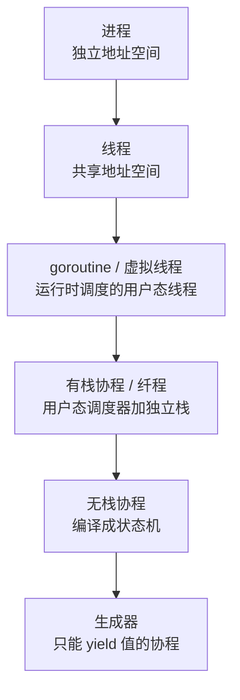
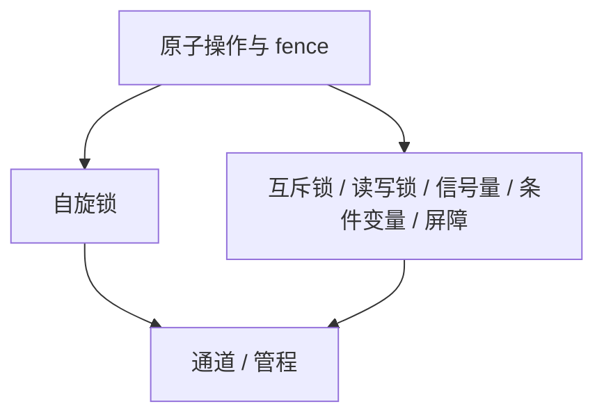

<!-- Fiber-纤程/有栈协程 Generator-生成器/受限协程 -->
<!-- Stackless Coroutine    Rust async/await、Python async、C++20 coroutines -->
<!-- Stackful Coroutine    Go goroutine、Erlang process、Lua coroutine -->

异步说的是一个线程怎样交错推进很多任务：进程、线程、协程、生成器切换时各保存什么，运行时怎样驱动 `Future`。原子说的是多核共享数据时怎样让读改写不被打断，以及锁、通道、无锁队列怎样建在原子之上。Rust、Zig、Go、Python、C++ 的写法逐项对照，Zig 代码以 `0.17.0-dev.224` 实测为准，RISC-V 指令取自 rustc 的实际编译结果。

<!-- more -->

## 四组容易混淆的概念

### 并发与并行

- 并发：一个核轮流跑多个任务，某一时刻只有一个在跑。
- 并行：多个核同时跑多个任务。

Rob Pike 的说法是 *Concurrency is about dealing with lots of things at once. Parallelism is about doing lots of things at once.* 并发讲怎么组织任务，并行讲怎么执行任务。协程和 async 解决的是并发：用很低的开销交错大量 I/O 任务。要并行，还得把任务分到多个系统线程上，例如 tokio 的多线程运行时、Go 的 `GOMAXPROCS`、rayon。

### 同步、异步与阻塞、非阻塞

这是两组互相独立的维度：

| | 阻塞：调用方原地等 | 非阻塞：立即返回 |
|:--:|:--:|:--:|
| 同步：调用方自己取结果 | 普通 `read()`，没数据就睡，就绪后被唤醒 | `read()` 加 `O_NONBLOCK`，没数据返回 `EAGAIN`，自己轮询 |
| 异步：完成后通知调用方 | 少见：提交请求后仍睡着等通知 | `io_uring`、回调、`await`：提交后去做别的，完成时由内核或运行时通知 |

阻塞与否看调用方要不要原地等；同步与异步看结果怎么交付，是自己去取，还是完成后通知。

### 抢占式与协作式调度

- 抢占式：调度器靠时钟中断把当前任务切走，任务自己不知道。系统线程属于这一类，Go 从 1.14 起也能用信号抢占 goroutine。一个任务死循环饿不死别人，但任务随时可能被打断，共享数据必须加锁。
- 协作式：任务自己让出（`yield`、`await`、`suspend`）才切换。Rust async、Python async、Lua coroutine 都属于这一类。让出点明确，单线程内不用加锁；但只要一个任务不让出，整个调度器就停在它身上。

### 协程为什么比线程轻

切换时保存的东西少，而且不进内核。线程切换要进内核、保存全部寄存器、经过调度器；切到另一个进程的线程还要换页表（RISC-V 的 `satp`）并刷 TLB。有栈协程只在用户态存十几个寄存器；无栈协程连寄存器都不存，只改状态机的当前状态。

---

## 从进程到生成器

能独立推进的执行流，按从重到轻排列：



| 载体 | 谁来切换 | 切换保存什么 | 栈 | 切换开销 | 代表 |
|:--:|:--:|:--:|:--:|:--:|:--:|
| 进程 | 内核 | 全部寄存器、页表、信号、fd 表 | 内核栈加用户栈 | 微秒级，含 TLB 刷新 | `fork` |
| 线程 | 内核 | 全部寄存器、信号掩码，页表共享 | 独立栈 | 微秒级，同进程内不刷 TLB | `pthread`、`std::thread`、`std.Thread` |
| goroutine / 虚拟线程 | 语言运行时 | 用户态寄存器 | 可增长的栈，Go 起始 2 KB | 百纳秒级 | Go goroutine、Java 虚拟线程 |
| 有栈协程 / 纤程 | 用户态调度器 | callee-saved 寄存器和 `sp` | 预先分配的栈 | 十到百纳秒 | corosensei、may、zigcoro、Lua、Erlang |
| 无栈协程 | 调用方 `poll` | 不存寄存器，状态在状态机里 | 没有独立栈，帧在堆上或父任务栈上 | 一次函数调用 | Rust、Python、C++20 的 async |
| 生成器 | 调用方 `next` | 同上 | 同上 | 一次函数调用 | Python `yield`、JS `function*`、Rust 协程 |

从上往下，切换从「内核换页表、刷 TLB」变成「改一个枚举值」。有栈协程的切换与内核切线程是同一套做法，存 `sp` 和寄存器，只是在用户态完成、不换页表。无栈协程不切栈，编译器把函数拆成几段，每次 `poll` 推进一段。

---

## 原子操作与内存模型

任务分到多个核上并行之后，共享数据要靠原子操作和内存序来保护。锁和无锁结构都建在这一层上。

### 为什么要原子

`x += 1` 在机器上是三步：读、改、写。两个核同时做，可能都读到旧值、各加一、各写回，结果只加了一次。原子操作由硬件保证这三步不被别的核插进来：要么整体完成，要么没发生。

单核也有同样的问题。任务刚改完还没写回，时间片到了，切到另一个任务；那个任务做完了自己的读改写，切回来后前一个任务又把过期的值写回去。所以单核上常见的做法是关中断，临界区结束前不切换任务。

### 原子类型与操作


<!-- tab Rust -->
```rust
use std::sync::atomic::{
    AtomicBool, AtomicI32, AtomicIsize, AtomicPtr, AtomicU64, AtomicUsize, Ordering,
};

let counter = AtomicUsize::new(0);
counter.store(42, Ordering::SeqCst);
let value = counter.load(Ordering::SeqCst);
let old = counter.swap(100, Ordering::SeqCst);    // 返回旧值
let old = counter.fetch_add(1, Ordering::SeqCst); // 返回旧值
let old = counter.fetch_sub(1, Ordering::SeqCst);

// CAS：当前值等于 100 才写入 7
let res = counter.compare_exchange(
    100,
    7,
    Ordering::SeqCst, // 成功时的内存序
    Ordering::SeqCst, // 失败时的内存序
); // Ok(旧值) 表示成功，Err(当前值) 表示失败
```
<!-- endtab -->
<!-- tab Zig -->
```zig
const std = @import("std");

var counter = std.atomic.Value(usize).init(0);
counter.store(42, .seq_cst);
const value = counter.load(.seq_cst);
const old = counter.swap(100, .seq_cst);
_ = counter.fetchAdd(1, .seq_cst);
_ = counter.fetchSub(1, .seq_cst);

// CAS：当前值等于 100 才写入 7；返回 null 表示成功，否则返回当前值
const res = counter.cmpxchgStrong(100, 7, .seq_cst, .seq_cst);
std.debug.print("{d} {d} {?d}\n", .{ value, old, res });
```
<!-- endtab -->



CAS 的返回值两边相反：Rust 的 `compare_exchange` 返回 `Result`，`Ok` 是成功；Zig 的 `cmpxchgStrong` 返回 `?T`，`null` 是成功。Rust 的 `Relaxed` 在 Zig 里叫 `.monotonic`，其余 `.acquire`、`.release`、`.acq_rel`、`.seq_cst` 同名。


| 操作 | Rust | Zig | C++ | Go |
|:--:|:--:|:--:|:--:|:--:|
| 类型 | `AtomicUsize` | `std.atomic.Value(usize)` | `std::atomic<size_t>` | `atomic.Uint64` |
| 读 | `.load(ord)` | `.load(ord)` | `.load(ord)` | `.Load()` |
| 写 | `.store(v, ord)` | `.store(v, ord)` | `.store(v, ord)` | `.Store(v)` |
| 原子加 | `.fetch_add(1, ord)` | `.fetchAdd(1, ord)` | `.fetch_add(1, ord)` | `.Add(1)` |
| CAS | `.compare_exchange(…)` | `.cmpxchgStrong(…)` | `.compare_exchange_strong(…)` | `.CompareAndSwap(…)` |

Go 的原子操作固定是顺序一致，不让选内存序；Rust、Zig、C++ 都要显式写内存序。

### 五种内存序

编译器和 CPU 都会重排指令。多核下，重排会让别的核看到不该看到的先后顺序。内存序是加在原子操作上的排序约束，编译器据此插入屏障，或者选用自带排序语义的指令。从弱到强：

```rust
// Relaxed：只保证这次操作本身不被打断、不撕裂，不约束与其他访存的先后
counter.fetch_add(1, Ordering::Relaxed); // 纯计数器，只要最终总数对

// Release：本线程在它之前的读写，不会被重排到它之后
data = 42;
ready.store(true, Ordering::Release);

// Acquire：本线程在它之后的读写，不会被重排到它之前
if ready.load(Ordering::Acquire) {
    println!("{}", data); // 读到 true 就一定能看到 42
}

// AcqRel：给 fetch_add 这类读改写用，读的一半按 Acquire，写的一半按 Release
let old = counter.fetch_add(1, Ordering::AcqRel);

// SeqCst：所有线程看到的全部 SeqCst 操作排成同一个全局顺序
counter.store(42, Ordering::SeqCst);
```

| 内存序 | 保证 | 用途 | 开销 |
|:--:|:--:|:--:|:--:|
| Relaxed | 只保证原子性 | 计数器 | 最低 |
| Release | 之前的读写不移到它之后 | 发布数据 | 低 |
| Acquire | 之后的读写不移到它之前 | 读取发布的数据 | 低 |
| AcqRel | 同时有 Release 和 Acquire | 读改写 | 中 |
| SeqCst | 全局单一顺序 | 拿不准时的默认选择 | 最高 |

### Release 与 Acquire 要成对

一个线程用 Release 写、另一个线程用 Acquire 读同一个原子变量，并且读到了这次写入的值，两者之间才建立 happens-before：写方在 Release 之前的写，读方在 Acquire 之后一定看得到。只有一边不起作用，这是无锁代码最常出错的地方。


<!-- tab Rust -->
```rust
// 线程 1：生产者
data = 42;
ready.store(true, Ordering::Release);

// 线程 2：消费者
if ready.load(Ordering::Acquire) {
    assert_eq!(data, 42); // 一定成立
}
```
<!-- endtab -->
<!-- tab Zig -->
```zig
var data: u32 = 0;
var ready = std.atomic.Value(bool).init(false);

// 线程 1：生产者
data = 42;
ready.store(true, .release);

// 线程 2：消费者
if (ready.load(.acquire)) {
    std.debug.assert(data == 42); // 一定成立
}
```
<!-- endtab -->


### RISC-V 的 A 扩展

RISC-V 用 A 扩展实现原子操作，A 由两个子扩展组成：

| 子扩展 | 内容 | 指令 |
|:--:|:--:|:--:|
| Zaamo | 原子内存操作 AMO | `amoswap`、`amoadd`、`amoand`、`amoor`、`amoxor`、`amomax[u]`、`amomin[u]`，各有 `.w`、`.d` 两种宽度 |
| Zalrsc | 保留读与条件写 | `lr.w`、`lr.d`、`sc.w`、`sc.d` |

AMO 一条指令做完一次固定的读改写，最快。LR/SC 能拼出 AMO 没有的操作，比如 CAS、带上限的自增、从无锁链表摘节点。后来的 Zacas 扩展另加了 `amocas`，CAS 也能一条指令完成。

以 `amoadd.d rd, rs2, (rs1)` 为例，硬件把读旧值、相加、写回、返回旧值做成一个不可分割的操作：

```
// amoadd.d rd, rs2, (rs1) 的语义
atomic {
    let tmp  = mem[rs1];       // 读旧值
    mem[rs1] = tmp + reg[rs2]; // 相加并写回
    reg[rd]  = tmp;            // 旧值放进 rd
}
```

实现上，执行 AMO 的核先通过缓存一致性协议拿到这个缓存行的独占权（MESI 的 M 或 E 态），在独占期间完成读改写，其他核对该行的请求要等它做完。

内存序落到指令上有两种形式：普通读写前后插 `fence`，读改写指令直接带 `.aq`、`.rl` 位。下表是 rustc 1.96 以 `-O` 编译到 `riscv64gc-unknown-none-elf` 的实际结果：

| Rust 操作 | Relaxed | SeqCst |
|:--:|:--:|:--:|
| `load` | `ld` | `fence rw,rw; ld; fence r,rw` |
| `store` | `sd` | `fence rw,w; sd; fence rw,rw` |
| `fetch_add` | `amoadd.d` | `amoadd.d.aqrl` |
| `swap` | `amoswap.d` | `amoswap.d.aqrl` |
| `compare_exchange` | `lr.d`、`sc.d` 循环 | `lr.d.aqrl`、`sc.d.rl` 循环 |
| `fetch_and` | `amoand.d` | `amoand.d.aqrl` |
| `fetch_or` | `amoor.d` | `amoor.d.aqrl` |

`.aq` 表示这条指令之后的访存不能提前到它前面，`.rl` 表示之前的访存不能推迟到它后面。读改写指令把内存序编码在自己身上，SeqCst 也不用另插 `fence`；普通的 `ld`、`sd` 没有这两位，只能靠前后的 `fence`。

LR/SC 让多个核安全地争抢同一个地址：

- LR：读出数据，同时让硬件登记对这个地址的保留。
- SC：保留还在才写入，写成功返回 0；否则不写、返回非零，软件跳回 LR 重试。

```asm
# 用 LR/SC 实现 CAS：*a0 等于 a1 时换成 a2
retry:
    lr.d   t0, (a0)       # 读 *a0 并登记保留
    bne    t0, a1, fail   # 当前值不等于期望值，放弃
    sc.d   t1, a2, (a0)   # 保留还在才写入；t1 为 0 表示成功
    bnez   t1, retry      # 期间被别的核改过，重试
fail:
```

每个 hart 有一组保留状态：

```
reg reservation_valid;
reg reservation_addr;

on LR(addr):                      // lr.d rd, (addr)
    reservation_valid = 1;
    reservation_addr  = addr;
    rd = mem[addr];

on SC(addr, val):                 // sc.d rd, val, (addr)
    if reservation_valid && reservation_addr == addr:
        mem[addr] = val;  rd = 0; // 成功
    else:
        rd = 1;                   // 失败
    reservation_valid = 0;        // 成败都清掉保留
```

保留会在这些情况下失效：别的 hart 写了被保留的地址；本 hart 执行了任意一条 SC（内核在上下文切换时会故意执行一条 SC 清掉保留）；规范还允许没有冲突时 SC 也失败。所以 LR/SC 一定要写成失败就重试的循环。规范同时保证，LR 与 SC 之间不超过 16 条基本整数指令、不含其他访存的循环最终一定能成功。这样硬件只需记一个地址，不用总线锁，多核扩展简单。

硬件内存模型决定默认重排有多激进，也就决定要插多少屏障：

| 架构 | 内存模型 | 允许的重排 |
|:--:|:--:|:--:|
| x86 / x86_64 | TSO | 只允许先写后读的重排 |
| ARMv8 / AArch64 | 弱序 | 多种重排 |
| RISC-V | RVWMO，2019 年批准 | 多种重排，与 ARM 接近 |

x86 上很多 Acquire、Release 不需要额外屏障；RISC-V 和 ARM 上同样的代码必须插屏障。同一份无锁代码在 x86 上跑对、搬到 ARM 或 RISC-V 就出错，原因就在这里。

---

## 同步原语

锁和通道拆到底，都是原子操作加一套等待与唤醒的办法。



### 自旋锁

一个原子标志位，抢不到就空转重试。适合很短的临界区，常见于内核和 RTOS；持有时间一长就白白耗 CPU。


<!-- tab Rust -->
```rust
use std::hint::spin_loop;
use std::sync::atomic::{AtomicBool, Ordering};

let lock = AtomicBool::new(false);
while lock.swap(true, Ordering::Acquire) { // 旧值是 true 说明别人持有
    spin_loop();                           // 提示 CPU 正在自旋
}
// 临界区
lock.store(false, Ordering::Release);
```
<!-- endtab -->
<!-- tab Zig -->
```zig
const std = @import("std");

var lock = std.atomic.Value(bool).init(false);
while (lock.swap(true, .acquire)) {
    std.atomic.spinLoopHint();
}
// 临界区
lock.store(false, .release);
```
<!-- endtab -->


### 互斥锁、读写锁、信号量、条件变量

这些锁抢不到就睡，让出 CPU，被唤醒后再抢。快路径是一次原子操作，慢路径在 Linux 上是 `futex`，在别的系统上是内核等待队列。

Rust 的 `std::sync::Mutex` 返回守卫，守卫离开作用域自动解锁；持锁线程 panic 后锁会被标记为中毒：

```rust
use std::sync::{Mutex, RwLock};

let m = Mutex::new(0);
{
    let mut g = m.lock().unwrap();
    *g += 1;
} // 守卫在这里释放，自动解锁

let rw = RwLock::new(0);
let _r = rw.read().unwrap(); // 多个读者可以同时持有
```

Zig 把同步原语放进了 `std.Io`：`Mutex`、`RwLock`、`Semaphore`、`Condition`、`Event`，`lock`、`unlock`、`wait` 都要传 `io`：

```zig
var m: std.Io.Mutex = .init;
var cond: std.Io.Condition = .init;

fn waitReady(io: std.Io) !void {
    try m.lock(io); // 等锁可被取消，所以返回错误联合
    defer m.unlock(io);
    try cond.wait(io, &m); // 解锁并睡眠，被唤醒后重新加锁
}
```

Rust 的锁靠守卫自动解锁，不需要额外参数。Zig 的锁要手动 `unlock`，通常配 `defer`；等锁时怎么等由传入的 `io` 决定，`std.Io.Threaded` 下是线程睡在 futex 上，事件循环实现下是让出当前任务。后文函数染色一节的 `io` 参数是同一个思路。

| 原语 | 作用 | Rust | Zig | C++ | Go |
|:--:|:--:|:--:|:--:|:--:|:--:|
| 自旋锁 | 忙等很短的临界区 | 手写原子或 `spin` crate | 手写原子加 `spinLoopHint` | 用 `atomic_flag` 手写 | 手写原子 |
| 互斥锁 | 睡着等独占 | `Mutex` | `std.Io.Mutex` | `std::mutex` | `sync.Mutex` |
| 读写锁 | 多读单写 | `RwLock` | `std.Io.RwLock` | `std::shared_mutex` | `sync.RWMutex` |
| 信号量 | 计数许可 | 标准库没有，用 tokio 等 | `std.Io.Semaphore` | `std::counting_semaphore` | 用带缓冲的 channel |
| 条件变量 | 等待与通知 | `Condvar` | `std.Io.Condition` | `std::condition_variable` | `sync.Cond` |
| 一次性初始化 | 只执行一次 | `OnceLock`、`Once` | 标准库没有，手写原子标志 | `std::call_once` | `sync.Once` |
| 屏障 | 等所有线程到齐 | `Barrier` | 标准库没有 | `std::barrier` | 标准库没有 |

### 共享内存与消息传递

- 共享内存加锁：多个线程访问同一块数据，靠锁保护。灵活，但容易写错。
- 消息传递：线程之间不碰对方的内存，值通过通道传递。Go、Erlang、Rust 的 mpsc 走这条路。

Go 的说法是 *Don't communicate by sharing memory; share memory by communicating.*


<!-- tab Rust -->
```rust
use std::sync::mpsc;

let (tx, rx) = mpsc::channel();
std::thread::spawn(move || tx.send(42).unwrap());
println!("{}", rx.recv().unwrap());
```
<!-- endtab -->
<!-- tab Go -->
```go
ch := make(chan int)
go func() { ch <- 42 }()
fmt.Println(<-ch)
```
<!-- endtab -->


Zig 语言本身没有通道，`std.Io.Queue(T)` 是标准库里的有界队列，用法接近通道；也可以像下一节那样手写无锁队列。

### 无锁数据结构

不加锁，靠原子操作保证总有线程能往前走。入门例子是单生产者单消费者的环形队列：生产者只改 `tail`，消费者只改 `head`，靠 Acquire 与 Release 配对保证对方看得到数据。

```zig
fn SpscQueue(comptime T: type, comptime CAP: usize) type {
    return struct {
        buf: [CAP]T = undefined,
        head: std.atomic.Value(usize) = .init(0),
        tail: std.atomic.Value(usize) = .init(0),

        pub fn push(self: *@This(), v: T) bool {
            const t = self.tail.load(.monotonic);
            const next = (t + 1) % CAP;
            if (next == self.head.load(.acquire)) return false; // 满
            self.buf[t] = v;
            self.tail.store(next, .release); // 先写数据，再发布 tail
            return true;
        }

        pub fn pop(self: *@This()) ?T {
            const h = self.head.load(.monotonic);
            if (h == self.tail.load(.acquire)) return null; // 空
            const v = self.buf[h];
            self.head.store((h + 1) % CAP, .release);
            return v;
        }
    };
}
```

无锁算法按进度保证分三级：wait-free 要求每个操作在有限步内完成；lock-free 要求总有一个线程在前进；obstruction-free 只要求没有竞争时能完成。常见的有 Michael-Scott 队列、Treiber 栈、Linux 的 RCU。无锁最难的是内存回收：别的线程可能还在读你想释放的节点，要靠 hazard pointer 或基于 epoch 的回收来处理。

### Send 与 Sync

C、C++、Zig、Go 靠程序员自己注意，再加 ThreadSanitizer、Go race detector 这类运行时工具找数据竞争。Rust 把这件事放到了编译期：

- `Send`：`T` 可以移动到别的线程。
- `Sync`：`&T` 可以被多个线程同时持有。

```rust
use std::rc::Rc;
use std::sync::Arc;

// Rc 的引用计数不是原子的，所以不是 Send，下面这行编译不过：
// std::thread::spawn(move || { let _x = Rc::new(1); });

std::thread::spawn(move || {
    let _x = Arc::new(1); // Arc 的引用计数是原子的
});
```

把线程不安全的类型交给 `thread::spawn`，编译器直接报错。数据竞争从运行时崩溃变成了编译错误，代价是类型系统更复杂。

---

## 函数染色

### 什么是函数染色

Bob Nystrom 在 2015 年的 *What Color is Your Function?* 里提出：语言引入 `async`/`await` 后，函数被分成普通函数和 async 函数两种颜色。async 函数只能在 async 函数里 `await`，普通函数调不了它。于是调用链底层只要有一个 async，往上整条链都得改成 async：

```python
async def fetch(): ...

async def process():      # 调了 fetch，只能也是 async
    data = await fetch()

async def main():         # 一直传到最顶层
    await process()

# 普通函数要调 fetch，得用 asyncio.run() 启动事件循环
```

Rust、JS、C#、Kotlin 都一样：底层一个 `async fn`，上面全得跟着改。

### 各语言的取舍

| 语言 | 异步方案 | 是否染色 |
|:--:|:--:|:--:|
| Python、JS、Rust、C#、C++20 | `async`/`await` 关键字 | 有，沿调用链传染 |
| Kotlin | `suspend` 函数，编译器隐式传 Continuation | 有，`suspend` 就是颜色 |
| Go | goroutine，阻塞时运行时自动挂起 | 无 |
| Java 虚拟线程，JDK 21 起 | 阻塞调用自动挂起 | 无 |
| Erlang | 进程加消息 | 无 |
| Zig 0.10 及以前 | stage1 编译器的 `async`、`await` | 有 |
| Zig 0.11 至 0.14 | 自举编译器没有实现 async，关键字保留但不能用 | 不可用 |
| Zig 0.15 起 | 删除 `async`、`await` 关键字，0.16 起异步经 `std.Io` 参数传入 | 设计上无 |

### 消除染色的两条路

第一条是绿色线程或虚拟线程，Go、Java、Erlang 走这条路。函数不分颜色，遇到阻塞调用时运行时自动挂起当前任务、去跑别的。代价是运行时要给每个任务一个可增长的栈，运行时较重。不染色是靠有栈协程加运行时调度换来的。

第二条是 Zig 的 `io` 参数。是否异步不写进函数类型，而是作为普通参数传入：

```zig
fn double(x: u32) u32 {
    return x * 2;
}

fn sum(io: std.Io) u32 {
    var a = io.async(double, .{20});
    var b = io.async(double, .{1});
    return a.await(io) + b.await(io);
}
```

`double` 是普通函数，没有颜色；`sum` 把它交给 `io.async`。`io.async` 只表示两次调用互不依赖，不保证并发：`std.Io.Threaded` 可以把它们放进线程池，单线程的实现可以当场依次执行；必须并发时用 `io.concurrent`。`std.Io.Mutex.lock(io)` 连加锁都收 `io`，是同一个思路。


Zig 没有消灭染色，只是把类型传染换成了参数传染，选哪种 `io` 实现时颜色才定下来。区别在于 `io` 是普通参数，函数类型不变：不需要异步的中间函数可以不收 `io`，后端也能在运行时更换。


### Rust 为什么接受染色

Rust 要零成本、不强制运行时，所以选了有颜色的 `async`/`await` 加 `Future`。async 函数编译成状态机，不需要 Go 那样给每个任务一个栈和一套重运行时，可以跑在 `#![no_std]` 的裸机上（如 embassy）。染色是 Rust 为零成本异步付出的代价，加上 `Send`、`Sync`，构成了 Rust 显式、可控但写起来繁琐的并发风格。

---

## 有栈协程与无栈协程

这不是写法风格的差别，而是实现机制不同，它决定了切换开销、能在哪里挂起、要不要染色。

### 区别

- 有栈协程，也叫纤程：每个协程有自己的栈。切换时保存当前的 `sp` 和 callee-saved 寄存器、恢复另一个协程的，与内核切线程几乎一样，只是在用户态、不换页表。整个栈都保留着，所以能在调用链任意深处直接 `yield`。代表：Go goroutine、Erlang 进程、Lua coroutine、Rust 的 corosensei 和 may、Zig 的 zigcoro。
- 无栈协程：没有自己的栈。编译器把 async 函数拆成状态机，跨挂起点存活的局部变量放进一个帧结构体，每次 `poll` 推进一段，只能在 `await` 处挂起。代表：Rust、Python、C++20、JS 的 async。

### 有栈协程的上下文切换

要保存 callee-saved 寄存器（`sp`、`s0` 到 `s11`），外加返回地址 `ra`：

```asm
# RISC-V：context_switch(old: *Context, new: *Context)
# sp、ra、s0..s11 共 14 个寄存器，112 字节，布局与后文实验的 TaskContext 相同
context_switch:
    sd sp,   0*8(a0)   # 保存当前协程
    sd ra,   1*8(a0)   # 恢复时从这里继续
    sd s0,   2*8(a0)
    # s1..s11
    sd s11, 13*8(a0)

    ld sp,   0*8(a1)   # 恢复下一个协程
    ld ra,   1*8(a1)
    ld s0,   2*8(a1)
    # s1..s11
    ld s11, 13*8(a1)
    ret                # 跳到新协程上次让出时保存的 ra
```

有栈协程与线程切换保存的寄存器数量差不多，省下的是进出内核和换页表。同一进程内切线程不换页表，但仍要进出内核、经过调度器；协程切换全在用户态完成，就是十几条读写指令加一条 `ret`。无栈协程连这些都不做，状态就在它自己的字段里。

corosensei、may、zigcoro 底层都是这样一段汇编，各平台一份：


<!-- tab Rust：corosensei -->
```rust
let mut co = Coroutine::new(|yielder, input: i32| {
    let x = yielder.suspend(input * 2); // 把 input*2 交给调用方，恢复时拿到新输入
    x + 1
});
co.resume(10); // Yield(20)
co.resume(99); // Return(100)
```
<!-- endtab -->
<!-- tab Zig：zigcoro -->
```zig
const libcoro = @import("libcoro");

fn worker() void {
    libcoro.xsuspend(); // 让出，切回调用方
}

fn run(stack: anytype) !void {
    const frame = try libcoro.xasync(worker, .{}, stack); // 立即开始运行，到 xsuspend 返回
    libcoro.xresume(frame);                              // 从 xsuspend 处继续，运行到结束
}
```
<!-- endtab -->


may 在有栈协程之上加了 M:N 调度：多个系统线程跑多个协程，任务窃取，用法接近 Go 的 `go`。

### 无栈协程

无栈协程不切栈，编译器把 async 函数翻译成状态机，每个 `await` 是一个状态。Rust 的抽象是 `Future`：

```rust
pub trait Future {
    type Output;
    fn poll(self: Pin<&mut Self>, cx: &mut Context<'_>) -> Poll<Self::Output>;
}

pub enum Poll<T> {
    Ready(T), // 对应有栈协程的 return
    Pending,  // 对应有栈协程的 yield
}
```

`async fn` 编译后大致是这样一个状态机：

```rust
// async fn f() { let a = step1().await; step2(a).await; }
enum F {
    Start,
    AwaitStep1(Step1Fut),
    AwaitStep2(Step2Fut),
    Done,
}
// 每次 poll 按当前状态推进一段，内层返回 Pending 就也返回 Pending
```

跨 `await` 存活的局部变量被搬进这个帧，帧放在堆上或父任务的栈上。帧里可能有指向自身的引用，所以 `poll` 的参数是 `Pin<&mut Self>`，用 `Pin` 禁止移动它。

Python 和 JS 也有 `async`/`await`，挂起时把函数帧保存在堆上；C++20 协程的帧由编译器生成，允许优化掉堆分配。Zig 现在没有 async 语法，无栈的写法是手写状态机；`io.async` 返回的 `Future` 怎么运行由 `Io` 实现决定，`Threaded` 用线程，事件循环实现用栈切换，都不是编译器生成的状态机。

### 两种协程对比

| 维度 | 有栈协程 | 无栈协程 |
|:--:|:--:|:--:|
| 独立栈 | 有，预先分配或可增长 | 无，帧在堆上或父栈上 |
| 切换保存 | `sp` 和 callee-saved 寄存器 | 只改状态机的当前值 |
| 切换开销 | 十到百纳秒 | 一次函数调用 |
| 挂起位置 | 调用链任意深处 | 只在 `await` 处 |
| 染色 | 无 | 有 |
| 栈溢出 | 要手动设栈大小 | 不存在 |
| 调用栈回溯 | 正常 | 被状态机切断 |
| 每任务内存 | 一个栈，KB 级 | 一个帧，按需，字节级 |

| | 有栈 | 无栈 |
|:--:|:--:|:--:|
| 语言内建 | Go goroutine、Erlang 进程、Lua coroutine | Rust、Python、C++20、JS、Kotlin `suspend` |
| 库 | Rust 的 corosensei、may，Zig 的 zigcoro | Rust 的 futures，Zig 的手写状态机、libxev |

有栈协程用每协程一个栈的内存，换来任意位置挂起和不染色；无栈协程接受染色和定点挂起，换来最省的内存和不依赖运行时。Go 选了有栈，写起来省心，运行时重；Rust 选了无栈，零成本、能上裸机，但有染色，写法更繁琐。

---

## 异步运行时

无栈 async 只是状态机，自己不会运行，需要一个运行时（执行器）反复 `poll` 它，并在 I/O 就绪时唤醒它。

### 为什么 async 需要运行时

`async fn` 返回的 `Future` 是一个还没开始运行的状态机。运行时做三件事：拿顶层 `Future` 循环 `poll`；`Future` 返回 `Pending` 时把它挂起，记下它在等什么；I/O 或定时器就绪时通过 `Waker` 唤醒对应的 `Future`，再次 `poll`。

```rust
let fut = async { 42 };      // 只是构造了一个 Future，什么都没执行
let v = smol::block_on(fut); // 交给运行时，在当前线程跑到完成
```

Rust 标准库只提供 `Future` trait，不带运行时，要自己选 tokio、smol 等。Go、Python、JS 的运行时是内建的：goroutine 调度器、asyncio 事件循环、浏览器事件循环。

### 就绪式与完成式 I/O

- 就绪式，如 epoll、kqueue：内核通知「fd 可读了」，程序再调 `read()`，内核把数据从内核缓冲区拷到用户缓冲区。tokio 走这条路。
- 完成式，如 io_uring、IOCP：程序提交读请求和缓冲区，内核异步执行，完成时通知「缓冲区已填好」。省掉了每次 `read` 的系统调用，配合注册缓冲区还能少拷贝。monoio 走这条路。

完成式的代价是所有权模型不同：内核处理期间缓冲区不能碰，调用方要把所有权交出去：

```rust
file.read(&mut buf).await?;                  // tokio：借用缓冲区即可
let (res, buf) = file.read_exact(buf).await; // monoio：缓冲区移进去，完成后再移回来
```

monoio 的签名是 `fn read<T: IoBufMut>(&mut self, buf: T) -> impl Future<Output = BufResult<usize, T>>`，其中 `BufResult<T, B> = (io::Result<T>, B)`。缓冲区按值传入，请求进行中由内部的 `Op` 结构体持有，它同时持有对 `SharedFd` 的强引用，防止 fd 在请求完成前被关闭；io_uring 完成后，缓冲区连同结果一起返还。

### Rust 运行时

| 运行时 | 线程模型 | I/O 后端 | 适合 |
|:--:|:--:|:--:|:--:|
| tokio | 多线程，任务窃取 | epoll、kqueue、IOCP | 服务端通用，生态最大 |
| monoio | 每核一个单线程运行时 | io_uring，旧内核退回 epoll | 低延迟 |
| async-std | 多线程 | async-io | 已于 2025 年停止维护，官方建议改用 smol |
| smol | 多线程 | async-io，底层 epoll、kqueue、IOCP | 由 async-executor、async-io 等小 crate 组成，适合读源码 |


<!-- tab tokio -->
```rust
#[tokio::main]
async fn main() {
    let h1 = tokio::spawn(async { 1u32 });
    let h2 = tokio::spawn(async { 2u32 });
    let (a, b) = tokio::join!(h1, h2); // 同时等两个任务
    let _ = (a, b);
    tokio::select! {                   // 等最先完成的那个
        v = async { 42u32 } => { let _ = v; }
        _ = tokio::time::sleep(std::time::Duration::from_millis(10)) => {}
    }
}
```
<!-- endtab -->
<!-- tab smol -->
```rust
fn main() {
    smol::block_on(async {
        let h = smol::spawn(async { 42u32 });
        assert_eq!(h.await, 42);
    });
}
```
<!-- endtab -->


### Zig 的并发

Zig 没有 tokio 那样的第三方运行时生态，并发靠下面几种方式：

| 方式 | 适用 | 来源 |
|:--:|:--:|:--:|
| 手写状态机 | 裸机，任何版本都能用 | 自己写 |
| `std.Thread` | CPU 密集 | 标准库 |
| `io.async`、`io.concurrent` | 0.16 起的标准做法，后端可换 | `std.Io` |
| libxev | 回调式事件循环，Linux 用 io_uring 或 epoll，macOS 用 kqueue | Mitchell Hashimoto 的社区库 |

```zig
const xev = @import("xev");

pub fn main() !void {
    var loop = try xev.Loop.init(.{});
    defer loop.deinit();

    const w = try xev.Timer.init();
    defer w.deinit();

    var c: xev.Completion = undefined;
    w.run(&loop, &c, 1000, void, null, &timerCallback); // 1000 毫秒后回调
    try loop.run(.until_done);
}

fn timerCallback(
    userdata: ?*void,
    loop: *xev.Loop,
    c: *xev.Completion,
    result: xev.Timer.RunError!void,
) xev.CallbackAction {
    _ = userdata;
    _ = loop;
    _ = c;
    _ = result catch unreachable;
    return .disarm;
}
```

libxev 的并发单位是 `Completion` 加回调，没有帧也没有栈，适合高并发 I/O，写起来不如 `async`/`await` 顺手。

### embassy

embassy 把 Rust 的 async 搬到无操作系统的 MCU 上：一个很小的执行器运行 `Future`，中断充当 `Waker` 唤醒任务。无栈协程不需要每个任务一个栈，每个任务只占它的状态机大小，正适合只有几十 KB RAM 的 MCU。

---

## 生成器

生成器只能把值单向 `yield` 给调用方，不能挂起去等别的任务。它也是无栈状态机，每个 `yield` 是一个状态，解决的是按需产出一串值。

### Python 与 JS


<!-- tab Python -->
```python
def fib():
    a, b = 0, 1
    while True:
        yield a
        a, b = b, a + b
```
<!-- endtab -->
<!-- tab JS -->
```javascript
function* fib() {
    let [a, b] = [0, 1];
    while (true) {
        yield a;
        [a, b] = [b, a + b];
    }
}
```
<!-- endtab -->


C# 的 `yield return`、Kotlin 的 `sequence { yield(x) }` 也是这样：写起来像循环，实际按需产出。

### Rust 的生成器

Rust 的协程（`Coroutine` trait 加 `yield`）和 `gen` 块都还在 nightly：

```rust
#![feature(coroutines, coroutine_trait, stmt_expr_attributes, gen_blocks)]
use std::ops::{Coroutine, CoroutineState};
use std::pin::Pin;

let mut g = #[coroutine] || {
    yield 1;
    yield 2;
    3
};
assert!(matches!(Pin::new(&mut g).resume(()), CoroutineState::Yielded(1)));

let v: Vec<u32> = gen { yield 1; yield 2; }.collect(); // gen 块直接得到迭代器
```

stable 上可以用 genawaiter。它借 async/await 模拟生成器：把 async 块当协程体，用一个共享单元 `Airlock` 在生成端和驱动端之间传值。源码里的关键部分：

```rust
// genawaiter/src/rc/engine.rs
pub struct Airlock<Y, R>(Rc<Cell<Next<Y, R>>>); // Next: Empty / Yield(Y) / Resume(R) / Completed

// genawaiter/src/core.rs
pub fn yield_(&mut self, value: A::Yield) -> impl Future<Output = A::Resume> + '_ {
    self.airlock.replace(Next::Yield(value));
    Barrier { airlock: &self.airlock }
}
```

`yield_` 把值写进 `Airlock`，返回一个只挂起一次的 `Barrier`。驱动方 `poll` 这个 async 块，执行到 `yield_` 时暂停，再从 `Airlock` 取出值。语言没有生成器，就用 async 的暂停能力实现了产出一个值。

itertools 是迭代器工具集，同样按需求值：

```rust
use itertools::Itertools;

let w: Vec<_> = (1..=5).tuple_windows::<(_, _)>().collect(); // [(1,2),(2,3),(3,4),(4,5)]
for chunk in &(0..100).chunks(10) {
    let _s: i32 = chunk.sum(); // 每 10 个一组
}
```

### Zig 的生成器

Zig 没有 `yield`，生成器就是一个带 `next()` 的结构体，状态全在字段里：

```zig
const FibGen = struct {
    a: u64 = 0,
    b: u64 = 1,

    pub fn next(self: *FibGen) u64 {
        const r = self.a;
        const nb = self.a + self.b;
        self.a = self.b;
        self.b = nb;
        return r;
    }
};

pub fn main() void {
    var fib = FibGen{};
    for (0..10) |_| std.debug.print("{d} ", .{fib.next()}); // 0 1 1 2 3 5 8 13 21 34
}
```

这就是无栈协程状态机最简单的形式。比 Python 啰嗦，但状态就是这几个字段，没有编译器隐藏的部分。

### 迭代器、生成器与协程

| | 方向 | 能力 |
|:--:|:--:|:--:|
| 迭代器 | 拉：调用方 `next` 取值 | 只产出值 |
| 生成器 | 推：`yield` 主动产出 | 产出值 |
| 协程 | 双向：`yield` 送出，`resume` 送入 | 产出并接收值 |

Rust 的 `Iterator` 是拉取式的；生成器是写迭代器的语法糖，手写 `Iterator::next` 很繁琐，有了 `yield` 就能像写循环一样写；完整的协程还能双向传值，例如 corosensei 的 `suspend(x)` 返回 `resume` 时传入的值。三者能力依次增加。

---

## oscamp 实验对照

`oscamp-base-experiment` 仓库里有三组练习与上面的内容对应：

| 练习 | 对应内容 | 验证什么 |
|:--:|:--:|:--:|
| `01_concurrency_sync` | 原子操作与同步原语 | 线程、`Arc<Mutex>`、mpsc、进程管道 |
| `04_context_switch` | 有栈协程 | RISC-V 上下文切换和绿色线程调度器 |
| `05_async_programming` | 无栈协程与运行时 | 手写 `Future`、`poll`、`Waker`，以及 tokio |

### RISC-V 上下文切换

这是能运行的 `switch_context`，只支持 riscv64。`TaskContext` 用 `#[repr(C)]` 固定布局，汇编里的偏移与字段一一对应：

```rust
#[repr(C)] // sp@0  ra@8  s0..s11@16..104
pub struct TaskContext {
    pub sp: u64,
    pub ra: u64,
    pub s0: u64,
    // s1..s10
    pub s11: u64,
}

impl TaskContext {
    pub fn init(&mut self, stack_top: usize, entry: usize) {
        self.sp = (stack_top & !0xF) as u64; // RISC-V ABI 要求栈 16 字节对齐
        self.ra = entry as u64;              // 第一次 ret 就跳到 entry
    }
}

#[unsafe(naked)] // 不让编译器生成函数序言和尾声
pub unsafe extern "C" fn switch_context(old: &mut TaskContext, new: &TaskContext) {
    std::arch::naked_asm!(
        "sd sp, 0(a0)", "sd ra, 8(a0)", "sd s0, 16(a0)", /* s1..s10 */ "sd s11, 104(a0)",
        "ld sp, 0(a1)", "ld ra, 8(a1)", "ld s0, 16(a1)", /* s1..s10 */ "ld s11, 104(a1)",
        "mv a0, zero", "mv a1, zero", // 不把指针参数带进新上下文
        "ret",                        // 跳到 new.ra
    )
}
```

保存 13 个 callee-saved 寄存器（`sp`、`s0` 到 `s11`）和作为恢复点的 `ra`，然后 `ret`，没有 `satp`，也没有 `sfence.vma`。`init` 把 `ra` 设成入口函数，所以第一次切到这个任务时，`ret` 直接跳进任务函数，协程就是这样启动的。在它上面加 Ready、Running、Finished 三种状态和一个调度循环，就是 `02_green_threads` 里的协作式绿色线程。

### 手写 Future

把运行时反复 `poll`、靠 `Waker` 唤醒这件事缩到最小，就是手写一个 `Future`：

```rust
use std::future::Future;
use std::pin::Pin;
use std::task::{Context, Poll};

pub struct CountDown {
    pub count: u32,
}

impl Future for CountDown {
    type Output = &'static str;

    fn poll(mut self: Pin<&mut Self>, cx: &mut Context<'_>) -> Poll<Self::Output> {
        if self.count == 0 {
            Poll::Ready("liftoff!")
        } else {
            self.count -= 1;
            cx.waker().wake_by_ref(); // 通知运行时再 poll 一次
            Poll::Pending
        }
    }
}
```

`count` 就是状态，每次 `poll` 推进一步。关键在 `cx.waker().wake_by_ref()`：没有它，运行时拿到 `Pending` 后就把任务挂起，不会再 `poll`。最小的只挂起一次的版本是 `YieldOnce`：第一次 `poll` 设标志、调 `wake` 并返回 `Pending`，第二次直接返回 `Ready`。

### 线程、锁、通道与进程

`01_concurrency_sync` 把前面的同步原语都跑了一遍：

```rust
let res = Arc::new(Mutex::new(0));
thread::scope(|s| {
    for _ in 0..n {
        let r = Arc::clone(&res);
        s.spawn(move || *r.lock().unwrap() += step);
    }
}); // scope 结束时等待所有线程
```

进程那一题能看出标准库 API 与系统调用的对应：`Command::spawn` 在 Linux 上走 `posix_spawn`，或 `fork` 加 `execve`；`Stdio::piped()` 对应 `pipe` 加 `dup2`；`drop(stdin)` 对应 `close`，子进程因此读到 EOF。

### 思考题

**Q1. `switch_context` 只保存 14 个寄存器，为什么不用保存 `a0` 到 `a7`、`t0` 到 `t6`？**


`switch_context` 是一次普通的函数调用。按 RISC-V ABI，caller-saved 寄存器（`a*`、`t*`）由调用方负责，调用前编译器已经把还要用的值存到栈上。切换只需保存 callee-saved 的 `sp` 和 `s0` 到 `s11` 共 13 个，再加 `ra`。`ra` 按 ABI 其实是 caller-saved，单独保存是因为它是协程的恢复地址，第一次 `ret` 靠它跳进入口函数。


**Q2. `CountDown` 每次 `poll` 都调 `wake_by_ref()`，删掉这行会怎样？**


任务永远不会完成。运行时拿到 `Pending` 后挂起任务，等 `Waker` 通知才再次 `poll`；不调 `wake` 就没人通知它。实际场景里 `wake` 由 I/O 就绪或定时器到期触发，这个练习在 `count` 没到 0 时自己调 `wake`，等于立即安排下一次 `poll`，也就是忙轮询。


**Q3. 同一个无锁 SPSC 队列，在 x86 上用 `Relaxed` 跑对了，搬到 RISC-V 就出错，为什么？**


x86 是 TSO，只允许先写后读的重排，`Relaxed` 恰好没暴露问题。RISC-V 是 RVWMO，读写都可能重排，`tail` 与 `buf` 之间不用 Acquire 与 Release 配对，消费者可能先看到 `tail` 更新、后看到数据写入。正确性要靠内存序保证，不能靠架构碰巧不重排。


**Q4. Zig 的 `std.Io.Mutex.lock(io)` 要传 `io`，Rust 的 `Mutex::lock()` 不用，差别在哪？**


Rust 的锁阻塞的是系统线程，等锁时线程睡在 futex 上，锁本身不关心运行时。Zig 把等锁交给 `io`：传入哪种实现，等锁时就是线程睡眠，或者让出当前异步任务。锁与调度器解耦，由调用方决定，代价是 `io` 要沿调用链一路传下去，好处是同一把锁能用在线程、协程和事件循环下。


---

## 内核与硬件中的异步

前面的异步都在用户态。还有一些工作把异步做进了内核结构，甚至做进硬件中断。

### 异步内核

Linux 等主流内核仍以线程为执行单位，异步主要留在用户态。近年的研究把 `Future` 或协程作为内核自身的执行单位，按异步进入内核的方式可以分成几类：

| 方式 | 代表 | 做法 |
|:--:|:--:|:--:|
| 异步 I/O 接口 | Linux io_uring | 用户态与内核共享提交队列和完成队列，内核本身仍以线程执行 |
| 系统调用写成 `async fn` | NoAxiom OS | 内核以无栈协程调度任务，系统调用处理函数是 `async fn` |
| 共享调度器 | TornadoOS | 调度器单独编译，加载到固定物理地址，内核与用户态共用 |
| 线程内核里用 `Future` 等待 | ArceOS 的 `axtask::future` | 调度单位仍是线程，阻塞等待写成 `Future`，由 `block_on` 在当前任务里驱动 |

TornadoOS 把调度器编译成独立的 `shared-scheduler.bin`，加载到固定物理地址，再通过一张 `SHARED_RAW_TABLE`（若干函数指针加调度器静态变量的地址）让内核态与用户态共用同一个协程调度器。`Future` 无论在内核还是用户态登记，都由它统一调度。

### 用户态中断

异步的另一半是完成后怎么通知。信号、epoll 唤醒都要经过内核。用户态中断允许一个用户态任务直接给另一个用户态任务发中断，不经过内核。Intel 从 Sapphire Rapids 起提供 uintr；RISC-V 曾有 N 扩展草案，后来从特权规范里移除；TAIC 是面向任务的中断控制器；rCore-N 在 rCore 上实现了 N 扩展的用户态中断。

典型用途是异步 IPC：客户端向服务端请求服务，内核分配一块双方共享的 IPC 缓冲区。同步方式下客户端轮询等结果；异步方式下客户端注册一个用户态中断处理函数，服务端处理完直接发用户态中断通知它，不需要内核参与。

### 可抢占的 async：embassy_preempt

大多数协程是协作式的，任务不让出，调度器就停在它身上。embassy_preempt 在 embassy 上加入 uC/OS-II 式的抢占，async 任务也能被时钟中断切走，兼顾 async 的省内存和抢占式的实时性。
