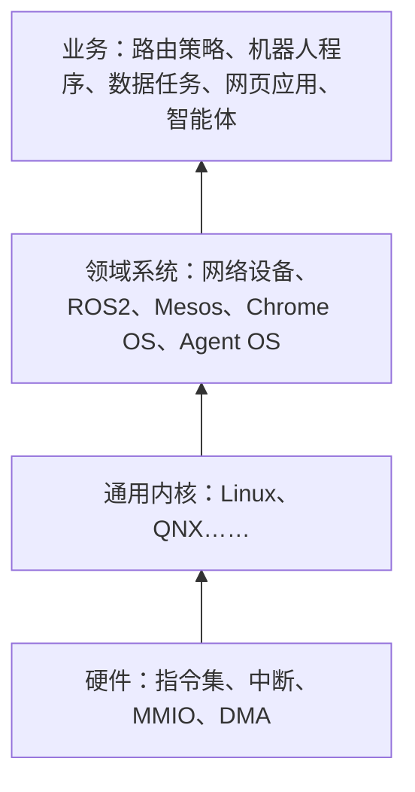

操作系统的本职是管资源、分资源。换一个领域，被管的资源就换了：网络设备管端口和转发表，机器人管传感器和执行器，数据中心管整个机房的 CPU 与内存，智能体系统管模型调用与上下文。各领域的系统坐在什么之上、往上给什么接口，决定了它的样子。

<!-- more -->

## 分层

## 硬件与软件

硬件给出的是指令集、中断、内存映射寄存器和 DMA。软件从固件、内核往上，一层层把这些包装成更好用的东西：进程、文件、套接字。分界线以上的每一层做的都是同一件事：把下层的资源分成份、彼此隔离，再分给上层。

## 网络设备

路由器和交换机管的是端口、带宽和转发表。结构上分两个平面：控制平面跑在通用 CPU 上，算路由（OSPF、BGP）；数据平面在交换芯片里，按表转发，包不经过 CPU。系统的主要工作是把控制平面算出的结果写进芯片的表。

| 系统 | 厂商 | 用在哪 | 说明 |
|:--:|:--:|:--:|:--:|
| IOS（Internetwork Operating System） | Cisco | 路由器、交换机 | 早期直接跑在硬件上；IOS XE 改为 Linux 内核上的一个进程 IOSd，命令行不变 |
| CatOS（Catalyst Operating System） | Cisco | 早年的 Catalyst 交换机 | 后被 IOS 取代 |
| NX-OS | Cisco | Nexus 数据中心交换机 | 基于 Linux |
| VRP（Versatile Routing Platform） | 华为 | 路由器、交换机 | 控制、业务、转发分平面 |

往上的接口：命令行、SNMP，以及 NETCONF/YANG、gNMI 这类可编程接口。

## ROS2

机器人操作系统（Robot Operating System）的第二代。名字叫 OS，实际是跑在 Linux 等通用系统上的中间件。基本单位是节点：节点之间用话题（topic）发布订阅，用服务（service）请求应答，用动作（action）做带进度反馈的长任务。通信经 rmw 抽象层落到 DDS 等实现上，节点可以分布在多台机器上，每条话题可以单独设服务质量（可靠还是尽力而为、保留几条历史）。往下用宿主系统的进程、网络与驱动，往上给节点、话题与 launch 文件。

## Apache Mesos

数据中心的操作系统，把整个机房当一台机器用。每台机器上的 agent 报告空闲的 CPU 与内存，master 把这些资源以「邀约」（offer）发给框架（Spark、Marathon 等），框架决定接不接、在上面跑什么。这叫两级调度：Mesos 只管分，框架自己排。任务跑在容器里，靠 Linux 的 cgroups 隔离。Kubernetes 走的是另一条路：一个调度器统一排。

## Chrome OS

以浏览器为中心：Linux 内核加 Chrome 浏览器当桌面，应用以网页应用为主。资源隔离大多在浏览器里做：每个标签页一个渲染进程，各自关在沙箱里。要跑普通 Linux 程序时，在虚拟机里起一个 Linux 容器（Crostini）。

## AI OS

管的资源换成了模型调用、上下文窗口和外部工具。[AIOS](https://arxiv.org/abs/2403.16971) 把这些从智能体应用里拿出来，放进一个内核统一调度：每个模型实例当作一个「核心」，调度器用 FIFO 或 RR 分派多个智能体的请求；上下文管理器做快照与恢复，推理到一半也能切换任务；记忆和存储分别管运行时数据与持久化数据；工具管理器负责加载工具和检查权限。智能体通过系统调用申请这些资源，往上给一套 SDK。模型相当于 CPU，上下文相当于内存，工具相当于外设。

## Agent OS

### 智能体侧

需求分两类：功能上要管生命周期、内存、工具、编排、可观测性、安全和治理；非功能上要可靠、可扩展、能互操作、满足实时性。结构一般分五层：内核层、服务层、智能体运行时层、编排层、用户层，安全、治理和可观测性贯穿各层。

实现有三种思路：

- 按意图授权（AgenticOS）：智能体不直接申请底层资源，而是提交结构化的意图声明，系统据此生成一个权限最小的运行环境。四层结构是 Ghost Kernel、Logic Shutter、Agent Capsule、Semantic Boundary Gateway。见 [arXiv:2606.21129](https://arxiv.org/abs/2606.21129)。
- 以安全为先的内核（AgentKernel）：把安全作为首要的设计约束，而不是应用层的中间件。分 Identity、Perception、Cognition、Execution 四部分，把传统操作系统的安全原则用到智能体特有的问题上：委托滥用、提示注入、记忆投毒、工具误用。见 [arXiv:2609.29647](https://arxiv.org/abs/2609.29647)。
- 集成控制平面（AOS）：不替换整个操作系统，而是把智能体的控制平面集成进 Linux 或 Windows。分两个平面：控制与治理平面（意图、策略、信任、权限、置信度、审计、可观测性、人工监督）和运行时与协调平面（生命周期、工作流协调、模型与工具路由、上下文与内存协调、调度、流量管理、运行时保障）。见 [arXiv:2606.01508](https://arxiv.org/abs/2606.01508)、[arXiv:2608.03214](https://arxiv.org/abs/2608.03214)。

### 机器人侧

目标是让机器人从被遥控的执行器，变成能理解、规划、记忆、失败后重新规划的具身智能体；开发方式也从手写代码，转向由 AI 编程智能体完成。

## 上下层靠什么衔接

| 层 | 往下用 | 往上给 |
|:--:|:--:|:--:|
| 通用内核 | 指令集、中断、MMIO、DMA | 系统调用、文件、套接字 |
| 网络设备系统 | 交换芯片的 SDK、内核驱动 | 命令行、SNMP、NETCONF、gNMI |
| ROS2 | 宿主系统的进程、网络、DDS | 节点、话题、服务、动作 |
| Mesos | 每台机器的内核与 cgroups | 资源邀约、框架 API |
| Chrome OS | Linux 内核、虚拟机 | Web 平台 API |
| Agent OS | 模型推理服务、工具接口 | 智能体 SDK |
