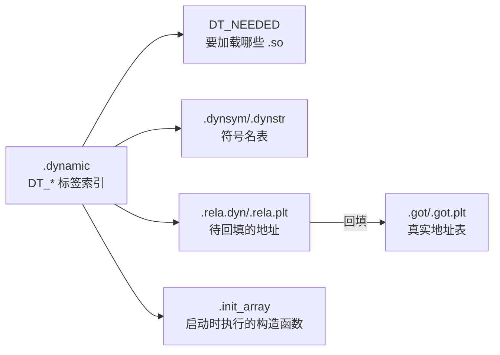
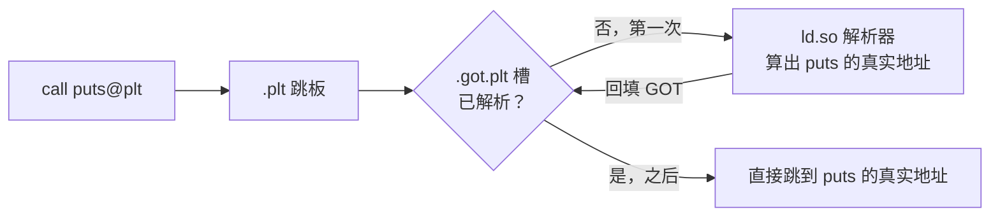
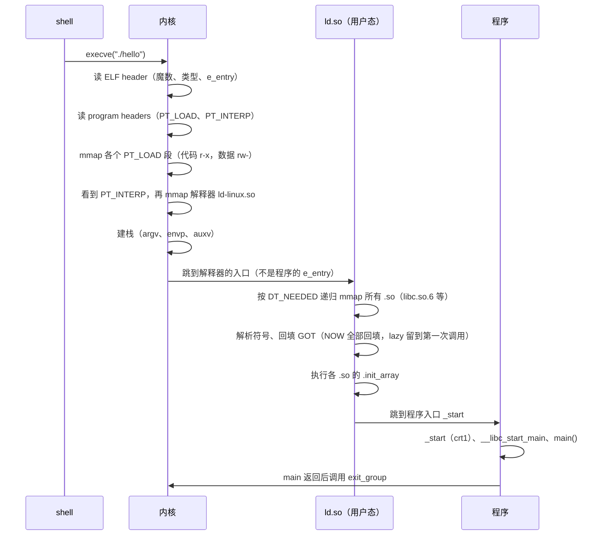
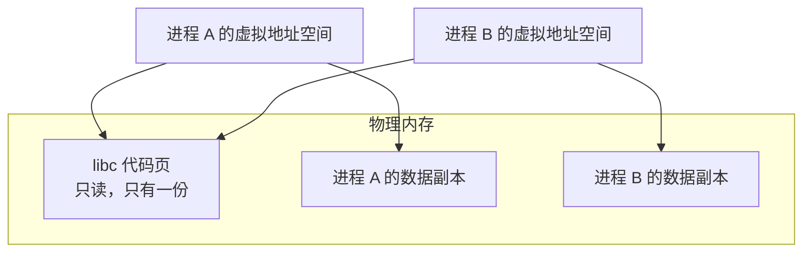
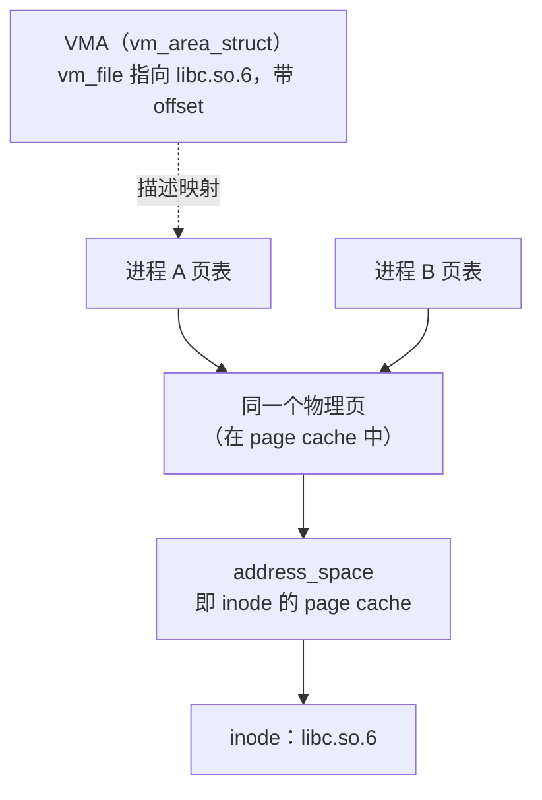

> ELF 格式的 `vmlinux`、能被 UEFI 当作 PE 加载的 `Image`、`.ko` 内核模块，这些文件怎样从源码生成，又怎样组合起来运行。以 Linux/ELF 为主，对照 Windows。

<!-- more -->

## 从 `hello.c` 到可执行文件

```mermaid
graph LR
    C["hello.c"] -->|预处理 cpp| I["hello.i"]
    I -->|编译 cc1| S["hello.s 汇编文本"]
    S -->|汇编 as| O[".o 目标文件"]
    O -->|链接 ld| E["可执行 ELF"]
    A[".a / 库.o"] -. 静态链接，复制进来 .-> E
    SO[".so 动态库"] -. 运行时由 ld.so 加载 .-> E
%% hello.c ─cpp→ hello.i ─cc1→ hello.s ─as→ hello.o ─ld→ 可执行 ELF
%%                                    .a ────静态链接───────↗
%%                                    .so ───运行时 ld.so 加载↗
```

编译把源码变成机器码，链接把多个目标文件和库组合成一个完整的程序。

---

## 编译的四个阶段

| 阶段 | 工具 | 输入与输出 | 做什么 |
|:--:|:--:|:--:|:--:|
| 预处理 | `cpp` | `.c` 到 `.i` | 展开宏、内联 `#include`、去掉注释 |
| 编译 | `cc1` | `.i` 到 `.s` | C 变成**汇编文本** |
| 汇编 | `as` | `.s` 到 `.o` | 汇编变成**机器码目标文件**（ELF relocatable） |
| 链接 | `ld` | `.o`（加库）到可执行文件 | 解析符号、按链接脚本分配地址、回填重定位 |

```bash
gcc -E hello.c -o hello.i     # 只预处理，看宏展开后的结果
gcc -S hello.c -o hello.s     # 停在汇编（.s 是文本，可以阅读）
gcc -c hello.c -o hello.o     # 停在目标文件（.o）
gcc    hello.c -o hello       # 一直到可执行文件
```

- 编译生成的是汇编文本 `.s`，由汇编器 `as` 再把它变成 `.o` 机器码，这是两步（用 `gcc -S` 和 `gcc -c` 可以分别看到）。
- 链接做两件事：一是为各个 `.o` 中未定义的符号（如 `puts`）找到定义；二是按链接脚本给各段分配最终地址（哪些进代码区、哪些进数据区，嵌入式中还要指定 flash 和 ram 的地址）。
- 再用 `objcopy -O binary` 去掉 ELF 中多余的段和符号，就得到裸二进制（PC 依次递增即可执行），裸二进制的 `Image` 就是这样得到的。

### `-c` 与完整编译的区别在于链接

两条命令的产物对比：

```text
gcc -c hello.c -o hello.o   →  hello.o    1488 字节   nm: T main / U puts        (没有 _start)
gcc    hello.c -o hello     →  hello     15960 字节   nm: T _start / T main / U __libc_start_main
```

- **`gcc -c` 只编译不链接**：执行完预处理、编译、汇编就停止，生成 `.o`。其中只有自己写的 `main`，`puts` 还未定义，没有入口 `_start`，没有启动代码，也没有 libc，所以不能运行。
- **`gcc hello.c -o hello`（不带 `-c`）包括链接在内的全部四个阶段**。链接（gcc 实际调用 `collect2`，再调用 `ld`）会加入：
  - **crt 启动文件**：`crt1.o`（包含真正的入口 `_start`；默认生成 PIE 时换成 `Scrt1.o`）、`crti.o`/`crtn.o`（init/fini 的框架）、`crtbeginS.o`/`crtendS.o`（gcc 自带）
  - **libc**（默认隐含 `-lc`，提供 `puts`）
  - ELF program header、`PT_INTERP`、`.plt`/`.got` 等运行时需要的结构

所以文件从 1488 字节变成 15960 字节，多出来的都是启动代码和运行时结构；符号表里除了 `main`，还多了 `_start` 和 `__libc_start_main`。启动顺序是：`_start`（crt1）、`__libc_start_main`、`main`。

```bash
gcc hello.c -o hello -v     # 查看 gcc 实际调用了哪些子程序
```

实际输出（只截取关键的两行，省略了路径）：

```text
cc1 ... hello.c ... -o /tmp/cc*.s                                      ← 编译器，生成汇编
collect2 ... Scrt1.o crti.o crtbeginS.o hello.o -lc crtendS.o crtn.o   ← 链接器，组合 crt 启动文件、hello.o 和 libc
```

第二行显示了链接做的事：把 crt 启动文件（`Scrt1.o`、`crti.o`、`crtbeginS.o`、`crtendS.o`、`crtn.o`）、`hello.o` 和 libc（`-lc`）组合成一个完整的可执行文件。也可以手动分两步：

```bash
gcc -c hello.c -o hello.o   # 只编译，得到 .o
gcc    hello.o -o hello     # 只链接，加上启动文件和 libc
```

#### `crt1.o` 与 `Scrt1.o`

这些 crt（C RunTime）启动文件做的事相同：提供入口 `_start`，准备好环境后调用 `__libc_start_main(main, …)`。区别在于用于哪种可执行文件：

| 文件 | 用于 |
|:--:|:--:|
| `crt1.o` | 非 PIE 的可执行文件（ET_EXEC） |
| `Scrt1.o` | **PIE** 可执行文件（ET_DYN，现在的默认） |
| `rcrt1.o` | static-PIE |
| `gcrt1.o` / `Mcrt1.o` | 性能分析（`gcc -pg`） |
| `crti.o` / `crtn.o` | `.init`/`.fini` 的开头和结尾（都会用到） |

- **后缀 `S` 表示 Shared，即位置无关的版本**（用于 PIE 和共享库），`crtbeginS.o`、`crtendS.o` 中的 `S` 也是这个意思。
- 本质区别：过去 `crt1.o` 用**绝对地址**引用 `main`（只能在固定基址加载），`Scrt1.o` 通过 **GOT** 间接引用（适应 PIE 的 ASLR 随机基址）。
- 是否已经相同取决于架构：在 **x86-64** 上，两者对 `main` 的重定位**已经相同**（都通过 GOT，即 `R_X86_64_REX_GOTPCRELX`）；在 **RISC-V** 上**仍然不同**，`crt1.o` 用 `R_RISCV_PCREL_HI20`（PC 相对，直接引用），`Scrt1.o` 用 `R_RISCV_GOT_HI20`（通过 GOT 间接引用，适应 PIE）。保留两个文件，是为了让链接器按 `-pie` 或 `-no-pie` 自动选择。

> **Windows 中的对应**：`cl /P`（预处理）、`cl /FA`（输出汇编）、`cl /c`（输出 `.obj`）、`link`（链接成 `.exe`）。

---

## 文件类型

| 角色 | Linux | Windows | 说明 |
|:--:|:--:|:--:|:--:|
| 目标文件 | `.o` | `.obj` | 单个源文件编译后的**可重定位**机器码（带符号表和重定位信息） |
| 静态库 | `.a` | `.lib` | 多个 `.o` 的**打包**（`ar`/`lib.exe`），链接时**复制进**可执行文件 |
| 动态库 | `.so` | `.dll` | 运行时才加载、**多个程序共享**的库 |
| 导入库 | 没有对应的文件 | `.lib`（import lib） | Windows 特有：链接 `.dll` 时先链接这个**桩**，真正的代码在 `.dll` 里 |
| 可执行文件 | ELF（没有后缀） | `.exe` | 能直接运行的完整程序（ELF 即 Executable and Linkable Format；Windows 用 PE，即 Portable Executable） |
| 内核模块 | `.ko` | `.sys` | 特殊的目标文件，用 `insmod` 链接进**内核地址空间**（不经过 ld.so，不包含 libc，直接调用内核 API） |

- `.a` 用 `ar rcs libfoo.a a.o b.o` 生成，就是 `.o` 的归档。
- `.so` 用 `gcc -shared -fPIC foo.c -o libfoo.so` 生成（`-fPIC` 表示生成位置无关代码）。
- Windows 的 `.lib` 有**两种用途**：静态库（包含代码），或者某个 `.dll` 的**导入库**（只有跳转桩），名字相同，要看用途。

---

## `.o` 为什么不能直接运行

`.o` 是**可重定位目标文件（relocatable）**，有未定义的外部符号，没有入口，段也没有按执行时的布局排列：

```text
gcc -c hello.c -o hello.o ;  nm hello.o
0000000000000000 T main      ← 已定义（代码在本文件）
                 U puts      ← 未定义（链接时到别处查找）
```

两点说明：

1. `T main` 表示本文件**定义**了 `main`；`U puts` 表示**未定义**，链接时才到 libc 里查找。`.o` 不能运行的根本原因是它的 ELF 类型是 `ET_REL`（可重定位），**内核直接拒绝执行**（`chmod +x x.o; ./x.o` 会报 `cannot execute binary file: Exec format error`），它没有入口 `_start`，也没有 `PT_LOAD`/`PT_INTERP`。`U puts` 是另一个问题：还要**链接**才能补上外部符号。所以关键是链接（编译阶段），不是缺动态库（即使全部静态链接，也要先链接）。
2. 源码写的是 `printf("hi\n")`，`nm` 却显示缺 `puts`：编译器把「常量字符串、以换行结尾、没有格式参数」的 printf 优化成了 puts（开销更小）。写的函数不一定是最终调用的函数，这是编译器优化的一个典型例子。

---

## 静态链接与动态链接

同一个 `hello.c` 用两种方式链接，结果差别很大：

```text
gcc hello.c -o hello_dyn          # 动态（默认）
gcc hello.c -static -o hello_sta  # 静态

ls -l :   hello_dyn  15960 字节   |  hello_sta  785360 字节   ← 相差约 49 倍
size  :   text 1365             |  text 668337            ← 整个 glibc 都放进来了
file  :   ...dynamically linked, interpreter /lib64/ld-linux-x86-64.so.2
          ...statically linked
ldd hello_dyn :  linux-vdso.so.1 / libc.so.6 / ld-linux-x86-64.so.2
ldd hello_sta :  not a dynamic executable
```

| | 静态（`.a`，复制进来） | 动态（`.so`，共享） |
|:--:|:--:|:--:|
| 体积 | 大（每个程序各有一份） | 小（只保留符号引用和桩） |
| 运行依赖 | 没有，单个文件就能运行 | 需要 `.so` 文件和 `ld.so` |
| 内存 | 每个进程各占一份库 | 多个进程**共享**同一份库的页 |
| 修复漏洞 | 必须**重新编译、链接**每个程序 | **替换一个 `.so`** 即可全部生效 |
| 启动 | 快（没有运行时链接） | 稍慢（`ld.so` 要解析） |

> 例如安全软件推送补丁，替换一个有漏洞的 DLL，所有使用它的程序就一起修复了，这是动态库的优势；静态链接的程序要修复同一个漏洞，必须逐个重新编译。

---

## ELF 文件结构

ELF 有两种视角：

- **Section（节）是链接时的视角**：`.text`、`.data` 等，给链接器和调试器使用。
- **Segment（段，program header）是执行时的视角**：把若干 section 归成 `PT_LOAD` 等，给**内核 mmap** 使用。

常见的 section：

| section | 内容 | 说明 |
|:--:|:--:|:--:|
| `.text` | 代码 | r-x |
| `.rodata` | 只读数据、常量字符串 | r-- |
| `.data` | 已初始化的全局变量 | rw- |
| `.bss` | 未初始化的全局变量 | **不占文件空间**，加载时清零 |
| `.symtab`/`.strtab` | 符号表 | 可以用 `strip` 去掉 |
| `.dynsym`/`.dynstr` | 动态符号表 | 动态链接使用 |
| `.rela.dyn`/`.rela.plt` | 重定位表 | 链接或加载时回填地址 |
| `.plt`/`.got`/`.got.plt` | **跳转表**（见「跳转表与动态链接」） | 动态调用的关键 |
| `.init_array`/`.fini_array` | 构造和析构函数的指针 | C++ 全局对象、`__attribute__((constructor))` |
| `.interp` | 解释器路径 | 只有动态可执行文件才有 |
| `.dynamic` | 动态段（NEEDED 等） | `ld.so` 的索引 |

```bash
readelf -h hello_dyn    # ELF 头（类型、入口、架构）
readelf -S hello_dyn    # 所有 section
readelf -l hello_dyn    # program header（segment）以及 section 到 segment 的对应
readelf -d hello_dyn    # 动态段（需要哪些库）
```

关键输出（`hello_dyn`）：

```text
readelf -h →  Type: DYN (Position-Independent Executable)   Entry: 0x1060
readelf -d →  (NEEDED) libc.so.6   (FLAGS) BIND_NOW   (FLAGS_1) NOW PIE
readelf -l →  INTERP → /lib64/ld-linux-x86-64.so.2 ; 两个 LOAD 段（代码 r-x，数据 rw-）
```

### 动态链接用到的 section

上表中的 `.dynsym`、`.rela.*`、`.got`、`.dynamic` 是动态链接的核心，相互关联：



- **`.dynamic` 是索引**。它是一串 `DT_*` 标签，`ld.so` 最先读取它：`DT_NEEDED`（需要哪些 `.so`）、`DT_SYMTAB`/`DT_STRTAB`（符号表在哪里）、`DT_RELA`/`DT_JMPREL`（重定位表在哪里）、`DT_INIT_ARRAY`、`DT_RUNPATH`、`DT_SONAME`、`DT_FLAGS`（如 `BIND_NOW`）。`readelf -d` 显示的就是它。
- **`.dynsym` 和 `.dynstr` 是动态符号表和名字字符串**。`.dynsym` 是动态链接**必须保留**的符号子集（导出的符号和未定义的符号，如 `puts`），`.dynstr` 存放它们的名字。它不同于 `.symtab`（完整的符号表，给链接器和调试器使用，可以 `strip` 掉），`.dynsym` **不能 strip**，`ld.so` 运行时靠它识别符号。每条记录包括名字、地址、类型（FUNC/OBJECT）、绑定（GLOBAL/WEAK）、所属段（`UND` 表示未定义，要到别的 `.so` 中查找）。
- **`.rela.dyn` 和 `.rela.plt` 是重定位表**。每一条表示「把这个位置按这个规则填上某个符号的真实地址」。`.rela.dyn` 是数据类（全局变量、GOT 中的数据项，加载时**立即**回填）；`.rela.plt` 是函数类（PLT 的 `JUMP_SLOT`，惰性绑定时留到第一次调用，`NOW` 时立即回填）。常见的类型：`R_X86_64_RELATIVE`（PIE 引用自身，等于基址加 addend）、`GLOB_DAT`（全局变量）、`JUMP_SLOT`（函数）。用 `readelf -r` 查看。
- **`.plt`、`.got`、`.got.plt` 是跳转表**（见「跳转表与动态链接」）。`.got` 是真实地址表（可写），`.plt` 是跳板代码（可执行）；上面的重定位就是向 `.got`/`.got.plt` 中**回填**地址。
- **`.init_array` 和 `.fini_array` 是构造和析构函数的指针数组**。`.init_array` 中的函数在 `main` **之前**执行（C++ 全局对象的构造、`__attribute__((constructor))`、libc 的初始化），`.fini_array` 在 `main` **之后**执行。每个 `.so` 加载完成后，`ld.so` 也会执行它的 `.init_array`。（旧的方式是 `.init`/`.fini` 段中的 `_init`/`_fini`，由 `crti.o`/`crtn.o` 提供开头和结尾。）
- **`.interp` 是解释器路径**，就是字符串 `/lib64/ld-linux-x86-64.so.2`。内核读取指向它的 `PT_INTERP`，然后加载这个解释器。**只有动态可执行文件才有**。`readelf -p .interp hello_dyn` 可以直接打印。

`ld.so` 的处理顺序是：读取 `.dynamic`，按 `DT_NEEDED` 加载 `.so`，用 `.dynsym`/`.dynstr` 识别符号，按 `.rela.*` 把地址**回填到 `.got`/`.got.plt`**，执行 `.init_array`，然后交给 `main`。

ELF 有三种类型：`ET_REL`（`.o`）、`ET_EXEC`（传统的可执行文件）、`ET_DYN`（`.so` **和 PIE 可执行文件**）。

> **PIE（Position-Independent Executable，位置无关可执行文件）是放在任意地址都能运行的程序。**
> - 原因：传统的可执行文件（`ET_EXEC`）被链接到固定地址（传统上是 `0x400000`），地址固定，攻击者总能知道代码在哪里。
> - **ASLR**（地址空间随机化）：每次运行时把程序加载到**随机的基址**，攻击者无法预知。但要随机化主程序，主程序就必须位置无关。
> - **PIE** 把可执行文件也编译成位置无关代码（像共享库一样用 RIP 相对或 GOT 间接寻址；RIP 是 x86-64 的指令指针寄存器，地址相对当前指令计算，而不是写成固定的绝对地址），加载器就能把它放到随机位置，ASLR 才能生效。
> - **PIC 与 PIE**：`PIC`（Position-Independent **Code**）是**代码的属性**（可以在任意地址执行）；`PIE`（Position-Independent **Executable**）是**可执行文件的属性**（用 PIC 代码做成、可以被内核随机放置的程序）。
> - **识别方法**：PIE 的 ELF 类型是 **`ET_DYN`（与 `.so` 相同）**，所以上面 `file` 显示 `hello_dyn` 是 pie executable。现在的 gcc 默认 `-pie`，用 `gcc -no-pie` 关掉后就是传统的 `ET_EXEC`。代价是运行时有少量开销。
>
> **Windows**：可执行文件和库都是 **PE/COFF** 格式（`.exe`、`.dll`），对应 ELF 的角色；用 `dumpbin /headers`、`dumpbin /imports` 查看。

---

## 跳转表与动态链接

跳转表所在的 section：

```text
readelf -S hello_dyn:
  .plt      0x1020   ← PLT 跳板，在代码段（可执行、只读），紧挨在 .text（0x1060）之前
  .got      0x3fb8   ← GOT 地址表，在数据段（可写），高地址
  .rela.plt 0x0610   ← PLT 使用的重定位（JUMP_SLOT）
```

- **`.plt`**（Procedure Linkage Table）是一组**跳板代码**，放在可执行段。
- **`.got`/`.got.plt`**（Global Offset Table）是一张**真实地址表**，放在可写的数据段。

传统的惰性绑定（lazy binding）：



第一次 `call puts` 时经过 PLT、GOT、`ld.so` 解析，再**回填 GOT 槽**；之后再调用就直接跳到真实地址。

> **为什么要通过 GOT 间接跳转**：PIE 和共享库是**位置无关**的，代码段只读，不能把地址写死在指令里；所以把会变化的地址集中放在**可写的 GOT** 中，代码只引用 GOT 槽（偏移固定）。

现在的加固方式是立即绑定加 RELRO（RELocation Read-Only）。`readelf -d hello_dyn` 的 `DT_FLAGS` 显示 `BIND_NOW` 和 `NOW PIE`：这个程序**不做惰性绑定**，而是在加载时一次解析完所有外部符号，再把 GOT 所在的段设为**只读**（防止改写 GOT 的攻击）。这是安全与启动速度之间的取舍，Ubuntu 和 Debian 默认打开。

### 用 RISC-V 交叉编译查看汇编

默认的 `hello_dyn` 是 `BIND_NOW`，看不到传统的惰性绑定。编译一个**非 PIE、惰性绑定**的 **RISC-V** 版本来看：

```bash
riscv64-linux-gnu-gcc hello.c -no-pie -fno-pie -Wl,-z,lazy -o hello_rv
riscv64-linux-gnu-objdump -d hello_rv
```

`main` 调用 puts 时先跳到 PLT，而不是直接调用 puts：

```asm
10532:  jal  10450 <puts@plt>
```

`puts@plt` 跳板，对应图中的「.plt 跳板」：

```asm
0000000000010450 <puts@plt>:
  auipc t3, 0x2          # auipc 即 Add Upper Imm to PC；t3 = PC + (0x2<<12)，组成 GOT 基址
  ld    t3, -1096(t3)    # t3 = *(GOT[puts] @ 0x12008)，读出 .got.plt 槽
  jalr  t1, t3           # 即 jalr t1,0(t3)；跳到 t3，返回地址放在 t1（供解析器判断是哪个 PLT 项）
  nop
```

`.got.plt` 槽和 JUMP_SLOT 重定位，对应图中的回填 GOT：

```text
readelf -r hello_rv:
  0x12008  R_RISCV_JUMP_SLOT  puts@GLIBC_2.27   ← 槽的初值指向 PLT[0]，解析后回填成 puts 的真实地址
```

`.plt[0]` 是公共的解析跳板，对应图中的 ld.so 解析器：

```asm
0000000000010420 <_PROCEDURE_LINKAGE_TABLE_>:    # PLT[0]：组成 _dl_runtime_resolve 的地址，跳进 ld.so
```

对照图中的流程：`main` 执行 `jal puts@plt`，`auipc/ld` 读出 GOT 槽，`jalr` 跳过去。**第一次**时槽指向 PLT[0]，进入 `_dl_runtime_resolve`（ld.so），算出 puts 的真实地址并**回填 GOT 槽**；**之后** `ld` 直接读出真实地址，`jalr` 直接跳过去。

> **RISC-V 与 x86 的区别**：x86 一条 `jmp *0x2fb6(%rip)` 就能通过 GOT 槽间接跳转（CISC 有内存间接跳转）；RISC-V 必须用 `auipc`、`ld`、`jalr` **三条指令**，先把地址读进寄存器，再 `jalr` 跳转（RISC 没有通过内存间接跳转的寻址方式）。

---

## 内核加载、`ld.so` 链接与程序运行

**动态链接不是内核做的，而是用户态的 `ld.so`（`ld-linux-*.so` 或 `ld-musl-*.so`）做的**。完整过程：



- `ldd hello_dyn` 的三行也说明了这一点：`linux-vdso.so.1`（内核映射到每个进程的**虚拟 .so**，磁盘上没有文件，用于快速系统调用）、`libc.so.6`（C 库）、`ld-linux-x86-64.so.2`（**动态链接器本身**）。
- **静态可执行文件**没有 `PT_INTERP`，内核直接跳到程序的 `_start`，全程不经过 `ld.so`。
- **Windows**：没有单独的 `ld.so`，动态链接由**加载器**（`ntdll.dll` 中的 loader）在进程启动时完成；`.dll` 的延迟解析靠 IAT（Import Address Table，相当于 GOT）。

### `.so` 怎样被多个进程共享

动态库省内存的原因是**同一份代码由多个进程共用**。



- `.so` 的**代码段是位置无关（PIC）且只读的**，物理内存中**只存一份**，各进程的页表把**同一个物理页**映射到自己的虚拟地址空间。
- 每个进程的**数据段（`.data`、`.bss`、`.got`）是私有的**（写时复制，COW），因为各进程的全局变量和 GOT 中的地址各不相同。
- 所以共享的是只读的代码页，可写的数据是私有的。100 个进程都使用 `libc`，代码在物理内存中只占一份，这是动态库省内存的原因，静态链接做不到。

### `ld.so` 查找库的顺序与加载步骤

`ld.so` 按 SONAME（如 `libc.so.6`，其中 `6` 是主版本号，多个版本可以共存）依次在下面的位置查找：

1. `DT_RPATH`（写在可执行文件中的路径，已弃用：它会被 `DT_NEEDED` 继承，有安全问题，所以被只对自身生效的 `DT_RUNPATH` 取代）
2. `LD_LIBRARY_PATH`（环境变量，用于调试或临时使用；suid/setgid 程序出于安全原因会**忽略**它）
3. `DT_RUNPATH`（现在使用的 rpath）
4. **`/etc/ld.so.cache`**（由 `ldconfig` 建立的索引，主要的查找路径；可以用 `ldconfig -p` 查看）
5. 默认的 `/lib`、`/usr/lib`

`ld.so` 的加载步骤：

1. 读主程序的 `.dynamic`，取得 `DT_NEEDED` 列表（需要哪些 `.so`）
2. 按上面的顺序找到每个 `.so`，`mmap` 到地址空间（代码页共享只读，数据页私有 COW）
3. **递归**：`.so` 自己也可能通过 `DT_NEEDED` 依赖其他库，继续加载，形成依赖图
4. **重定位**：处理 `.rela.dyn`，按实际的加载基址把 GOT 中的全局地址回填好
5. **符号绑定**：解析 PLT 的 `JUMP_SLOT`（函数地址），`NOW` 时全部回填，`lazy` 时留到第一次调用
6. 执行各 `.so` 的初始化（`.init_array`、`DT_INIT`）
7. 跳到主程序的 `_start`

### `.so` 怎样进入共享的物理页

**并没有一张记录共享页的表让 `ld.so` 查询「是否已经有现成的」**。共享是内核的 page cache 自动提供的，`ld.so` 根本不知道别的进程存在。分三层：

**`ld.so` 查找文件（用户态）**：按 SONAME 依次查找（见「ld.so 查找库的顺序与加载步骤」），在**磁盘**上找到文件，或者找不到。

**`mmap` 文件（由用户态发起，内核完成）**：

```text
mmap(代码段, PROT_READ|EXEC,  MAP_PRIVATE)
mmap(数据段, PROT_READ|WRITE, MAP_PRIVATE)
```

`mmap` 只**建立映射关系**（一个 VMA），不会立即读盘，而是按需分页（demand paging）。

**内核的 page cache 提供共享（自动完成）**：

- 进程第一次访问某一页时发生**缺页异常**，内核把这一**文件页读进 page cache**（如果还没缓存），再映射给进程。
- **page cache 是全系统共享的，按（inode，偏移）索引。** 进程 B 也 `mmap` **同一个文件**时，缺页时发现这一页**已经在 page cache 中**，B 的页表就指向**同一个物理页**。共享的物理页不是查出来的，而是同一个文件被多次 `mmap` 时自然落到了同一个 page cache 页上。
- **代码段只读**，从不写入，不会触发 COW，一直共享一份；**数据段可写**，第一次写入时触发 COW，各进程变成私有。

`/proc/self/maps` 中 `libc.so.6` 的几段：

```text
...  r--p  /usr/lib/x86_64-linux-gnu/libc.so.6   ← ELF 头和只读数据
...  r-xp  /usr/lib/x86_64-linux-gnu/libc.so.6   ← 代码段（多个进程共享同一物理页）
...  rw-p  /usr/lib/x86_64-linux-gnu/libc.so.6   ← 数据段（私有 COW）
```

#### 缺页时内核做了什么

涉及的内核数据结构：



- `struct vm_area_struct`（VMA）记录进程虚拟地址空间中「映射了某个文件的某一段」（`vm_file` 指向 `libc.so.6`，带有偏移和权限）。
- `struct address_space` 是**每个 inode 一个**的 page cache 索引，按文件偏移存放物理页。
- 多个进程的 VMA 各自独立，但都指向**同一个 inode 的同一个 address_space**，所以物理页只有一份。

按需分页时缺页的处理过程：

1. `ld.so` 调用 `mmap(...MAP_PRIVATE...)`，内核通过 `elf_map()`、`vm_mmap()` 建立 VMA，**不读盘**（`fs/binfmt_elf.c:371`）。
2. 程序跳进 libc 的代码，访问还没有页表项的地址，发生**缺页异常**。
3. 内核的 `filemap_fault()`（`mm/filemap.c`）计算出文件偏移，查找这个 inode 的 page cache：
   - **命中**（别的进程已经读过这一页）就直接复用同一个物理页；
   - **未命中**就分配页框、读盘填充，并插入 page cache。
4. 把这个物理页以**只读**方式映射到本进程的页表。多个进程缺页时都找到**同一个 page cache 页**，这就是共享。

代码共享、数据私有，靠的是 MAP_PRIVATE 和写时复制：

- 代码段以 `MAP_PRIVATE` 只读映射，页表只读地指向共享页，不会写入，不会触发 COW，一直共享一份。
- 数据段以 `MAP_PRIVATE` 可写映射，最初只读地映射 page cache 页（文件中的初值），**第一次写入**时触发 `do_wp_page()`（`mm/memory.c`）的**写时复制**：复制一份匿名的私有页并设为可写，之后就是私有的。`.bss` 是匿名的零页，一开始就是私有的。
- 用 `MAP_PRIVATE` 而不是 `MAP_SHARED`，是因为对 `.data` 的写入**不能**写回文件，也不能影响别的进程（`fs/binfmt_elf.c:677` 中 PT_LOAD 段用的就是 `MAP_PRIVATE`）。

GOT 每个进程一份：GOT 在数据段（可写、私有 COW），`ld.so` 把解析出的地址写进**本进程私有的 GOT 页**（触发 COW），所以每个进程各有一份 GOT（各进程的 ASLR 基址不同，填入的地址也不同）。代码段始终只读共享，PIC 通过 GOT 间接访问，正是为了**不修改代码**（避免文本重定位把代码页也变成私有的，失去共享）。

相关的内核代码：

| 环节 | 代码 |
|:--:|:--:|
| 映射 ELF 段（包括解释器） | `fs/binfmt_elf.c` 的 `elf_map()`（:371） |
| PT_LOAD 使用 MAP_PRIVATE | `fs/binfmt_elf.c:677` |
| 建立 VMA | `mm/util.c` 的 `vm_mmap()`（真正建立 VMA 的是 `mm/mmap.c` 的 `mmap_region()`） |
| 文件缺页与 page cache | `mm/filemap.c` 的 `filemap_fault()` |
| 写时复制 | `mm/memory.c` 的 `do_wp_page()` |
| VMA 结构 | `include/linux/mm_types.h` 的 `struct vm_area_struct`（`vm_file`） |

常见问题：

- **共享页中没有、但磁盘上有，会加载吗**：`ld.so` 查找的是**磁盘**，不查共享页。`mmap` 之后，如果那一页没有缓存，第一次访问时从磁盘读进 page cache；如果别的进程已经缓存，就直接复用。加载到共享页就是缺页时填充 page cache，自动发生。
- **所有目录都找不到会报错吗**：会。`ld.so` 找不到时报 `error while loading shared libraries: libXXX.so.N: cannot open shared object file`，程序**无法启动**（`dlopen` 则返回 NULL，用 `dlerror()` 取得原因）。
- **共享由谁完成**：`ld.so` 只负责按名字在**磁盘**上找到文件并 `mmap`；**跨进程共享由内核按 inode 组织的 page cache 自动提供**，`ld.so` 全程不知道别的进程存在。

### 两个程序共享同一个库

写一个公共函数的库 `libmath.so`（`square()`），以及两个程序 `progA`（`square(7)`）和 `progB`（`square(9)`），都链接这个库和 libc，同时运行，查看 `/proc/PID/maps`：

```text
progA(PID 100785): libc @0x7481_34228000 r-xp   libmath @0x7481_34503000 r-xp
progB(PID 100786): libc @0x715e_bc428000 r-xp   libmath @0x715e_bc6b6000 r-xp
ls -i:  libmath.so=inode 7628755 · libc.so.6=inode 2507420   ← 同一个文件
```

```bash
# 公共库 libmath.c，只有一个函数 square
cat > libmath.c <<'EOF'
int square(int x){ return x*x; }
EOF

# 两个程序：都声明并调用 square（来自 libmath.so）和 printf（来自 libc）
cat > progA.c <<'EOF'
#include <stdio.h>
#include <unistd.h>
int square(int);                  // 定义在 libmath.so 中
int main(){ printf("A:%d\n", square(7)); fflush(stdout); sleep(20); return 0; }
EOF
cat > progB.c <<'EOF'
#include <stdio.h>
#include <unistd.h>
int square(int);
int main(){ printf("B:%d\n", square(9)); fflush(stdout); sleep(20); return 0; }
EOF

# 编译：库要 -shared -fPIC；程序用 -lmath 链接，-rpath 让运行时能找到
gcc -shared -fPIC libmath.c -o libmath.so
gcc progA.c -L. -lmath -Wl,-rpath,. -o progA
gcc progB.c -L. -lmath -Wl,-rpath,. -o progB

# 同时运行，查看两个进程的库映射和 GOT 重定位
./progA & ./progB &
grep -E 'libmath|libc' /proc/$(pgrep -f progA)/maps
grep -E 'libmath|libc' /proc/$(pgrep -f progB)/maps
ls -i libmath.so                    # 查看 inode（两个进程映射的是同一个）
readelf -r progA | grep square      # 查看 square 的 GOT 重定位
```

三个现象：

1. **虚拟地址不同（ASLR），但文件相同**：progA 和 progB 把 libmath 映射到不同的虚拟地址（随机基址），但 `ls -i` 显示是**同一个 inode**。
2. **物理内存中只有一份（page cache 共享）**：同一个 inode 对应同一个 `address_space`，两个进程的 `r-xp` 代码页指向**同一批物理页**，`square()` 的机器码在物理内存中**只有一份**，由 progA 和 progB 共用。
3. **GOT 是每个进程私有的**：`readelf -r progA` 中 `square` 有 `R_X86_64_JUMP_SLOT @GOT 0x3fb8`。两个进程把库映射到不同的地址，`square` 的真实地址不同，各自 GOT 中填入的值也不同（数据段 COW）。代码是共享的，「square 在哪里」是私有的。

这一机制分成两部分：

- **内核的 `fs/` 和 `mm/` 子系统负责共享**：`mmap` 同一个文件，`filemap_fault()` 按 inode 取得 page cache 页，代码页因此共享；GOT 在数据段，`do_wp_page()` 写时复制，每个进程私有。
- **`ld.so` 负责解析**，以 musl 的 `ldso/dynlink.c` 为例：`do_relocs()`（:379）遍历重定位，`R_TYPE(rel[1])`（:405）取出类型，`find_sym()`（:345）按名字找到 `square` 的真实地址，**写进本进程的 GOT 槽**（这就是回填 GOT 在源码中的样子；惰性绑定时由第一次调用触发的 `_dl_runtime_resolve` 完成）。

#### `ld.so` 怎样回填 GOT

以 progA 第一次 `call square` 为例（按惰性绑定讲解；progA 默认是立即绑定），展开图中「ld.so 解析器」那一步：

1. `call square@plt`，跳到 `square@plt` 跳板。
2. 跳板跳到 `*GOT[square]`，但这个槽的**初值**指向跳板的下一条指令（还不是真实地址）。
3. 跳板压入这一项的**重定位索引**，跳到 PLT[0]。
4. PLT[0] 压入 `link_map`（描述本进程加载了哪些库），跳到 `_dl_runtime_resolve`，进入 `ld.so`。
5. `ld.so` 解析（musl 中就是 `do_relocs`/`find_sym`）：
   - 用索引在 `.rela.plt` 中找到这条重定位，取得符号下标，再从 `.dynstr` 查到符号名 `square`。
   - **查找符号** `find_sym`：遍历依赖图（顺序是可执行文件，然后各个 `.so`，第一个全局或弱定义有效），在 `libmath.so` 中找到 `square`。
   - **计算真实地址**：等于库的加载基址（ASLR 随机）加上 `square` 在库内的偏移，所以 progA 和 progB 的 GOT 值不同。
   - **回填**：把这个地址**写进本进程的 GOT 槽**（数据段，私有，触发 COW）。
   - 返回真实地址，跳去执行 `square`。
6. **之后再调用**：跳板的 `jmp *GOT[square]` 此时已经是真实地址，直接跳过去，不再进入 `ld.so`。

立即绑定（now binding）时，在加载时对**所有**重定位一次完成第 5 步，再把 GOT 设为只读（RELRO），运行时不再回填。

musl `ldso/dynlink.c` 中 `do_relocs` 的第 379 到 470 行：

```c
type    = R_TYPE(rel[1]);                       // 重定位类型（REL_PLT 即 JUMP_SLOT 等）
name    = strings + sym->st_name;               // 符号名（.dynstr）
def     = find_sym(ctx, name, type==REL_PLT);   // 查找符号，找到定义它的库（dso）
sym_val = laddr(def.dso, def.sym->st_value);    // 真实地址 = def.dso->base（库基址）+ 库内偏移
*reloc_addr = sym_val + addend;                 // 回填：写进 GOT 槽（reloc_addr）
```

真实地址等于库基址加库内偏移，写进 `reloc_addr`（GOT 槽）。各进程的 `def.dso->base` 因 ASLR 而不同，所以同一个 `square`，各进程 GOT 中填入的值不同。

### dlopen

上面讲的是**启动时**按 `DT_NEEDED` 自动加载。程序也可以在**运行时手动**加载库：

```c
void *h  = dlopen("libfoo.so", RTLD_NOW);  // 运行时加载库
void (*f)() = dlsym(h, "do_work");          // 按名字取得函数地址
f();                                         // 调用
dlclose(h);                                  // 卸载
```

这是**插件机制**的基础，浏览器插件、Python C 扩展、游戏 mod 都依靠它：主程序不预先依赖，运行时按需加载，用完卸载。

> **Windows 中的对应**：`LoadLibrary("foo.dll")`、`GetProcAddress(h,"do_work")`、`FreeLibrary`，分别对应 `dlopen`、`dlsym`、`dlclose`。

---

## 交叉编译与目标三元组

工具名 `arch-vendor-os-abi` 的每一段都有含义：

| 工具 | arch | vendor | os | abi/libc | 用途 |
|:--:|:--:|:--:|:--:|:--:|:--:|
| `riscv64-unknown-elf-gcc` | riscv64 | unknown | **elf** | newlib | **裸机**（没有操作系统）：固件、内核 |
| `arm-none-eabi-gcc` | arm | none | **eabi** | newlib | **裸机** Cortex-M |
| `riscv64-linux-gnu-gcc` | riscv64 | | **linux** | gnu（glibc） | RISC-V **Linux 用户态** |
| `arm-linux-gnueabihf-gcc` | arm | | linux | gnu 加 **eabihf**（硬浮点） | ARM Linux 用户态 |
| `aarch64-linux-musl-gcc` | aarch64 | | linux | **musl** | ARM64 Linux 加 musl |
| `x86_64-w64-mingw32-gcc` | x86_64 | w64 | **mingw32** | | 编译 **Windows** exe |

- **`-elf` 和 `-none-eabi` 表示裸机（freestanding）**：没有操作系统，没有 Linux 系统调用，用 newlib 或不用 libc，自带裸机的 `crt0` 和默认的裸机链接脚本（编译固件、RTOS、内核，如 OpenSBI、Cortex-M 程序）。
- **`-linux-gnu` 和 `-linux-musl` 表示宿主环境（hosted）**：目标操作系统提供完整的 libc 和系统调用；链接 glibc 或 musl，使用 Linux 系统调用，编译用户态程序。
- **vendor 段**：`w64` 表示 Windows，`pc` 表示 x86/PC，`none` 表示裸机，`unknown` 是通用的占位符。有的有具体含义，但真正决定编译行为的是 **os** 和 **abi/libc** 两段。
- 选定三元组，也就确定了**用哪套 libc、哪个 crt 启动文件、默认的链接脚本、ABI（软浮点或硬浮点）**；选错了，系统调用、ABI、libc 都不对，编译出来无法运行。

---

## 工具链

GNU binutils：

| 工具 | 作用 |
|:--:|:--:|
| `as` | 汇编器（`.s` 到 `.o`） |
| `ld` | 链接器 |
| `ar` | 打包静态库（`.o` 到 `.a`） |
| `objcopy` | 格式转换（ELF 到裸二进制 `Image`） |
| `objdump` | 反汇编、查看段 |
| `readelf` | 解析 ELF 头、段、符号、动态段 |
| `nm` | 列出符号（`T` 已定义，`U` 未定义） |
| `strip` | 删除符号表，减小体积 |
| `ldd` | 查看动态依赖 |

LLVM 对应的工具：编译器 `clang`/`clang++`，链接器 `lld`，与 binutils 对应的 `llvm-objcopy`/`llvm-readelf`，以及对应 GCC `libgcc` 的底层运行时库 `compiler-rt`。

Windows 上 MSVC 的工具：编译用 `cl.exe`，链接用 `link.exe`，打包 `.lib` 用 `lib.exe`，查看 PE 用 `dumpbin`（对应 `readelf`/`objdump`）。

生成库的例子：

```bash
ar  rcs libfoo.a foo.o bar.o                 # 静态库
gcc -shared -fPIC foo.c -o libfoo.so         # 动态库
gcc main.c -L. -lfoo -o app                  # 链接（动态还是静态，取决于找到的是 .so 还是 .a，以及是否加 -static）
```

---

## 构建系统

| 工具 | 定位 |
|:--:|:--:|
| **GNU `make`** | 用 `Makefile` 描述「目标、依赖、命令」，按时间戳增量编译 |
| **CMake** | **跨平台的生成器**：写 `CMakeLists.txt`，生成 Makefile、Ninja 或 VS 工程 |
| **Ninja** | 很快的底层构建工具（CMake 常用它作后端） |
| autotools / Meson | 前者是老牌的 `./configure && make`，后者是较新的替代 |

`make` 负责执行，`CMake` 负责生成 make 脚本，同一份 CMake 配置在 Linux（make、ninja）和 Windows（VS）上都能构建。

---

## 常用命令与常见问题

| 操作 | Linux | Windows |
|:--:|:--:|:--:|
| 编译成目标文件 | `gcc -c` / `clang -c` | `cl /c` |
| 链接 | `ld` / `gcc` | `link.exe` |
| 打包静态库 | `ar rcs` | `lib.exe` |
| 生成动态库 | `gcc -shared -fPIC` | `cl /LD` |
| 查看符号 | `nm` / `readelf -s` | `dumpbin /symbols` |
| 查看依赖 | `ldd` | `dumpbin /dependents` |
| 反汇编 | `objdump -d` | `dumpbin /disasm` |

常见问题：

1. `.o` 不能运行：它是可重定位文件，要先**链接**（静态或动态都可以）。
2. 动态链接的程序换一台机器就无法运行：缺少 `.so`（用 `ldd` 查看缺哪个），或者 `ld.so` 版本不对。
3. 生成 `.so` 时漏了 `-fPIC`：链接报错（共享库需要位置无关代码）。
4. 静态链接 glibc 体积很大，而且某些功能（NSS、dlopen）有问题：嵌入式常用 musl 静态链接。
5. 交叉编译选错了三元组（`-elf` 与 `-linux-gnu`）：编译出来的系统调用和 ABI 都不对。

## 思考题

**Q1. `nm hello.o` 为什么显示缺 `puts` 而不是 `printf`？把 `printf("hi\n")` 改成 `printf("hi %d\n", 1)` 再 `nm`，还会是 `puts` 吗？**


会变回 `printf`。`printf("hi\n")` 是常量字符串、以 `\n` 结尾、没有格式参数，gcc 把它优化成 `puts("hi")`（puts 会自动加换行，开销更小），所以缺的是 `puts`。改成 `printf("hi %d\n", 1)` 后有格式参数 `%d`，puts 不能格式化，无法代替，`nm` 显示的就变回 **`U printf`**。


**Q2. 静态的 `hello_sta` 有 785K，动态的 `hello_dyn` 只有 16K，少掉的 769K 去哪了？运行 `hello_dyn` 时这些代码从哪里来？**


少掉的就是 glibc 的代码。静态版把它复制进可执行文件（785K），动态版不包含，只保留引用（16K）。运行 `hello_dyn` 时，这些代码来自磁盘上的 `/lib/x86_64-linux-gnu/libc.so.6`，`ld.so` 启动时把它 `mmap` 进内存，而且**多个进程共享物理内存中同一份** libc 代码页（见「.so 怎样被多个进程共享」）。代码没有消失，只是放在共享的 `libc.so` 里，按需加载，多个进程共用。


**Q3. PIE 可执行文件的 ELF 类型为什么是 `ET_DYN`（与 `.so` 相同），而不是 `ET_EXEC`？**


因为 PIE 要支持 ASLR（随机基址）。`ET_EXEC` 的加载地址是固定的，不能随机；`ET_DYN` 是位置无关的，可以加载到任意基址（`.so` 就是这一类）。PIE 使用与共享库相同的 `ET_DYN` 机制，加载器就能把它放到随机地址，它只是比普通的 `.so` 多了作为程序入口的 `main`。


**Q4. 动态链接由用户态的 `ld.so` 完成，那 `ld.so` 自己由谁加载？需要另一个 `ld.so` 吗？**


由内核直接加载，不需要另一个 `ld.so`。`execve` 时内核看到 `PT_INTERP`，由**内核自己**（`fs/binfmt_elf.c` 中的 ELF 加载器）把这个解释器 `mmap` 进内存。而且 `ld.so` 本身是**静态、自包含、能自己重定位**的（`ldd /lib64/ld-linux-x86-64.so.2` 显示 `statically linked`，没有任何依赖；它有一段自举代码，先完成自己的重定位，再去加载别的库）。顺序是内核加载 ld.so，ld.so 再加载其他所有 `.so`。

