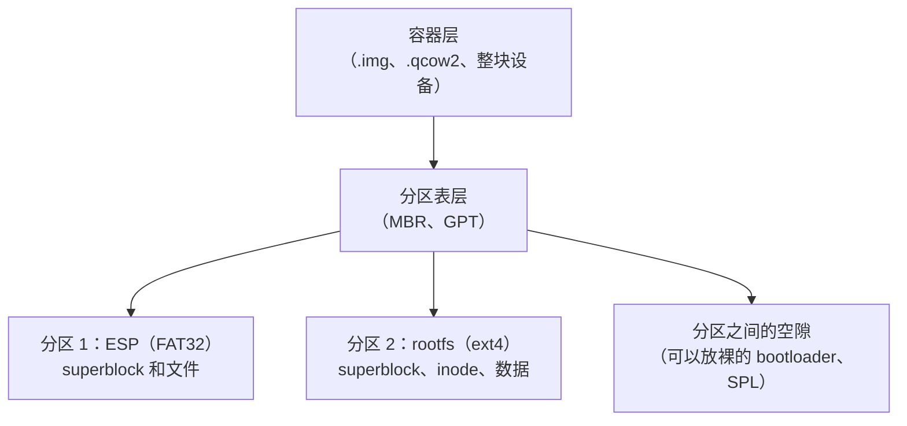
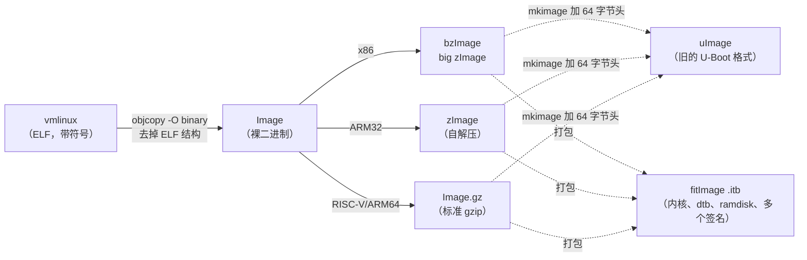

> 一个 `.img` 文件是什么，怎样变成能让开发板启动的 SD 卡。以 RISC-V/Linux 为例，对照 x86、ARM、Windows、macOS。

<!-- more -->

## 二进制与结构

常见的误解是：纯二进制就是 `*.bin`，是一堆没有结构的数据。其实「二进制」只表示「不是文本」，即这些字节不打算被当作字符读取，**与有没有内部结构无关**。

文本与二进制是一组区分（能不能当字符读），有结构与无结构是另一组，两者互相独立。`.bin` 只是约定的后缀，里面可以是纯数据，也可以是带可执行头的内核 `Image`、带分区表和多个文件系统的磁盘镜像、自定义格式的固件。大多数二进制格式都有丰富的内部结构，只是不供人直接阅读。

后面会多次看到 `file` 命令把一个文件判为 `data`，这表示它没有识别出结构（没有匹配到魔数），而不是文件没有结构。魔数一出现，它就能识别出来。

---

## 文件大小与稀疏文件

### `touch`、`truncate` 与 `fallocate`

这三个命令常被混用，其实管的是不同的东西：

| 命令 | 管什么 | 结果 |
|:--:|:--:|:--:|
| `touch f` | **是否存在和时间戳** | 创建 0 字节的文件，或只更新 atime/mtime，不改内容 |
| `truncate -s N f` | **大小** | 把文件设为 N；变大时补**空洞**（稀疏），变小时**截断并丢弃数据** |
| `fallocate -l N f` | **大小和实际分配** | 设为 N 并**实际占用磁盘**（没有空洞） |

```bash
touch empty.bin                  # size=0，占用的块=0，只管是否存在
touch -d '2020-01-01' empty.bin  # 只改 mtime，不改内容；make 增量构建和缓存失效依靠它
truncate -s 10M sized.bin        # 逻辑大小 10M，但 du 显示实际占用为 0；变大时补空洞（稀疏）
```

> **Windows**：`fsutil file createnew f 10485760`（创建指定大小的文件）；稀疏文件要 `fsutil sparse setflag f`。修改时间戳用 PowerShell 的 `(Get-Item f).LastWriteTime = '2020-01-01'`。
> **macOS**：`mkfile -n 10m sized.bin`（`-n` 表示稀疏）；`touch` 与 Linux 相同。

### `ls -l`、`du` 与 `df` 的区别

这三个命令衡量的是三件不同的事，也是理解稀疏文件的关键：

| 命令 | 衡量的是 |
|:--:|:--:|
| `ls -l` | 文件的**逻辑大小** |
| `du` | 文件**当前实际占用的磁盘块** |
| `df`（对挂载点） | 文件系统的**总容量、已用、可用** |

创建一个 256M 的镜像，建立 ext4 并挂载：

```text
truncate -s 256M sparse.img
  ls -l → 268435456 (256M 逻辑)        du → 0        (稀疏，没有占用磁盘)     file → data
mkfs.ext4 sparse.img
  du → 17M (ext4 元数据：superblock、inode 表、journal 是实际写入的)       file → ext4 filesystem
挂载后 df → Size 224M  Used 24K       (256M 设备减去 ext4 元数据和保留空间，约 224M 可用)
```

`du` 的 17M 和 `df` 的 224M 衡量的不是同一件事：前者是宿主磁盘实际分配了多少，后者是文件系统认为自己有多大。文件系统认为有 224M，但磁盘上目前只实际分配了 17M，这个差额就是稀疏。

### 写时分配

向镜像中写入 50M，三个数字的变化：

```text
dd if=/dev/zero of=/mnt/spx/blob bs=1M count=50 conv=fsync
  du sparse.img : 17M → 67M   (增加 50M，实际占用增加)
  df Used       : 24K → 51M   (增加 50M)
  df Size       : 224M → 224M  (不变)
```

写入多少，实际占用就增加多少，文件系统的总容量不变。稀疏文件就是写入时才分配空间。

### 稀疏文件的代价

稀疏文件节省空间（逻辑大小大、实际占用小，分发时只传有效字节），但有三个代价：

**碎片**：空洞在写入时才分配，块按写入那一刻的空闲位置选取，可能分散在各处。ext4 的 extent 和延迟分配会尽量连续，但在不同时间跳着写入仍会产生碎片。用 `filefrag -v img` 查看碎片（列出每段 extent 和空洞）。

**超额分配与 ENOSPC（最危险）**：逻辑大小可能大于实际可用的空间：

```bash
truncate -s 10G huge.img     # 在只剩 200M 的磁盘上也能成功（只是一堆空洞）
```

逻辑大小 10G，物理空间只剩 200M。往空洞中写入，写到底层磁盘满时就会出现 `write: No space left on device`，而且常常是写到一半才出错。虚拟机磁盘镜像（raw 稀疏文件、qcow2 精简配置）最常遇到：客户机以为有 100G，宿主磁盘满了，客户机突然出现 I/O 错误，甚至文件系统损坏。

**只传有效字节要用支持稀疏文件的工具**：普通的 `cp`、`dd` 默认把空洞展开成 0 字节，10G 的逻辑大小复制后变成实际占用 10G。要保留稀疏，用：

```bash
cp --sparse=always    rsync -S    tar -S    qemu-img convert
```

**对策是 `fallocate`**：`fallocate -l N f` 立即分配、连续、没有空洞，不会出现 ENOSPC，也不会产生碎片，代价是立即占满空间。**swap 文件必须用它**（内核不允许 swap 使用稀疏的空洞）。

> 要体积小、分发快，用 `truncate` 生成稀疏文件（接受超额分配的风险）；要可靠、可预测、性能高，用 `fallocate` 预先分配。

---

## 在镜像中创建文件系统

`mkfs.<fs>` 在**块设备或镜像文件**上格式化：写入 superblock、inode 表、位图、日志等元数据（上面的 17M 就是它写入的）。

常见的有 `ext2/3/4`、`fat/vfat/msdos`、`minix`、`cramfs`、`bfs`（`mkfs.<Tab>` 列出的是本机已安装的；安装 `btrfs-progs`、`xfsprogs`、`f2fs-tools`、`exfatprogs` 等后会增加）。

```text
mkfs.vfat t.img → DOS/MBR boot sector, OEM-ID "mkfs.fat"   # FAT 引导扇区（也以 55AA 结尾，与 MBR 同一格式）
mkfs.ext4 t.img → Linux rev 1.0 ext4 filesystem data       # file 根据 superblock 的魔数识别
```

选择：

| 场景 | 选择 |
|:--:|:--:|
| **EFI 系统分区（ESP）** | **必须 FAT32**：`mkfs.vfat -F 32`（UEFI 固件只支持 FAT） |
| Linux rootfs | ext4（也可以用 btrfs、xfs） |
| 在 Windows、Linux、相机之间交换 | FAT32（单个文件小于 4G）或 exFAT（大文件） |
| 只读的嵌入式系统 | squashfs（`mksquashfs`）、cramfs、erofs |
| **裸 NOR/NAND flash** | **不用 mkfs.\***，用 jffs2、ubifs、littlefs（通过 mtd 设备，有磨损均衡和掉电保护） |

> **Windows**：`format X: /FS:FAT32` 或图形界面的「格式化」；分区和卷管理用 `diskpart`。
> **macOS**：`diskutil eraseDisk FAT32 NAME /dev/diskN`，或底层的 `newfs_msdos`、`newfs_hfs`。

---

## loop 设备

### 用途

`mount` ext4、FAT 这类**块设备文件系统**时，内核需要的是一个**块设备**（能按扇区偏移随机读写，以便到固定位置读取 superblock），但 `sparse.img` 是一个**普通文件**。

**loop 设备**把一个普通文件**包装成块设备** `/dev/loopN`：对 `/dev/loopN` 的**扇区读写**，由 loop 驱动**转换成对该文件对应偏移的 `pread`/`pwrite`**。

```bash
sudo losetup -f --show ./sparse.img   # 找一个空闲的 loop 设备并绑定，得到 /dev/loop0
sudo mount /dev/loop0 /mnt/spx         # 现在可以挂载了
# 或者一步完成（mount 自己调用 losetup）：
sudo mount -o loop ./sparse.img /mnt/spx
# 带分区表的镜像要加 -P，才会出现 /dev/loop0p1、/dev/loop0p2：
sudo losetup -fP --show ./disk.img
```

### `umount` 不会解绑 loop 设备

loop 设备**不会因为 umount 而自动解绑**，除非它带有 **autoclear** 标志。

手动创建还是由 mount 创建，记录在**内核中每个 loop 设备的一个标志位** `LO_FLAGS_AUTOCLEAR`（定义在内核的 `include/uapi/linux/loop.h`，值为 4，可以通过 `LOOP_SET_STATUS` 或 `LOOP_CONFIGURE` ioctl 设置）。

- `mount -o loop` 创建 loop 设备时**设置 AUTOCLEAR**；手动 `losetup` **不设置**。
- 块设备的最后一个使用者关闭时（由 umount 触发），内核检查这个标志：**设置了就自动解绑，没设置就保持绑定**。

`losetup -l` 有 AUTOCLEAR 一列，可以直接看到：

```text
sudo losetup -f ./sparse.img            → AUTOCLEAR=0   (手动创建，不会自动解绑)
sudo mount -o loop ./sparse.img /mnt/spx → AUTOCLEAR=1   (mount 创建，umount 后自动消失)
```

> 如果某个 loop 设备**已经绑定了同一个文件**，`mount -o loop` 会**复用它**（不会重复绑定），也就**继承**它的标志：手动创建的是 0，复用后仍是 0。要得到新的 AUTOCLEAR=1，先用 `sudo losetup -d /dev/loopN` 解绑。
>
> `mount -o loop` 报 `failed to setup loop device` 时，**先检查路径是否正确**（文件不存在也会报这个错误，很容易误导）。

> **Windows**：挂载 `.vhd/.iso` 用 PowerShell 的 `Mount-DiskImage -ImagePath x.vhd`（卸载用 `Dismount-DiskImage`），或在 `diskpart` 中 `select vdisk file=...` 加 `attach vdisk`。原生不支持 ext4（需要 WSL2 或第三方驱动）。
> **macOS**：`hdiutil attach disk.img`（挂载）、`hdiutil detach /dev/diskN`（卸载），一步完成 loop 和 mount。

---

## 烧录：dd、page cache 与 sync

### dd 与 cp 的区别

一个常见的误解是：`dd` 逐字节直接写硬件、有严格的地址限制，而 `cp` 只能通过文件系统。实际上：

- `dd` 和 `cp` **都通过 VFS 的 `open()`/`write()` 系统调用**，没有哪个更底层。
- `bs=` 控制每次 `write()` 的块大小：`bs=4M` 一次写 4MB；`bs=1` 每个字节一次系统调用，**最慢**（上下文切换的开销远大于数据搬运），并不更精确。
- 对齐和地址是**块层和文件系统**的事，与应用层的 `write()` 无关。

烧卡习惯用 `dd`，是因为 `dd` 有 **`skip=`、`seek=`、`count=`、`conv=`、`oflag=`** 等精细的控制，尤其是 `seek=` 可以**按偏移写入**，把 SPL 或 bootloader 写到卡上的指定偏移；`cp` 只能把整个文件放进文件系统，两者的用途不同。在系统调用层面，二者没有底层与否之分。

> 整盘与分区：`/dev/sdX`（如 `/dev/sda`）是**整块磁盘**，是一整段裸扇区，开头放分区表，里面再划分出分区，它本身不是 ext4 或 FAT。`mkfs` 格式化、`mount` 挂载的是其中的**分区** `/dev/sdX1`（如 `/dev/sda1`）。所以 `dd … of=/dev/sdX` 是直接向**裸盘**写入字节（块层只搬运数据，不按文件系统的规则解释），才能把一个**自带分区表和文件系统**的完整镜像整盘写进去。

### dd 结束不等于数据已写入

`dd` 的进度走完时，**数据可能还在 page cache（脏页）中**，必须 `sync`（或 `dd conv=fsync`、`oflag=direct`）才会写入磁盘。看起来已经完成，这时拔卡就会丢数据。

`/proc/meminfo` 中的 `Dirty` 是等待写回的脏页量：

```text
开始时                        Dirty 很小
dd 200M（不 fsync）           Dirty 升到约 200M   ← 数据还没写入磁盘
sync                         Dirty 降回接近 0    ← 强制写回
dd 200M oflag=direct         Dirty 基本不变      ← O_DIRECT 绕过 page cache，直接 DMA
```

能用 `oflag=direct` 绕过，正说明默认要经过 page cache。

> **为什么块存储经过缓存，外设寄存器却不经过**：两类外设不同。
> - **块存储**（SD 卡、U 盘、NVMe，`/dev/sdX`）存的是**数据**，经过 page cache（可以重复读取，有局部性），所以要 `sync`；
> - **MMIO 外设寄存器**（UART、GPIO、控制器寄存器）是**控制**接口，用 `ioremap` 映射成 **uncached/device 内存**，用 `volatile` 直接读写（读一次 RX 寄存器会取走一个字节，状态寄存器自己会变化，缓存就会读到过期的值）。
>
> `dd` 写 SD 卡时，大块**数据**经过 page cache，再通过 DMA 写到 flash；存储控制器的寄存器（uncached）只被驱动用来**下发 DMA 命令**，两条路径是分开的。
> （如果 `/tmp` 是 tmpfs（内存盘），写入不会产生磁盘脏页，做这个实验要写到真实磁盘的路径。）

### 把镜像写入存储卡

| 平台 | 命令或工具 |
|:--:|:--:|
| **Linux** | `sudo dd if=os.img of=/dev/sdX bs=4M conv=fsync status=progress`，然后 `sync`（一定要先用 `lsblk` 确认 `/dev/sdX` 是目标盘，不要写错） |
| **Windows** | 图形工具最稳妥：**Win32 Disk Imager**、**Rufus**、**balenaEtcher**、**Raspberry Pi Imager**；命令行有 `dd for Windows`（`dd if=os.img of=\\.\PhysicalDriveN bs=4M`）。查看磁盘号用 PowerShell 的 `Get-Disk` 或 `wmic diskdrive list brief` |
| **macOS** | `diskutil list` 找到磁盘，`diskutil unmountDisk /dev/diskN`，再 `sudo dd if=os.img of=/dev/rdiskN bs=4m`（`rdiskN` 是裸设备，更快）；也可以用 balenaEtcher |
| **WSL2** | 见下一节的 `usbipd-win` |

### 在 WSL2 中烧录：usbipd-win

WSL2 默认**看不到** Windows 上插入的 USB 块设备。[`usbipd-win`](https://github.com/dorssel/usbipd-win) 通过 **USB/IP** 协议把 Windows 的 USB 设备**直通到 WSL2**，之后在 WSL 中就能像本地块设备一样 `dd`：

```powershell
# 在 Windows PowerShell（管理员）中
usbipd list                       # 列出 USB 设备，记下 BUSID（如 2-4）
usbipd bind   --busid 2-4         # 第一次共享（只需一次）
usbipd attach --wsl --busid 2-4   # 直通到 WSL2
```

```bash
# 在 WSL2 中
lsblk                                   # 现在能看到 /dev/sdX
sudo dd if=os.img of=/dev/sdX bs=4M conv=fsync status=progress && sync
```

```powershell
# 用完后还给 Windows
usbipd detach --busid 2-4
```

> 不想设置直通，也可以直接在 Windows 上用 Win32 Disk Imager 或 Rufus 烧录。

---

## 镜像的分层结构

### 三层抽象

一个可启动的镜像不是一个文件系统，而是三层嵌套的结构：



`cp file /mnt/...` 只复制某个**已挂载**文件系统中的文件内容；`dd` 整盘复制的是**裸字节布局**。下面这些是 `cp` **无法复制**的，所以整盘 `dd` 的镜像能启动，用 `cp` 复制文件不能：

> 分区表本身（MBR、GPT 头和表项），分区之间的空隙（包括裸的 bootloader），superblock，inode 位图，块位图，日志，MBR 中 446 字节的引导代码，以及任何**按绝对块号寻址**的结构。

### LBA0 是 Protective MBR

常见的误解是 GPT 分区表从 0x0 开始。实际上：

```text
LBA0      → Protective MBR   (保护性 MBR，兼容旧工具)
LBA1      → GPT Header       (魔数 "EFI PART")
LBA2–33   → GPT 分区表项      (每项 128 字节)
```

创建一个 GPT 镜像，用 `xxd` 查看：

```text
parted -s disk.img mklabel gpt; parted -s disk.img mkpart primary ext4 1MiB 100%

xxd 查看 LBA0:
  000001c0: 0200 eeff ffff 0100 0000 ...   ← 0x1c2 = EE（protective MBR 的分区类型）
  000001f0: ...                      55aa   ← 0x1fe = 55 aa（引导扇区签名，沿用 MBR）
xxd 查看 LBA1（偏移 512）:
  00000200: 4546 4920 5041 5254 ...         ← "EFI PART"（GPT header 的魔数）
```

**同一份字节，两种工具读到两个层**：

```text
file disk.img  → DOS/MBR boot sector; partition 1 : ID=0xee ...   ← file 读的是 MBR 层
fdisk -l       → Disklabel type: gpt; disk.img1 ...               ← fdisk 读的是 GPT 层
```

这就是 **Protective MBR 的作用**：让**只支持 MBR 的旧工具**看到一个占满整盘的 0xEE 分区（不认识这个类型，就不会改动），**防止后面真正的 GPT 被当作空盘覆盖**。

> **RISC-V SD 卡的典型布局**：GPT，加上存放 U-Boot/SPL 的分区（裸写入或放在特定偏移），再加 ext4 rootfs。各家 SoC 的 SPL 偏移**没有统一标准**（不像 ARM sunxi 固定在 8KB），**必须查芯片手册**。

> **Windows 查看分区**：PowerShell 的 `Get-Disk`、`Get-Partition`，或图形界面的「磁盘管理」；查看十六进制用 `Format-Hex -Path disk.img -Count 64`。
> **macOS 查看分区**：`diskutil list`、`gpt -r show /dev/diskN`；十六进制同样用 `xxd`。

---

## 魔数与 file 命令

### file 判断类型的方法

`file` 按三步判断：先看**魔数**（已知偏移处的签名字节），不匹配再判断是否为文本（按编码推测），都不是就输出 `data`。

| 类型 | 魔数 | 位置 |
|:--:|:--:|:--:|
| ELF | `7f 45 4c 46`（`\x7fELF`） | 0 |
| PE/EXE | `4d 5a`（`MZ`） | 0 |
| gzip | `1f 8b` | 0 |
| PNG | `89 50 4e 47` | 0 |
| 脚本 shebang | `23 21`（`#!`） | 0 |
| **uImage** | `27 05 19 56` | 0 |
| **ext2/3/4 superblock** | `53 ef`（即 0xEF53） | **0x438** |
| **RISC-V Image** | `52 53 43 05`（`RSC\x05`） | 0x38 |

前面 `file sparse.img` 识别出 ext4 的原因：

```text
xxd -s 0x438 -l 2 sparse.img → 53 ef     # 这两个字节（小端的 0xEF53）就是 ext4 superblock 的魔数
```

### 让 file 识别自定义格式

`file`/libmagic **不是 Linux 内核的一部分**，而是独立的项目 [`github.com/file/file`](https://github.com/file/file)。魔数库在 `magic/Magdir/*`（按类别分文件，编译成 `magic.mgc`）。

- 要被上游收录，就向 `file/file` 的 `magic/Magdir/<类别>` 提 PR；
- 通常**不需要提 PR**，在本地添加即可：`~/.magic`（个人）、`file -m mymagic yourfile`（临时）、`/etc/magic`（全系统）：

```text
# magic 语法：偏移  类型  值  描述
0     string  MYOS     MyOS image
>8    lelong  x        \b, version %d
```

> 例如给自己的固件或镜像定一个格式，在 `~/.magic` 中写几行，`file` 就能识别出「MyOS image, version 3」。

---

## 内核镜像格式

### 生成过程

所有格式都从 `vmlinux` 开始：**ELF** 格式、未压缩、带调试符号的完整内核。它不能直接烧录或跳转执行，因为它是 ELF（有文件头、段表、符号表），而 bootloader 需要的是放到内存某个地址就能运行的裸二进制。所以要经过下面的处理：



| | **x86** | **ARM** | **RISC-V** |
|:--:|:--:|:--:|:--:|
| 裸二进制 | | `Image`（ARM64） | `Image`（带内核定义的 64 字节头，魔数 `RSC\x05`） |
| 压缩格式 | **`bzImage`** | `zImage`（ARM32） | `Image.gz` |
| 含义 | **bz 是 big zImage，不是 bzip2**，big 表示可以大于 512K、加载到高地址，突破 640K 实模式的限制；实际用 gzip 压缩 | zlib 压缩加**自解压代码**（启动时自己解压） | **标准 gzip**（发行版中的 `vmlinuz-x.y.z` 通常就是它） |
| 适用范围 | x86 专用 | ARM32 专用 | **不用 zImage 和 bzImage**（没有 ARM 的自解压，也没有 x86 实模式的历史负担） |

最后两种通用的封装：

- **uImage** 是用 `mkimage` 加在外面的 **64 字节 U-Boot 旧格式头**（魔数 `0x27051956`、加载地址、入口、架构、操作系统类型、CRC），供旧的 `bootm` 使用。只能有一个内核，没有 dtb，没有多套配置。
- **fitImage（.itb）** 是 FIT（Flattened Image Tree），用 **DTB 的二进制格式**描述，打包**内核、dtb、ramdisk、多套配置、多个哈希、多个签名（verified boot）**。这是 U-Boot 现在主推的格式，用 `mkimage -f x.its` 生成。

对应的命令：`booti`（RV/ARM64，识别 Image 头）、`bootm`（旧格式，识别 uImage 的 `0x27051956`，也能启动 FIT）、`bootefi`（UEFI 方式）。

### RISC-V Image 的头部

`Image` 相对 ELF 是裸的，但它**内嵌一个本身就能执行的 64 字节头**。拆开 buildroot 编译出的 Image：

```text
偏移                                  解码
0x00  4d 5a ───────────────  "MZ"  ← 既是 PE 的 MZ 魔数，又是一条无害的 RISC-V 压缩指令
0x02  6f 10 60 0d ─────────  一条 j(jal) 跳转，跳过这 64 字节头，到真正的入口
0x08  00 00 20 00 .. ──────  text_offset = 0x20_0000 = 2 MiB  ← 0x8000_0000+0x20_0000=0x8020_0000 的来源
0x10  00 80 a8 01 .. ──────  image_size 约 27.8 MB
0x20  02 00 .. ────────────  header version = 2
0x30  52 49 53 43 56 ──────  "RISCV\0\0\0"（旧魔数）
0x38  52 53 43 05 ─────────  "RSC\x05"（magic2）
0x3c  40 00 00 00 ─────────  = 0x40，指向 PE/COFF 头的偏移

file Image → PE32+ executable (EFI application) RISC-V 64-bit ... for MS Windows
```

`file` 把 Linux 内核识别成了 Windows 的 EFI 程序，因为这个头**同时也是合法的 PE/COFF 头**（偏移 0 处是 MZ，0x3c 处是 PE 头偏移），**UEFI 可以把内核当作 `.efi` 直接启动**（EFI stub）。

从偏移 0 开始执行和前 64 字节是结构化的头并不冲突：头的前几个字节本身就是指令（MZ 是无害的指令，紧接着一条 `j` 跳过头部）。同一个文件，`booti` 把它当裸内核跳转执行，UEFI 把它当 PE 加载，`file` 把它识别为 Windows 程序。

### RISC-V 启动地址的几点说明

- `0x8000_0000` 是**事实标准**（来自 SiFive FU540），**不是 ISA 规范规定的**；换板子必须查 datasheet。
- 复位向量 `0x1000` 是 **QEMU virt**（以及部分硬件的 ROM）的选择，**不是大多数板卡的通用标准**，真正的原因是 SoC 通常把 mask ROM 放在低地址。
- 真实硬件上 SPL 运行在**片上 SRAM** 中（上电时 DRAM 控制器还没初始化，要先由 U-Boot SPL 做 DDR 训练）；QEMU 简化成直接在 0x8000_0000 运行。
- 各级之间靠寄存器约定交接：SBI 进入操作系统时 `a0=hartid`、`a1=DTB 物理地址`（所有 RISC-V 固件都遵守，不遵守就无法启动）。

---

## 常用命令

| 操作 | Linux | Windows（PowerShell 或工具） | macOS |
|:--:|:--:|:--:|:--:|
| 创建指定大小的文件 | `truncate -s 1G f` / `fallocate -l 1G f` | `fsutil file createnew f 1073741824` | `mkfile -n 1g f` |
| 创建文件系统 | `mkfs.ext4` / `mkfs.vfat -F32` | `format X: /FS:FAT32` / `diskpart` | `diskutil eraseDisk` / `newfs_msdos` |
| 把文件当设备挂载 | `losetup -fP` 加 `mount` / `mount -o loop` | `Mount-DiskImage` / `diskpart attach vdisk` | `hdiutil attach` |
| 卸载 | `umount`（加 `losetup -d`） | `Dismount-DiskImage` | `hdiutil detach` |
| 烧录到卡 | `dd ... conv=fsync` 加 `sync` | **Win32 Disk Imager** / Rufus / balenaEtcher | `dd of=/dev/rdiskN` / balenaEtcher |
| 同步到磁盘 | `sync` | 工具自动完成 | `sync` |
| 查看分区表 | `fdisk -l` / `parted print` | `Get-Disk` / `Get-Partition` / 磁盘管理 | `diskutil list` / `gpt -r show` |
| 查看十六进制 | `xxd` | `Format-Hex` | `xxd` |
| 识别文件类型 | `file` | 没有原生命令，可以安装 Windows 版 `file` | `file` |
| WSL2 使用 USB 设备 | 在 Windows 上 `usbipd attach --wsl --busid X-Y`，然后在 WSL 中 `dd` | `usbipd-win` | |

## 格式化、分区与烧录

> 截至 2026 年的一般选择：跨平台交换大文件首选 **exFAT**（Linux 5.4 起原生支持，加上 `exfatprogs`；Windows 和 macOS 原生支持）；EFI 启动分区必须用 **FAT32**；Linux 根盘用 **ext4**（稳妥）或 **btrfs、f2fs**（较新）；只读固件镜像用 **squashfs（zstd）**。

### Linux

```bash
# 查看并清除旧签名（换盘重做之前）
lsblk -f                          # 查看已有的分区、文件系统和 UUID（最常用）
sudo wipefs -a /dev/sdX           # 清除旧的分区表和文件系统魔数，避免残留导致误判

# 建立分区表（四选一）
sudo fdisk /dev/sdX               # 交互式（经典）
sudo cfdisk /dev/sdX              # 文本界面
sudo parted -s /dev/sdX mklabel gpt \
     mkpart ESP   fat32 1MiB  513MiB \
     mkpart root  ext4  513MiB 100%  set 1 esp on
sudo sgdisk -n 1:0:+512M -t 1:ef00 -c 1:ESP \
            -n 2:0:0     -t 2:8300 -c 2:root /dev/sdX   # 写脚本时首选

# 格式化
sudo mkfs.vfat -F 32 -n BOOT /dev/sdX1        # ESP 或启动分区（UEFI 只支持 FAT32）
sudo mkfs.ext4 -L root /dev/sdX2              # Linux 根盘的主流选择
sudo mkfs.exfat -L DATA /dev/sdX2             # 跨平台大文件（exfatprogs）
sudo mkfs.btrfs -L data /dev/sdX2             # 写时复制、快照、压缩
sudo mkfs.xfs  -L data /dev/sdX2              # 大文件、高并发
sudo mkfs.f2fs -l flash /dev/sdX2             # 适合 SD、eMMC、UFS 等闪存
sudo mkswap /dev/sdX3 && sudo swapon /dev/sdX3   # 交换分区
mksquashfs rootfs/ ro.img -comp zstd          # 只读压缩镜像（嵌入式、initramfs）
# 通用写法：sudo mkfs -t ext4 /dev/sdX2

# 烧录整盘镜像
sudo dd if=os.img of=/dev/sdX bs=4M conv=fsync status=progress && sync
sudo bmaptool copy os.img.gz /dev/sdX         # 只写有效的块（Yocto、树莓派在用），比 dd 快数倍
```

> 图形界面和封装工具：GNOME **Disks**（`gnome-disks`）、`udisksctl`，以及 systemd 的 `systemd-repart`（声明式分区）。

### Windows

```powershell
# PowerShell（管理员）
Get-Disk                                              # 查看磁盘号
Clear-Disk -Number 2 -RemoveData -Confirm:$false      # 清空整盘（会删除全部数据）
Initialize-Disk -Number 2 -PartitionStyle GPT
New-Partition -DiskNumber 2 -UseMaximumSize -AssignDriveLetter |
  Format-Volume -FileSystem FAT32 -NewFileSystemLabel BOOT   # 也可以用 exFAT、NTFS
```

```bat
:: diskpart（交互式，旧脚本仍在使用）
diskpart
  list disk
  select disk 2
  clean
  convert gpt
  create partition primary size=512
  format fs=fat32 quick label=BOOT
  assign
:: cmd 中快速格式化单个卷
format X: /FS:exFAT /Q /V:DATA
```

> 烧录镜像的图形工具：**Raspberry Pi Imager**、**balenaEtcher**、**Rufus**、**Win32 Disk Imager**；命令行用 `dd for Windows`（`of=\\.\PhysicalDriveN`）。图形界面的磁盘管理是 `diskmgmt.msc`。

### macOS

```bash
diskutil list                                         # 查看 /dev/diskN
diskutil eraseDisk APFS  MyName        /dev/disk4      # 整盘格式化为 APFS（macOS 默认）
diskutil eraseDisk MS-DOS BOOT MBR     /dev/disk4      # 整盘格式化为 FAT32（MS-DOS 即 FAT）
diskutil eraseDisk ExFAT  DATA  GPT    /dev/disk4      # 跨平台大文件
diskutil partitionDisk /dev/disk4 GPT \
         FAT32 BOOT 512MB  APFS ROOT R                 # 一条命令完成分区和格式化
# 底层命令：newfs_msdos、newfs_apfs、newfs_hfs；烧录用 dd of=/dev/rdiskN 或 balenaEtcher
```

### 文件系统的选择

| 文件系统 | Linux | Windows | macOS | 典型用途 |
|:--:|:--:|:--:|:--:|:--:|
| **FAT32** | √ | √ | √ | **EFI 系统分区（ESP）**、小容量卡、兼容性最好（单个文件小于 4G） |
| **exFAT** | √（5.4 起） | √ | √ | 跨平台交换**大文件**（SD 卡、U 盘的首选） |
| **NTFS** | √（ntfs3 可读写） | √ 原生 | ! 只读 | Windows 系统盘 |
| **ext4** | √ 原生 | ×（需要驱动或 WSL） | × | Linux 根盘的主流选择 |
| **btrfs/xfs/f2fs** | √ | × | × | 写时复制快照、高并发、闪存 |
| **APFS** | × | × | √ 原生 | macOS 系统盘 |
| **squashfs** | √ 只读 | × | × | 只读压缩固件、initramfs |

---

## 常见错误

1. `dd` 完成后没有 `sync` 就拔卡，数据会丢失（还在 page cache 中）。
2. `of=` 写错了盘，会清掉系统盘。烧录前用 `lsblk` 反复确认，要写的是 `/dev/sdX`，不是 `/dev/sdX1`。
3. `umount` 后 loop 设备没有解绑（手动 `losetup` 没有 autoclear），loop 设备会越来越多，用 `losetup -a` 查看、`-d` 解绑。
4. `mount -o loop` 报 `failed to setup loop device`，先检查文件路径（文件不存在也会报这个错误）。
5. 把 bzImage 的 `bz` 当成 bzip2，实际是 big zImage。
6. 以为 LBA0 是 GPT，实际是 Protective MBR，GPT header 在 LBA1。
7. 用 `mkfs.ext4` 直接格式化裸 NAND flash，裸 flash 要用 ubifs 或 jffs2（通过 mtd），不能用块设备文件系统。
8. ESP 用了 ext4，UEFI 只支持 FAT32。
9. `/tmp` 是 tmpfs 时做 Dirty 实验，结果不准，要写到真实磁盘的路径。

## 思考题

**Q1.** 为什么 `truncate -s 0 f && truncate -s 1G f` 之后 `du f` 是 0，而 `cp f g` 之后 `du g` 也可能是 0？（cp 默认会不会保留空洞？）

**Q2.** 把一个 1KB 的 `hello.txt` 用 `cp` 复制进已挂载的 ext4 镜像，再用 `xxd` 查看整个镜像文件，能在裸字节中找到「hello」吗？它在哪个绝对偏移？为什么 `cp` 修改了镜像文件的内容，却改不到分区表？

**Q3.** 一个 RISC-V `Image` 既能被 `booti` 跳转执行，又能被 UEFI 当作 `.efi` 加载，如果把它开头 2 个字节的 `MZ` 改掉，两种情况下分别会怎样？

**Q4.** 为什么烧录 SD 卡用 `dd` 而不用 `cp`，但烧录后可以直接用 `cmp` 或 `sha256sum` 读取 `/dev/sdX` 来校验？
